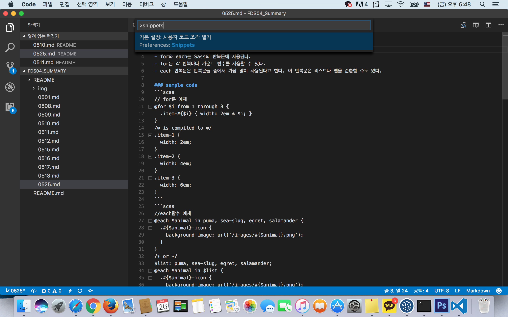
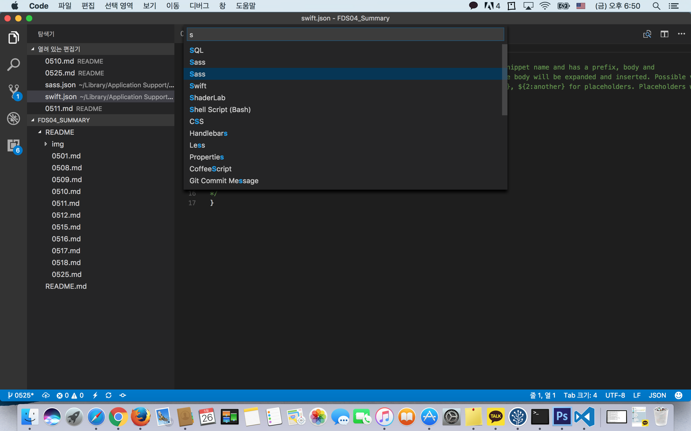
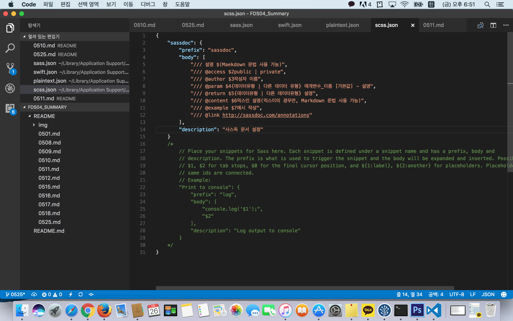
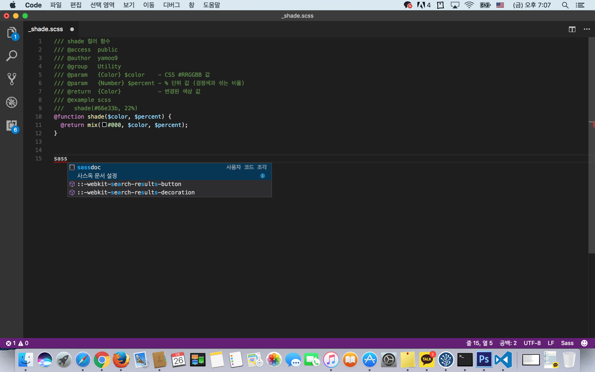
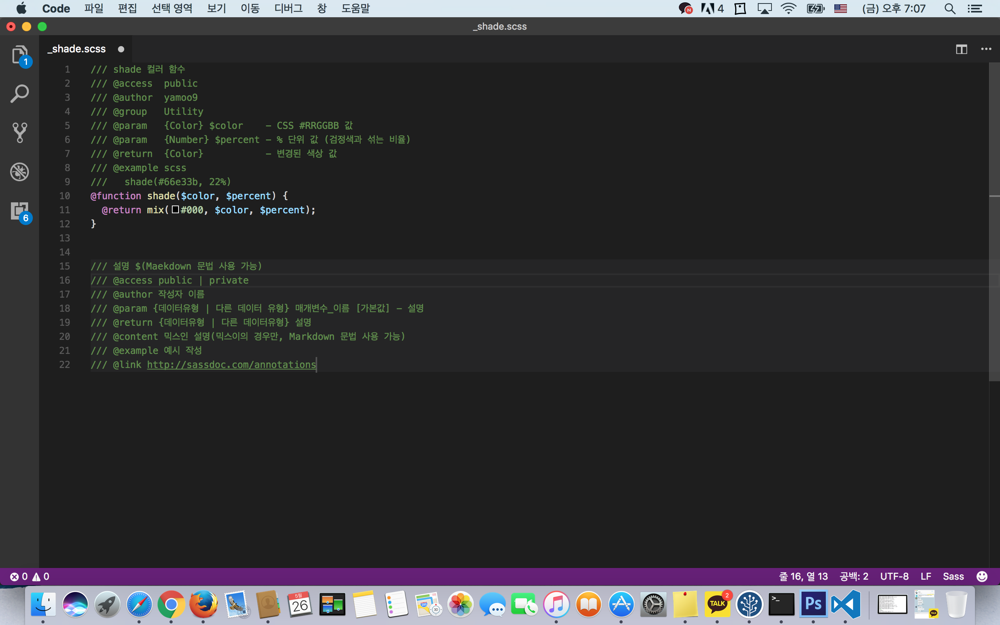

# 목차
  1. [개발환경 세팅](#개발환경-세팅)
  2. [Snippets 설정하기 - VScode](#snippets-설정하기---vscode)
  3. [chrome workspace 사용법](#chrome-workspace-사용법)
  4. [chrome dev tool](#chrome-dev-tool)

------

# 개발환경 세팅
1. firefox 설치
  - [firefox 설치](https://www.mozilla.org/ko/firefox/new/)
  - 확장 프로그램 목록
    - firebug
    - web developer
    - headingsmap
    - open wax

2. git 설치
  - [git설치](https://git-scm.com/)
  - [git 초기설정](https://git-scm.com/book/ko/v1/%EC%8B%9C%EC%9E%91%ED%95%98%EA%B8%B0-Git-%EC%B5%9C%EC%B4%88-%EC%84%A4%EC%A0%95) user.name 과 user.email 설정
  - git 복제하기 [데레사님 github 주소](https://github.com/seulbinim/FDS04)
  - `git clone https://github.com/seulbinim/FDS04.git` 명렁어로 복사
  - `cd FDS04`  -> 명령어로 디렉토리 변경
  - `git checkout -b 4th_school` -> 명령어로 브랜치 생성후 변경 
  
  - Windows에서 GitBash로 터미널 설정하는 방법.
    - 파일 → 기본설정 → settings → 설정 검색에서 terminal.integrated.shell.windows 찾기 →  "terminal.integrated.shell.windows": "C:\\Program Files\\Git\\bin\\bash.exe" 로 변경

3. Visual Studio Code 
  - [Visual Studio Code 설치](https://code.visualstudio.com/)
  - 설치한 확장프로그램 목록
    - open in browser
    - Mithril Emmet
      - [에밋 치트 시트](https://docs.emmet.io/cheat-sheet/) 
    - HTML Snippets
    - HTMLHint
    - IntelliSense for CSS class names
    - VS Color Picker
    - VS Code CSS Comments
    - Beautify css/sass/scss/less
    - Sass
    - Sass Lint
  - **VS code 단축키**
    맥은  CTRL --> Cmd

  | 키                 | 설명               |
  | :---------------- | :--------------- |
  | CTRL + \          | 화면분할             |
  | CTRL + /          | 주석처리             |
  | CTRL + `          | 내부에서 터미널열기       |
  | CTRL + ALT + DOWN | 멀티선택             |
  | CTRL + B          | 사이드바 보기          |
  | CTRL + P          | 파일팔레트 보기         |
  | CTRL + SHIFT + C  | 외부에서 터미널열기       |
  | CTRL + SHIFT + E  | 파일탐색기 보기         |
  | CTRL + SHIFT + G  | GIT 보기           |
  | CTRL + SHIFT + M  | 문제 보기            |
  | CTRL + SHIFT + O  | 심볼팔레트 보기         |
  | CTRL + SHIFT + P  | 명령팔레트 보기         |
  | CTRL + SHIFT + U  | 출력 보기            |
  | CTRL + SHIFT + V  | 미리 보기            |
  | CTRL + SHIFT + X  | 확장 보기            |
  | CTRL + SHIFT + Y  | 디버그콘솔 보기         |
  | CTRL + SPACE      | 자동완성(맥도 control) |
  | CTRL + W          | 창닫기              |

  - [참조링크]
    - [VSCode 단축키](https://code.visualstudio.com/docs/getstarted/keybindings)
    - [서브라임 단축키](http://docs.sublimetext.info/en/latest/reference/keyboard_shortcuts_win.html)

------

# Snippets 설정하기 - VScode
  1. command + shift + p
    
  2. snippets 입력창에 입력
    
  3. snippets 입력창에 입력
    
    - 주석을 참고하여 다음과 같이 작성한다.
      + 첫번째 속성이 명령어 
      + 두번째 prefix속성 값은 단축 명령어 
      + body속성 값에 배열로 내용을 작성하고 $+[nubmer]로 탭이동의 우선 순위를 지정한다. 

  4. 다음과 같이 동작 가능해진다.
    
  5. sassdoc 입력후 enter 혹은 tab key를 입력하면 짜잔
    

------

# chrome workspace 사용법
  - 개발도구에서 변경한 사항을 소스파일에 적용시킬 수 있게 된다.
    1. 개발도구 > settings(F1) > workspace > add folder로 작업 folder 추가.
    2. 개발도구 > sources탭 > 좌측 path tree에서 작업 폴더에 오른쪽클릭 > add folder to workspace > path tree 안쪽에 오른쪽클릭 > map to network resource
  - 이후 개발자 도구 내에서 변경한 사항을 저장 하면 원본파일에도 적용된다.

------

# chrome dev tool
  - stop point
    - source창 (자바스크립트 파일이 열린 상태에서) 좌측 행번호를 클릭하면 javascript 실행 중 해당 행에서 실행이 일시정지 된다. 정지된 상태에서 변수의 값등을 콘솔에서 확인할 수 있다.
  - source prettify
    - source창 하단 좌측의 '{ }' 버튼을 누르면 압축된 소스코드가 읽기 쉽게 변한다.

------

[Index바로가기](https://github.com/seromkim1005/study)