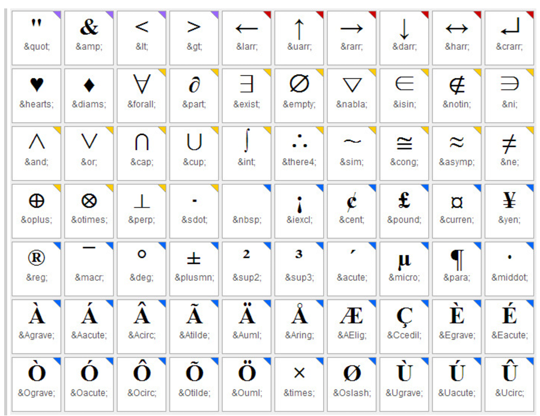
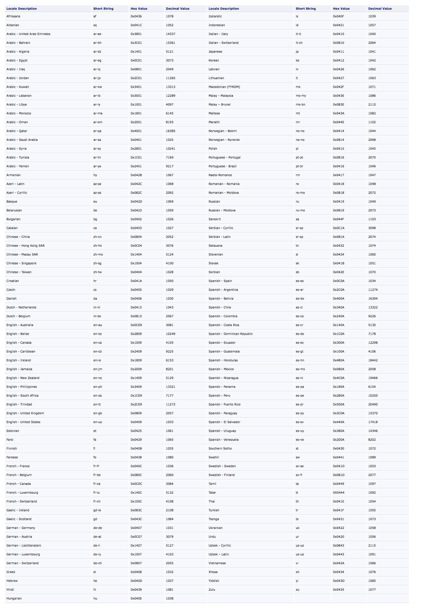

# 목차
  1. [HTML](#html)
  2. [HTML Entity Code Table](#html-entity-code-table)
  3. [HTML Language and Locale](#html-language-and-locale)
  4. [DOCTYPE의 의미](#doctype의-의미)
  5. [body에 가장 먼저 와야하는것](#body에-가장-먼저-와야하는것)
  6. [속성 id와 name 차이점](#속성-id와-name-차이점)
  7. [< Form > 태그](#-form--태그)
  8. [폼 submit과 button의 차이점](#폼-submit과-button의-차이점)
  9. [< button > 태그](#-button--태그)
  10. [< input > 태그](#-input--태그)
  11. [< select > 태그](#-select--태그)
  12. [< dl > 태그](#-dl--태그)
  13. [< a > 태그](#-a--태그)
  14. [< time > 태그](#-time--태그)
  15. [< figure > 태그](#-figure--태그)
  16. [< abbr > 태그](#-abbr--태그)
  17. [< video > 태그](#-video--태그)
  18. [< source > 태그](#-source--태그)
  19. [< track > 태그](#-track--태그)
  20. [시멘틱 요소](#시멘틱-요소)
  21. [Labeling](#labeling)
  22. [< table > 태그](#-table--태그)
  

------

# HTML
  - HTML5에서 새로 추가된 시멘틱 엘리먼트
    - html5의 구조에서 중요한 역할을 담당한다.
    - sementic tag list  
      `<header>`, `<footer>`, `<article>`, `<section>`, `<nav>`, `<main>`, `<aside>`
  - `<header>`와 `<footer>`는 문서에 여러개 존재해도 되지만 `<main>`은 항상 한개만 존재해야함
  - `<article>`은 RSS feed로 배포할 만한 가치가 있는 하나의 완성된 독립적인 컨텐츠인 경우 사용
  - `<section>`은 1-1, 1-2, 1-3... 장이나 절로 구분가능한 콘텐츠 불록 사용
  - `<main>`은 문서에서 한번만 사용가능한다. 주요 콘텐츠 블록에만 사용

  - [HTML5] 클리어보스 HTML5 명세서
    - [HTML5 명세](http://html5.clearboth.org/spec)
    - [HTML 오픈 레퍼런스](http://html5ref.clearboth.org/)
[go to top](#목차)

------

# HTML Entity Code Table
  

  - [참조링크]
    - [somgle](http://somgle.tistory.com/46)

[go to top](#목차)

------

# HTML Language and Locale
  

  - [참조링크]
    - [vbsedit](http://www.vbsedit.com/html/882ca1eb-81b6-4a73-839d-154c6440bf70.asp)

[go to top](#목차)

------

# DOCTYPE의 의미
  ```html
    <!DOCTYPE HTML PUBLIC "-//W3C//DTD HTML 4.01 Transitional//EN" "http://www.w3.org/TR/html4/loose.dtd">
  ```
  - `-` 는 업계 표준을 의미,  `+`는 W3C표준을 의미

[go to top](#목차)

------

  1. 글로벌 속성
    - 모든 태그에서 공통으로 쓸수있는 속성
    - lang, class, id, title, style, data-* 
    - 보통 태그마다 다른 속성을 갖는다. 
  2. lang
    - 설정한 언어에 맞게 읽어준다.접근성 관점에서 유용하다. 이해하기 쉽게 만들어주고 정교한 구조가 된다. 
    - <html lang="ko">로 속성에 주로 사용하는 언어의 속성을 적어주어야 한다. 도중에 다른 언어가 나오면, 그 태그에 lang속성을 지정해 준다. 
  3. meta
    - 현재 문서의 문자 인코딩을 결정한다. 예전에는 euc-kr 사용했지만, 영어와 한글말고는 깨졌었다.
    - UTF-8는 다국어 지원 모드.
    - charset="UTF-8"는 title보다 위쪽에 위치해야한다. 
  4. viewport : 화면에 보이는 영역. 화면의 사이즈 
    - width=device-width 모바일기기는 물리적 해상도와 가상해상도를 갖는데, 가상해상도가 아닌 물리적 해상도로 렌더링하게 하는 것. 디바이스의 크기를 가지고 가로 크기로 사용한다
    - width=320px 이런식으로 사용할 수 있지만, 디바이스가 달라지면 화면이 맞지 않을 수 있다.
    - initial-scale  페이지가 처음 로드될 때 줌 레벨을 조정한다. 
    - 확대 축소를 막아두는 것 UX(사용자의 경험)을 저하시키기 때문에 좋지않다. (확대 max 10배(보통3까지) min 0.5배 가능)
    - <meta http-equiv="X-UA-Compatible" content="ie=edge"> IE를 위한 설정, 호완성 보기 모드 관련. 
      - ie=edge 최신 브라우저로 렌더링하라는 의미, ie=8 8로 렌더링.
  - [참조링크]
    - [미디어 쿼리요소](http://aboooks.tistory.com/365)  
    - [Pure CSS Menu: Drop Down](http://codepen.io/andornagy/pen/xhiJH)

[go to top](#목차)

------

# body에 가장 먼저 와야하는것 
  - 건너뛰기 링크 : 본문의 핵심 위치로 가게 한다.
  - class ="a11y" 접근성을 위해서 추가한 링크라는 의미로 많이 사용하는 이름.
  - a href="#id" 해당 id가있는 위치로 이동.
    - 식별자 이름을 주고 식별자 위치로 연결해준다.
    - href요소 연결할 사이트를 의미, 링크 텍스트에 들어갈 내용에 대해서도 생각해 봐야한다. (어디로 연결되는 것인지 잘 알 수 있게 해야한다) 

[go to top](#목차)

------

# 속성 id와 name 차이점
  - id는 웹페이지 내부에서만 사용 가능하다
    - name 은 action에 해당하는 경로로 전달하는 파라미터로 사용

[go to top](#목차)

------

# < Form > 태그
  - 폼 태그 속성에는 name, action, method, target 등이 있습니다. 폼 속성을 이용하여 전송할 때 어디로 보내야 하는지 그리고 어떤 방법으로 보낼지 정합니다. 폼 태그 속성은 다음과 같습니다.
  - 서버와 클라이언트 사이의 요청과 응답을 주고받는 마크업
  - html5 에서는 form바깥에 form속성의 마크업 button등이 존재할 시 form쪽에 아이디 속성을 주고 연결하면 꼭 form 안에 있지 않고 벗어나더라도 연결이 가능하다.
  - 스타일을 id선택자로 지정하면 나중에 재정의할때 그것보다 큰선택자로 선택해야하기 때문에 왠만하면 클래스 선택자 사용하는 것이 용이.
  - 로그인 버튼이 오른쪽에 위치하기 위해 float를 쓰면 아이디와 비밀번호가 묶여 있어야함
  - absolute는 화면에 자리를 차지하지 않으면서 레이어 기준으로 떠있는 상태. 자기 자신위치를 기준으로 떠 있다.
  - button은 기본 box-sizing이 border-box로 지정되어 있다.
  - 유지, 보수시 버튼이 div 버튼 /div라고 되어있다면  
  div role="button" 으로 바꿔줄 수 있다.
  - flex 는 부모에게 적용한다.
  - flex 와 float 둘다 사용해 보며 장단점 생각해볼것.

  - `action` : 폼을 전송할 서버 쪽 스크립트 파일을 지정
  - `name` : 폼을 식별하기 위한 이름을 지정합니다
  - `accept-charset` : 폼 전송에 사용할 문자 인코딩을 지정합니다.
  - `target` : action에서 지정한 스크립트 파일을 현재 창이 아닌 다른 위치에 열도록 지정합니다.
  - `method`: 폼을 서버에 전송할 http 메소드를 정합니다. (GET 또는 POST)

  ```html
    <form action=".jsp, .php 등의 서버파일 혹은 경로" accept-charset="utf-8" name="form-name" method="post 혹은 get">
  ```

  - `Form 태그에 id 속성 사용하기`
    - 과거에는 form 태그 안에 submit 버튼이 있어야만 동작했지만, form 태그에 id 속성을 부여해서 form 태그 밖에서도 동작하도록 만들 수 있다.
    ```html
      <form class="" id="btn-submit" action="index.html" method="post">
        ...
      </form>
      <button type="submit" form="btn-submit" name="button" class="btn-login">로그인</button>
    ```

[go to top](#목차)

------

# 폼 submit과 button의 차이점
  > 폼 전송 기능을 하는 submit 과 태그 button 은 기능적으로 동일하다. 기본적으로 button 요소는 type 속성을 명시하지 않으면 submit 기능을 수행한다. 즉 폼에서 이를 대체하기 위한 목적으로는 안성맞춤이다.

[go to top](#목차)

------

# < button > 태그
  > 브라우저별 기본 button 요소의 기능이 상이할 수 있으니 되도록 이를 명시하도록 하자.
  - **속성값**
    - `type="submit"` : 폼의 전송 기능을 담당한다.
    - `type="reset"` : 폼 작성 내용을 초기화하는데 사용한다.
    - `type="button"` : 흔히 자바스크립트를 이용한 기능 구현에 많이 사용한다.

  - **button 의 장점**
    - 무엇보다도 디자인적인 관점에서 input 요소와 달리 매우 자유롭다. 일반적인 요소들을 디자인하는 모든 것들을 적용할 수 있어 배경으로 이미지를 넣을 수도 있고, 버튼 태그 사이에 다른 태그들을 삽입할 수도 있다. 최근에는 각종 라이브러리에서 button 요소들에 대한 꾸밈을 적용한 CSS를 배포하기에 간단히 클래스명을 이용해 이를 적용할 수도 있다.

  > 폼 내부에 버튼 형태를 만듦
  ```html
    <input type="button" value="버튼 내용" onclick="함수()">
  ```
  - submit이나 reset과 같은 자체 기능은 없으며 javascript와 같은 함수를 연결하여 사용
  - 브라우저마다 agent style 이 다르기 때문에 box-sizing: border-box; 를 활용하여 agent style을 초기화 하여 작업

  - 버튼/동작.  
    - `action` : `form`에 있는 정보들을 전송할 주소 설정하는 속성.  
    - 여기서는 `pseudo-protocol` 방식을 사용해 `javascript`를 실행함.  
    - `type="submit"` : 기본값이며 정보를 전송한다.  
    - `type="clear"` : 값을 초기화한다.
    ```html
      <form action="javascript:alert('회원님 반갑습니다.');">
        <fieldset>
          <legend>회원 로그인 폼</legend>
          <button type="submit" class="btn-login">로그인</button>
        </fieldset>
      </form>
    ```

[go to top](#목차)

------

# < input > 태그
  - 스타일링 시 id 값으로 선택자를 선택하면 배점이 100이 되어 나중에 재정의하기에 번거로울 가능성이 있다. class 선택자를 우선 사용.
  - input 태그는 내부적으로 block 요소로 작동된다.
  
  - **속성**
    - `text` 
      - 기본값으로 한 줄 텍스트 입력 칸을 생성한다. 한글 영문 상관없이 문자 길이로 판단하며 최소 문자 길이 설정하는 속성은 없다.
      - `maxlength` : 최대 입력 길이.
    - `search`
      - 검색 창을 생성한다. `datalist`요소와 함께 사용하면 유용하다.
      - `datalist` 요소와 함꼐 사용하면 유용하다.
        - `datalist`  
          - `html5`에 추가된 요소로 form 요소에서 미리 지정된 옵션 목록을 제공함.  
          - 사용자들이 특정 글자를 입력하면 그에 해당하는 미리 지정된 목록을 보여줌.  
          - `<option>`요소를 포함함.  
            ```html
              <input type="search" autofocus list="search-list">
              <datalist id="search-list">
                <option label="DM" value="Depeche Mode">
                <option label="Moz" value="Morrissey">
                <option label="NO" value="New Order">
                <option label="TC" value="The Cure">
              </datalist>
            ```
        - 위의 예제에서 함께 사용한 `autofocus`.  
          - 페이지 접속시 자동으로 포커스를 갖도록 하는 속성.  
          - 자동적으로 포커스가 이동되어 유용할 수도 있지만 접근성에 문제가 생길 수 있음.  

    - `tel` : 전화번호 입력 창을 생성한다. 모바일 환경의 경우 입력상자 선택시 숫자패드가 나타난다.
      - `pattern` : 입력 값이 통과해야 할 정규 표현식을 명시함.  
      - 해당 속성을 사용했다면 반드시 `title` 속성을 써서 이 패턴에 대한 설명을 제공해야함. 
      ```html
        <input type="tel" pattern="[0-9]{10}" name="tel" title="Phone Number?!?!"/>
      ```

    - `password` : `text` 속성과 같지만, 문자를 숨겨서 표시한다.  
      - `placeholder` : 한 단어나 짧은 구로 이루어진 입력 값에 대한 힌트.  
      ```html
        <input type="password" placeholder="password"/>
      ```
    - `url` : 웹 주소 입력 창을 생성한다.
      ```html
        <input type="url" id="url" name="earl" required />
      ```
    - `email` : email 주소 창을 생성한다. 입력 값이 email 형식이 맞는지 자동적으로 체크한다.
      ```html
        <input type="email" placeholder="foo@bar.com" />
      ```
    - `datetime` : 날짜 시간 창을 생성한다.(년, 월, 일, 시, 분, 초, 초의 분할) 표준시간을 기준으로 한다.
      - 모든 브라우저에서 지원하지 않으며, `datetime` 유형은 브라우저에서 인식하지만 `datetime`에 대한 UI가 없는 상태임.  
      ```html
        <input type="datetime" />
      ```
    - `date` : 날짜 입력 창을 생성한다.
      - `date` 와 비슷한 형식으로 `month`, `week`, `time`이 있다.
        - `month` : 년과 달의 입력 창을 생성한다.  
        - `week` : 년과 주의 입력 창을 생성한다.  
        - `time` : 시간 입력 창을 생성한다.
      ```html
        <input type="date" />
      ```
    - `datetime-local` : 날짜 시간 창을 생성한다.(년, 월, 일, 시, 분, 초, 초의 분할) 표준 시간 없음
      ```html
        <input type="datetime-local" />
      ```
    - `number` : 숫자 입력을 위한 상자를 생성한다. 최소/최대값을 설정할 수 있다.  
      - 숫자 제한을 줄 수 있음.  
      - `min`: 최소 값.  
      - `max` : 최대 값.  
      - `step` : 숫자 간격.  
      ```html
        <input type="number" min="99" max="101"/>
      ```
    - `range` : 정확한 값이 중요하지 않는 숫자를 입력하는 상자를 생성한다. 오페라 Forest 엔진에서 지원했으나, 현재 Opera는 webkit 엔진 사용중이라서 지원하지 않음.
      - `<output>` : 계산이나 사용자 행동의 결과를 나타내는 요소.  
      ```html
        <input type="range" required name="range" />
        <output onforminput="value=range.value">0</output>
      ```
    - `color` : 색상 선택 창을 생성한다.
      ```html
        <input type="color"/>
      ```
    - `checkbox` : 체크박스를 생성한다. 선택 항목 중에 여러개 선택이 가능하다. 
      - `checked` : 기본적으로 체크로 설정하기 위한 속성.  
    - `radio` : 라디오 버튼을 생성한다. 선택 항목 중 1가지만 선택이 가능하다.
    - `file` : 파일 선택 창을 생성한다. multiple 속성으로 여러 개의 파일을 선택할 수 있게 한다.
      - `multiple` : 다중 선택을 지원하는 속성.  
      ```html
        <input type="file" multiple />
      ```
    - `required` : 입력 값이 필수임을 지정하는 속성.  

  - **input태그의 pattern 속성**
    - 자바스크립트 정규 표현식과 일치해야 한다.
    - 올바른 값이 사용되었다면, 사용된 숫자는 요소에서 허용되는 최대 길이가 된다. 속성이 생략되었거나 그 값을 파싱하는 과정에서 에러가 있다면, 허용하는 값의 길이 제한은 없다.
  - **checkbox와 radiobox 차이점**
    - check Box : 체크박스는 여러개를 선택할 수 있다는 특징을 가지고 있다.
        체크박스(Check Box)는 복수의 값을 선택할 수 있기에 폼이 전송될때 이 값들이 어떻게 전송되는지를 잘 이해해야 한다.
    - Radio Button :체크박스와 비슷하나 라디오 버튼은 하나만 선택할 수 있다는 특징을 가지고 있다.

[go to top](#목차)

------

# < select > 태그 
  - 드롭다운 목록을 만들 때 사용하는 요소이다. 선택항목은 <option>요소를 사용하여 지정한다.
  ```html
    <select>
      <option value="volvo">Volvo</option>
      <option value="saab">Saab</option>
      <option value="mercedes">Mercedes</option>
      <option value="audi">Audi</option>
    </select>
  ```
  > 옵션들의 메뉴가 존재하는 컨트롤. 메뉴에 있는 옵션들은 option 요소에 의해 표현되며, optgroup 요소에 의해 묶일 수 있음.
    ```html
      <select name="select">
        <option value="value1">Value 1</option> 
        <option value="value2" selected>Value 2</option>
        <option value="value3">Value 3</option>
      </select>
    ```
  - **property**
    - `autofocus` : 페이지가 로드되면, 포커스를 가지도록 할 수 있음
    - `disabled` : 사용자가 컨트롤과 상호작용할 수 없음
    - `form` : select요소가 연관된 form 요소 (요소의 form owner)
    - `multiple` : 목록에서 다중 옵션들이 선택될 수 있음
    - `required` : 비어있지 않은 문자열 값이 반드시 선택되어야 하는 옵션
    - `size` : 목록에서 한 번에 볼 수 있는 행의 개수
  - **적용**
    - 잘못된 사례
      > 이유 : 목록 선택 상자에서 초점변경으로만 새창이 열리는 경우는 잘못된 사례이다.
      ```html
        <select onchange="copyrtChgUrl(this.value)">
          <option value="">패밀리 사이트 전체</option>
          <option value="http://daum.net">다음</option>
          <option value="http://naver.com">네이버</option>
          <option value="http://yahoo.com">야후</option>
          <option value="http://google.com">구글</option>    
        </select>
      ```
    - 개선 방법
      - 방법 1 : 목록 선택 후 별도의 [이동] 버튼을 제공하여 개선
        ```html
          <form>
            <fieldset>
              <label for="">패밀리 사이트</label>
              <select onchange="copyrtChgUrl(this.value)">
                <option value="">패밀리 사이트 전체</option>
                <option value="http://daum.net">다음</option>
                <option value="http://naver.com">네이버</option>
                <option value="http://yahoo.com">야후</option>
                <option value="http://google.com">구글</option>    
              </select>
              <input type="submit" value="이동">
            </fieldset>
          </form>
        ```
      - 방법 2 : 새창임을 알려주고 포커스 이동이 가능하도록 개선
        ```html
          <div>
            <h1>패밀리사이트</h1>
            <ul>
              <li><a href="http://daum.net" target="_blank" title="다음 사이트로 이동">다음</a></li>
              <li><a href="http://naver.com" target="_blank" title="네이버 사이트로 이동">네이버</a></li>
              <li><a href="http://yahoo.com" target="_blank" title="야후 사이트로 이동">야후</a></li>
              <li><a href="http://google.com" target="_blank" title="구글 사이트로 이동">구글</a></li>
            </ul>
          </div>
        ```

  - [참조링크]
    - [MDN : select](https://developer.mozilla.org/ko/docs/Web/HTML/Element/select)
    - [웹접근성연구소](http://www.wah.or.kr/board/boardView.asp?page=1&brd_sn=4&brd_idx=741)
    - [w3schools : att select multiple](https://www.w3schools.com/tags/att_select_multiple.asp)
    - [w3schools : tag select](https://www.w3schools.com/tags/tag_select.asp)

[go to top](#목차)

------

# < dl > 태그
  - dl(description list) 요소는 이름-값 형태의 목록. 이름-값 형태의 그룹은 '단어와 정의', '메타데이터와 값', '질문과 답변', 이 외에 '이름과 값' 형태 등으로도 가능.

  - definition list의 약자
  - 용어를 설명하는 목록을 만듦
  - 하위 요소로 `<dt>`와 `<dl>`을 가짐
  - `<dt>`
    - definition term의 약자
    - 설명하는 용어의 제목을 넣을 때 사용
    - `<dl>`의 하위요소로만 사용가능
    - `<dt>`와 `<dl>`의 관계는 1:1, 1:N, N:1 모두 가능
  - `<dd>`
    - definition description의 약자
    - 용어를 설명하는 데 사용
    - `<dl>`의 하위요소로만 사용가능

  - **마크업 규칙**
    - 플로우 컨텐츠에 속한다.
    - 자식 요소로 하나 이상의 dt 요소와 그 뒤를 따르는 하나 이상의 dd 요소로 구성된 0개 이상의 그룹을 포함할 수 있다.
    - 이름-값은 1:1 형태가 아닌 1:다, 다:1, 다:다 형태를 취할 수 있다.

  - **예시**
    ```html
      <dl>
        <dt>이름</dt>
        <dd>홍길동</dd>
      </dl>
    ```

  - [참조 링크]
    - [w3schools : dl](https://www.w3schools.com/tags/tag_dl.asp)

[go to top](#목차)

------

# < a > 태그
  > a태그는 하나의 페이지에서 다른 페이지로 연결하는 데 사용되는 하이퍼 링크를 정의 한다. 
  > a요소의 가장 중요한 특성은 링크의 목적지를 나타내는 href 속성이다.
  - **주요 속성**
    - href (링크로 진행 페이지의 URL을 지정)
      - `value` : url
    - Target
      - `_blank` : 새창에 로드
      - `_parent` : 부모창에 로드
      - `_self` : 현재창에 로드
      - `_top` : 최상위창에 로드
  - **예시**
    ```html
      <a href="https://www.w3schools.com" target="_blank" title="w3school a태그 관련 링크">Visit W3Schools.com!</a>
    ```
  - **접근성 이슈**
    - Title 속성을 사용하여 웹접근성을 향상시킬 수 있다.
    - 명확한 링크대상과 target 속성에 대해 표현한다.

  - `target="_self | _parent | _top | _blank"`
    - `_self`
      - 현재의 브라우징 문맥를 나타냅니다.
    - `_parent`
      - 현재의 브라우징 문맥에 부모 창이 있다면 그 부모 브라우징 문맥에서 링크가 열립니다.
    - `_top`
      - 최상위 브라우징 문맥에서 링크가 열립니다.
    - `_blank`
      - 새로운 브라우징 문맥에서 링크가 열립니다.
      - 새 창에서 열림


  - [참조 링크]
    - [w3schools : a](https://www.w3schools.com/tags/tag_a.asp)
    - [target 속성 상세 설명](http://html5ref.clearboth.org/doku.php?id=html5:attribute:target)

[go to top](#목차)

------

# < time > 태그
  - Defines a date/time
  > HTML <time> 요소는 24시간 시각이나 정확한 그레고리력 날짜를 나타냅니다. (선택적으로 시간과 타임존 정보가 함께 들어갈수 있습니다.) 이 요소는 기계가 이해할수 있는 형태로 날짜나 시간을 나타내기 위해서 사용됩니다. 이를 이용해서 브라우저는 사용자 달력에 들어갈 일정을 안내할 수 있습니다.
  > - HTML5에서 추가됨
  > - IE9.0부터 호환
  - **예시**
    ```html
      The class begins at <time>10:00</time> every morning.
      The concert took place on <time datetime=“2017-05-04 19:00”>May 4</time>.
    ```
  - **속성**
    - `datetime`
      - 요소의 시간과 날짜를 표시
      - 시간 정보를 갖는 날짜 문자열로 파싱될 수 없다면, 요소는 관련된 타임스탬프를 소유하지 않게 됨.
      - YYYY-MM-DD HH:MM 형태로 사용 (정보 생략 가능)
    - `pubdate`
      - 문서의 작성 날짜를 표시

  - **사용방법**
    - `Date만 나타낼 경우`
      ```html
        <time datetime="2011-03-08" title="Mardi Gras (Fat Tuesday), 2011">March 8, 2011</time>
        is the latest in the year Mardi Gras falls until
        <time datetime="2011-03-09" title="Mardi Gras (Fat Tuesday), 2038" style="cursor: help">March, 2038</time>
      ```
    - `Date와 Time을 나타낼 경우`
      ```html
        <time xsi:type="xsd:dateTime" datetime="2010-12-31T23:59:59-04:00" title="One second before midnight, New Years Eve, 2010" style="cursor: help">12/31/2010 11:59:59 PM EST</time>
      ```
    - `Time 만 나타낼 경우`
      ```html
        <time datetime="12:00:00-05:00" title="Noon Eastern time" style="cursor: help">12:00 PM ET</time>
      ```
  
  - [참조 링크]
    - [MDN : time](https://developer.mozilla.org/ko/docs/Web/HTML/Element/time)
    - [time 요소 상세 설명](http://html5ref.clearboth.org/doku.php?id=html5:element:time&s[]=time)

[go to top](#목차)

------

# < figure >  태그
  > figure tag는 책이나 잡지에서 이미지, 차트 등이 나올 때 이를 설명하는 문구와 함께 소개됩니다. 사진, 도표, 삽화, 오디오, 비디오, 코드 등을 담는 컨테이너 역할을 하는 태그이고 흔히 figcaption tag와 함께 사용 됩니다. 
  - **마크업 규칙**
    - 보통 figure tag는 주 문서에 영향을 주지 않으면서 다른 부분이나 부록으로 옮길 수 있는  문서에서 참조하는 이미지나 삽화, 도표, 코드 조각 등입니다. 
    - 안에 (첫번째나 마지막 자식으로) figcaption tag를 넣어서 figure tag와 연관지을 수 있습니다. (figcaption tag가 필수는 아님)
  - **예시**
    ```html
      <!-— figure 만 사용 -—>
      <!-— figure 만 사용 -—>
      <figure>
      
      </figure>
      <p></p>
      <!-— figcaption 을 함께 사용 -—>
      <figure>
      	
      <figcaption>Fig1. MDN 로고</figcaption>
      </figure>
      <p></p>
    ```
  - [참조 링크]
    - [MDN : figure](https://developer.mozilla.org/ko/docs/Web/HTML/Element/figure)

[go to top](#목차)

------

# < abbr > 태그
  > abbr tag는 주로 줄임말, 약어 등에 사용하는 요소로, 브라우저나 검색엔진에 유용한 정보를 제공해 줍니다. 
  - **마크업 규칙**
    - 주로 title 속성과 함께 사용하는데, title은 abbr tag에 대한 설명 문구입니다. 
  - **예시**
    ```html 
      <abbr title="Cascading stylesheet">CSS</abbr>
    ```
  - [참조 링크]
    - [MDN : abbr](https://developer.mozilla.org/ko/docs/Web/HTML/Element/abbr)

[go to top](#목차)

------

# < video > 태그
  > 비디오 태그는 HTML5 시대가 오면서 웹표준만으로도 동영상을 볼 수 있게한다.
  > HTML5 video 요소를 사용하여 웹 페이지에 동영상 플레이어를 추가하는 가장 기본적인 방법은 한 줄의 HTML로 수행됩니다.
  > controls 특성을 추가하면 사용자가 동영상 재생을 제어할 수 있습니다.
  > `CSS 스타일시트를 사용하여 요소의 스타일과 위치를 지정할 수 있습니다.` 
  ```html
    <div class="news" role="region" aria-labelledby="webcafe-news">
        <h2 id="webcafe-news" class="news-heading">웹카페 소식</h2>
        <video controls poster="media/poster.jpg" preload="none" width="640" height="360">
          <source src="media/google-developer-stories.webm" type='video/webm; codecs="vp8, vorbis"'>
          <track src="media/video-subtitles-en.vtt" kind="captions" srclang="en" label="English captions" default>
        </video>
    </div>
  ```
  - `mp4, webm 및 ogg 동영상의 세 가지 형식이 나열됩니다.` 브라우저에 따라 동영상 요소에서 재생 가능한 형식을 선택합니다. 아무 형식도 재생할 수 없거나 HTML5 동영상이 지원되지 않는 경우 작업이 완료되지 않고 video 태그 사이에 포함된 텍스트가 표시됩니다. 이 "대체" 동작을 사용하여 메시지를 표시하거나 포함된 플레이어를 추가할 수 있습니다.   
  
  - HTML5 동영상을 지원하지 않을 경우 `동영상 콘텐츠에 대한 링크만 제공`합니다.  
  
  - **속성**
    - src
      - 재생할 동영상 파일을 가리킵니다. 동영상을 재생하려면 비디오 파일의 URL에 src 특성을 할당합니다.   
    - controls
      - 브라우저에 기본 제공 재생 컨트롤을 표시하도록 지정합니다. 최소한 재생 및 일시 중지 컨트롤, 동영상에서 앞/뒤로 건너뛰는 단추 또는 진행률 표시줄, 시간 카운터가 표시되어야 합니다.
    - autoplay
      - 동영상을 로드 후 바로 재생하도록 하는 부울 특성입니다.
    - source
      - 동영상 콘텐츠 형식에 대한 "자동 맞춤"을 제공합니다.대개 Windows Internet Explorer의 경우 .mp4 파일이 선택되고, 다른 브라우저의 경우에는 .ogg/.ogv 형식이 선택됩니다. 이 예에서는 다음과 같은 세 가지 파일 형식을 갖는 동영상 요소를 보여 줍니다.  

  | 속성이름     | 값                        | 설명                                       |
  | :------- | ------------------------ | ---------------------------------------- |
  | src      | URL                      | 비디오파일의 경로지정                              |
  | heigt    | 숫자                       | 비디오의 높이를 지정                              |
  | width    | 숫자                       | 비디오의 너비를 지정                              |
  | poster   | URL                      | 비디오 준비중일 때의 이미지 파일 경로 지정. 이 값을 지정하지 않을 경우 첫 번째 프레임이 사용 가능하게 될때까지 아무것도 출력되지 않다가, 가능하게 되면 첫 번째 프레임을 포스터 프레임으로 출력한다. |
  | muted    | "muted","",-             | 음소거. 이 값을 넣지 않았을 경우, 기본 값은 false이며 이는 비디오가 재생되면 오디오도 같이 재생됨을 의미한다. |
  | controls | "controls","",-          | 비디오 재생 도구를 출력할지 지정. 소리 조절(volume), 동영상 탐색(seek), 일시 정지(pause)/재시작(resume)을 할 수 있는 컨트롤을 제공. 제어 가능한 콘텐츠로 만들어 준다. |
  | autoplay | "autoplay","",-          | 비디오를 자동 재생할지 지정                          |
  | loop     | "loop","",-              | 비디오를 반복할지 지정. 동영상 재생이 마친 후(동영상의 마지막에 도달하면) 자동으로 처음으로 돌아간다. |
  | preload  | "none","metadata","auto" | 음악을 재생하기 전에 모두 불러올지 지정 none : 사용자가 비디오를 필요로하지 않을 것이라고 명시, 미리 다운로드 하지 않음 metadata : 사용자가 비디오를 필요로 하지 않을 것이지만, 기본정보(크기,첫프레임,오디오길이 등)는 가져온다. auto : 사용자가 비디오를 필요로 하고 미리 다운로드를 한다 (기본값) |
  | buffered | -                        | 버퍼링 된 미디어의 시간 범위를 *TimeRanges*(버퍼링 된 추적의 목적을 위해, 시간 범위의 집합을 나타내는 데 사용) 값을 포함한다. |

  - [참조링크]
    - [브라우저 비디오](https://msdn.microsoft.com/ko-kr/library/hh924820(v=vs.85).aspx)
[go to top](#목차)

------

## < source > 태그
  - source태그는 picture, audio, video 요소의 다중 미디어 리소스를 지정하기 위해 사용된다. 일반적으로 다른 브라우저에서 지원하는 여러 포맷들을 통해 같은 미디어를 제공하기 위해 사용된다.
  - 웹브라우저에서 지원하는 비디오 파일 형식
    1. MP4(H.264+ACC) - IE/크롬/사파리/파이어폭스/오페라(25버전 부터)
    2. WebM(VP8+Vorbis) - 크롬/파이어폭스/오페라
    3. OGV(Theora+Vorbis) - 크롬/파이어폭스/오페라
    
  | 속성이름   | 값           | 설명                                     |
  | :----- | ----------- | -------------------------------------- |
  | sizes  | -           | 다양한 페이지 레이아웃에 대한 이미지 크기를 지정            |
  | src    | URL         | audio태그 및 video태그에 사용. 미디어 파일의 URL을 지정 |
  | srcset | URL         | picture태그에 사용. 다른상황에서 사용할 이미지의 URL을 지정 |
  | type   | MIME-type   | 자원의 MIME 유형을 지정                        |
  | media  | media_query | 일반적으로 CSS에 정의 된 유효한 미디어 쿼리를 수락         |

[go to top](#목차)

------

## < track > 태그
  - track태그는 자막 파일이나 미디어가 재생 될 때 볼 수 있어야 텍스트가 포함 된 다른 파일을 지정하는 데 사용된다.

  | 속성이름    | 설명                     |
  | :------ | ---------------------- |
  | kind    | 텍스트 트랙의 종류를 정의         |
  | src     | 텍스트 트랙 데이터의 주소를 정의     |
  | srclang | 텍스트 트랙 데이터의 언어를 정의     |
  | label   | 사용자가 읽을 수 있는 트랙 제목을 정의 |
  | default | 기본 트랙을 정의              |

[go to top](#목차)

------

- [참고링크]
  - [동그란우주 T-Story](http://dolly77.tistory.com/30)
  - [MDN video태그](https://developer.mozilla.org/ko/docs/Web/HTML/Element/Video)
  - [MDN TimeRanges](https://developer.mozilla.org/en-US/docs/Web/API/TimeRanges)

[go to top](#목차)

------

# 시멘틱 요소 
  - 어떤 의미를 갖는지, 적용하려는 의미를 갖는 요소가 존재하는지 확인 후 사용하거나 없을 경우 대체할 요소 선택.

  - 같은 레벨 요소들의 정보 전달로 끝나는게 아니라 요청과 응답 작업이 반복 실행 되는 영역.  
    - `<h2>` : 제목 역할 (로그인)   
  
  - 입력 받기 위한 영역 구성.  
    - `<form>`  
    - `<fieldset>` : 묶어놓는 역할 중 전용 그룹화 요소 사용.  
    - `<legend>` : 그룹화 영역을 설명하는 요소 사용. 

  - 연관 관계를 알려주기 위해 **`id`** 같은 설명 값을 입력상자에 연결해 줘야함.  
    - 아래와 같이 `<input>`과 `<label>`을 연결시켜준 방식을 **명시적 레이블링** 라고 함.  
    - `<label for="user-id">` `<input id="user-id">`  
    - `<label for="user-pw">` `<input id="user-pw">`  
    - `<input>` 요소에 `title` 속성을 주어 연결하는 방법을 **비명시적 레이블링** 라고 함.  
    - 접근성을 위해서 **명시적 레이블링** 사용을 권장함.  
    - `<input>` 또는 `<button>` : 로그인 버튼.  

  - `<a>` 요소 사용하여 처리함 : 텍스트 링크.  
  - `<ul>` 요소 사용하여 `<li>`로 처리하는 게 좋음. 
  
  - 만약, `<section>` 사용해서 묶으면, 제목 레벨에 대한 고민을 안해도 됨.  
  - 하지만, `<section>` 요소는 하위 섹션이 존재할 경우에 적합.   

[go to top](#목차)

------

# Labeling

  1. 명시적 - label 태그의 for 속성 사용(권장)
    ```html
      <label for="userid">아이디</label>
      <input type="email" name="id" id="userid">
    ```

  2. 암묵적 - input 태그에 title 속성 사용  
    - 카드 번호 16자리를 넣어야 하는 경우 하나의 칸만 id로 연결하고 title로 나머지 항목에 대한 설명을 넣어준다.
    ```html
      <input type="text" title="1에서 4자리">
    ```

  - 사용자 중심의 UI/UX를 고민해봐야 함
  - label은 inline 요소이다. block의 성격을 가져야 너비를 가질 수 있다.

[go to top](#목차)

------

# < table > 태그
  - `이용목적` : 표를 만들어 데이터를 정리하기 위함.
  - `기본 구성요소`
    - `tr` : table row의 약어, 표의 가로줄(보통 글씨, 왼쪽 정렬)
    - `th` : table head의 약어, 표의 제목(굵은 글씨, 중앙 정렬)
    - `td` : table data의 약어, 표의 셀(보통 글씨, 왼쪽 정렬)
  
  

  - `HTML5는 지원하지 않는속성`
    - align, bgcolor, border, cellpadding, cellsapacing, frame, rules, `summary`, width
  
  - `summary 속성` 
    - table 요약을 지정한다. 테이블 요약은 복잡한 구성의 테이블에 대한 설명 정보를 의미하는데 HTML5에서는 권장되지 않는요소
  - `border 속성`
    - 테이블 테두리선지정. `기본적으로 테두리선이 없기때문에` 보이게 하려면 border속성을 지정해야함  
  - `caption 요소`
    - table제목을 표시한다. 가장 먼저 읽혀져야 하는 제목 요소니 table 요소 바로 다음에 위치한다. `table 당 한개의 caption 만 설정할 수 있다.`
  - `scope 속성`
    - 헤더의 셀 범위를 지정함.  
    - `scope="row"`헤더 셀이 가로 행에 적용된다.  
    -     
    - `scope="column"`헤더 셀이 세로 행에 적용된다.  
  - [참조링크]
    - [table 요소](http://webdir.tistory.com/317) 

[go to top](#목차)

------
[Index바로가기](https://github.com/seromkim1005/study)