# 목차
  1. [CSS](#css)
  2. [tip](#tip)
  3. [브라우저 접두어(prefix)]()
  4. [box-sizing]()
  5. [float](#float)
  6. [flexbox](#flexbox)
  7. [ID & CLASS]()
  8. [RGB모드](#rgb모드)
  9. [linear-gradient]()
  10. [Transition과 Animation의 차이]()
  11. [Animation](#animation)
  12. [@keyframes]()
  13. [애니메이션 속성(animation- ...)]()
  14. [transform](#transform)
  15. [transition](#transition)
  16. [counter-increment]()
  17. [단축 표기법](#단축_표기법)
  18. [line-height]()
  19. [vertical-align]()
  20. [cursor](#cursor)
  21. [letter-spacing]()
  22. [text-indent]()
  23. [font-weight]()
  24. [radial-gradient]()
  25. [white-space]()
  26. [text-shadow]()
  27. [border-radius]()
  28. [box-shadow]()
  29. [calc() 함수]()
  30. [Quotes 속성](#quotes_속성)
  31. [IconFont](#iconfont)
  32. [CSS에서 Fontello 아이콘 폰트 적용하기]()
  33. [width 와 max-width의 차이점]()

------

# CSS
  - css는 스타일이 겹치고 겹치고 겹쳐서 마지막에 선언된 것이 적용된다. 겹치면 속도가 느려진다.
  - 퍼포먼스가 좋은 것을 생각해야한다. 
  - CSS는 독립적으로 아무런 영향력을 가지지 않는다. html과 연결되어야 적용이된다. 

[목차](#목차)

------
# tip
  - `block level element` : 한줄을 다 차지한다. 항상 새로운 줄에서 시작한다. 
  - `inline level element` : 새로운 줄에서 시작하지 않는다. width와 height를 적용할 수 없다. 

  - `margin`
    - 겹침 : 노멀플로우일때만 상하 마진이 겹친다.
    - 가운데로 배치 
      - 마진은 투명하기 때문에 상자가 이동한 것으로 보인다. 
      - margin: auto 가운데 정렬한 것 아니지만 정렬한 것으로 보인다. 
      - 동작 조건은 width가 있어야 한다. width로 값을 뺀 나머지를 양쪽으로 반씩 나누어서 값을 주어 가운데 위치가 오게 된다.

  - `display`
    - 보여지는 렌더링 결과를 설정할 수있다. 
    - block, inline요소를 block요소처럼 보여지게 설정.
    - none 없는 존재가 된다. 

  - `vh단위` (viewport height)
    - 100vh : 높이 100%


[목차](#목차)

------

# 브라우저 접두어(prefix)
  - 아직 css 표준으로 인정되진 않았지만, 과도기적 단계에서 사용하는 것.  표준으로 만들어지기 전에 일어날 문제들을 사전에 막기 위한 것. 
  > Firefox : -moz-
  > Chrome : -webkit-
  > safari : -webkit-
  > IE : -ms-
  > opera : -o- 에서 -webkit- 가 됨. 
  > (webkit : 오픈소스 렌더링 엔진)

[목차](#목차)

------

# box-sizing
  - `box-sizing: border-box;`
    - border과 padding으로 인해 박스 크기가 달라질 수 있다. 이때 box-sizing:border-box를 적용하면 보더와 패딩이 width에 포함되서 계산된다. IE8부터 동작한다. 
    - 모바일 개발할때 도움이된다.width 100%로 했을 때 패딩을 주면 100%를 넘어가기 때문에 box-sizing을 쓰지 않았었던 때는 div.outer /div.inner로 해서 outer에 100%를 주고 inner에 paddin을 주고는 했음.
    - width,height,margin,padding의 크기 계산이 잘못되면 레이아웃이 무너진다.

[목차](#목차)
     
------

# float
  - `f{loat 이슈`
    - float 화면에 붕 띄운다는 의미 right나 left밖에 없음. 부모가 float되면 자식요소도 같이 뜬다.
    - 다른 영역에 겹쳐서 배치된다. 컨텐트는 겹칠수 없다. 겹치면 밑으로 내려가기도 한다.
    - float : left를 했는데 left위치에 이미 다른 요소가 있으면 그 옆에가서 위치된다.
    - 모든 요소를 float : left로 했을 때 1/2/3 이렇게 가로 배치된다.
    -  g2 / g1 / g3 으로 순서를 주고 싶으면  :  g1과 g2를 div로 묶어서 float를 2중으로 적용한다.
    - 모든 요소를 float로 하면 노멀 플로우의 높이가 사라진다. 
    - 부모에게 높이를 준다., (부모의 높이를 지정하지 않으면 auto가 되어서. 자식의 크기에 맞게 맞춰지는데 자식이 모두 float가 되면 높이가 사라져버린다). 
    - oevrflow : auto; 부모에게 값을 준다. visible만 아니면 된다. 
    - oevrflow : hidden; 의 문제 => 부모의 밖으로 영역이 나가게되면 내용이 잘린다. 
    - clear :  both; float된 요소의 다음 요소에 넣어준다. 마진을 응용한 것, float 높이만큼 강제로 마진을 준다. 마진을 추가하기위해서는 float높이 + 마진값을 주어야 한다.
    - `::after`요소에 `clear : both`를 적용한다. clear를 사용하기 위한 가상의 박스, 인라인요소이기 때문에 display :  block을 해야한다. `content :  "";` 필수

  - `가상요소 선택자`
    - ::after 노멀 플로어 다음에
    - ::before 노멀 플로어의 전에
    - : level2버전
    - :: leve}l3버전

[목차](#목차)

------

# flexbox
  - 부모 요소에 display : flex;
  - flex-direction : row 가 디폴트 flex의 메인축 방향을 정한다.  
  - align-items : 교차축을 정렬하는 것! 기본값은 strech 세로,가로 값이 지정되어있지 않으면 부모 사이즈에 맞춰 스트레치 된다.
  - 요소 간격을 똑같이 할때 justify-content: space-between; 하고 부모에 padding을 준다.
  - 크기계산을 잘 못하거나, 생각지 못한게 들어와서 레이아웃이 바뀌는 경우에 유연하게 요소의 사이즈가 바뀐다. 

  - flex-wrap: wrap 을 하면 사이즈를 넘어갔을때 줄바꿈을 해준다. 디폴트는 nowrap;
  - flex-flow: row wrap; 디렉션과 wrap을 함께 제어할 수 있다. 
  - flex-self: 혼자만 독립적으로 정렬하는것 자식 요소에 적용한다. 

  - 메인축 direction이 정하는 축 
  - 교차축 메인축에 90도 교차하는 축

  - flexbox를 사용할때 가상요소의 영향을 받는다. 

  - order : 직접 위치할 순서를 적용한다. / 반응형에서 유용하게 사용할 수 있지만, 탭키를 사용하는 사용자에게 혼란을 줄 수도 있다. 

[목차](#목차)

------

# ID & CLASS
  - `id`
    - 중복된 이름이 등장해서는 안된다, 한 문서에 한번만 등장해야한다. 식별기호 #
  - `class`
    - 여러번 중복 사용가능하다. 식별기호 . 
    - 스타일의 범위를 한정하기 위해, 시멘틱하게 이 영역이 무엇인지 설명하기 위해사용. 
    - 태그 선택자는 특정 엘리먼트를 초기화 하거나 전체 설정할 때 말고는 잘 사용하지 않는다.

  - 이름을 정할때 이름만 보더라도 콘텐츠 내용을 유추할 수 있게한다. 
  - 기준을 잡고 일관성있게 네이밍해야한다. 마크업할 때 이름을 미리 짓는 것이 좋다.

  - **이름작성법**
    - `camelCase` : mainContent
    - `snake_case`: main_content
    - `kebab-case` : main-content 
    - `PascalCase` : MainContent 

[목차](#목차)

------

# RGB모드 
  - 16진수 모드 RGB #FFFFFF 둘다 반복될때 단축해서 FFF로 가능 
  - RGBA 모드 
    - 10진수 권장.
    - 255, 255, 255, 0
    - 알파채널 0~1로 투명 불투명 설정 가능. 
  - HSLA 모드
    - 360도
    - 0 ~ 350, 100%, 50%, 0
    - 알파채널 0~1로 투명 불투명 설정 가능. 

[목차](#목차)

------
# linear-gradient
  - **Syntax**
    - `background`: linear-gradient(direction, color-stop1, color-stop2, ...);
  - **색상 선택(color stops)**
    - 선을 그리기 위해 색을 설정(color stop), 시작 color / 끝 color 2가지는 필수로 선택  
    - 중간 색상은 쉼표(,)로 구분하여 추가 가능
    - 색상명은 영문, rgba, hsla 등이 가능
  - **방향 / 각도 설정**
    - 기본 값(default)은 to bottom(위에서 아래)
    - 방향을 지정 할 경우, 시작 지점은 생략 가능하고 도착 지점만 to를 사용하여 지정
    - 왼쪽에서 오른쪽
      `background: linear-gradient(to right, color-stop1, color-stop2, ...)`
    - 오른쪽 상단으로
      `background: linear-gradient(to top right, color-stop1, color-stop2, ...)`
    - 왼쪽 하단으로
      `background: linear-gradient(to bottom left, color-stop1, color-stop2, ...)`
    
  - **색상점 위치 지정하기(stop position)**
    - Gradient 축에서 색상점(color stop)의 위치를 원하는 곳에 지정할 수 있다.
    - %, px단위도 가능
      `background: linear-gradient(to right, skyblue5%, green20%, white)`

  - [참조 링크]
    - [지구별안내서](http://aboooks.tistory.com/362)

[목차](#목차)

------

# Transition과 Animation의 차이
  - `발생요건`
    - transition : :hover와 같은 pseudo-class(가상 클래스)에 의해서 동작.
    - animation : 별도의 설정이 필요 없이 정의하면 자동으로 동작.
  - `동작설정`
    - transition : 처음과 마지막 상태(start, end) 변화에 대한 설정만 가능.
    - animation : 구체적인 상태 변화 설정 가능(0~100%).
  - `반복기능`
    - transition : 별도의 반복가능한 속성을 가지지 않고 필요하다면 스크립트로 'transitionEnd' 이벤트를 받는다.
    - animation : animation-interation-count 속성으로 반복동작 가능
  - `키프레임 설정`
    - transition : 키프레임 설정을 할 수 없다.
    - animation : 키프레임 설정 가능
  - [참조링크]
    - [kirupa](https://www.kirupa.com/html5/css3_animations_vs_transitions.htm)

[목차](#목차)

------

# Animation

------

## @keyframes
  - `@keyframes`는 animation 속성에 적용할 키 프레임을 생성하기 위한 규칙이다. 키 프레임이란 에니메이션을 구현할 때 기준이 되는 특정 시점으로, 각 키 프레임 사이의 애니메이션은 자동으로 구현된다.
  - 정해진 시간분할에 따라 %단위로 애니메이션(animation)을 구현하기 위한 것이며 이를 위해 animation-속성 사용 후 keyframe과 연결하여 애니메이션을 구현하게 된다.
  ```css
    /* 퍼센트를 사용 */
    @keyframes percentage-style {
      0%{
        opacity: 0;
      }
      50%{
        opacity: 1;
      }
      100%{
        opacity: 0.3;
      }
    }
    /* from - to 를 사용 */
    @keyframes from-to-style{
      from{
        width: 0px;
      }
      to{
        width: 100px;
      }
    }
  ```

[목차](#목차)

------

## 애니메이션 속성(animation- ...)
  - **Syntax**
    - `animation` : [-name] | [-duration] | [-timing-function] | [-delay] | [-iteration-count] | [-direction]
  - **property**
    - `animation-name**`
      - 어떤 keyframe을 연결할지 지정하는 속성
      - 이름 (예시에서는 ani-text를 사용함)
    - `animation-duration`
      - 애니메이션이 얼마 동안 구현 될지에 대한 시간을 지정한다.
      - 타임프레임 길이. 애니메이션 시작부터 마지막까지 총 지속시간
      - 루프 (loop) 방향. 정방향으로 반복, 역방향으로 반복, 번갈아가며 반복 등을 설정
    - `animation-delay`
      - 애니메이션을 즉시 재생하지 않고 지정한 시간 동안 지연 후 재생하도록 한다.
      - 애니메이션이 시작하기 전 지연시간
    - `animation-fill-mode`
      - 애니메이션 시작/끝 상태 제어 ( none | forwards | backwards | both )  
    - `animation-iteration-count`
      - 애니메이션 반복 횟수를 지정한다.
      - 무한대: infinite
      - 반복 횟수
    - `animation-timing-function`
      - 애니메이션이 재생될 때의 시간차에 대한 함수를 지정
      - 특정 곡선이 아닌 임의의 시간차를 필요로 할 경우에는 cubic-bezier 함수를 사용한다.
      - 애니메이션 속도 조절 ( linear | ease | ease-in | ease-out | ease-in-out | cubic-bezier )
    - `animation-direction`
      - 애니메이션이 어떤 형식으로 반복할지에 대한 반복형식을 지정하는 속성
      - alternate로 지정하는 경우 from에서 to로 갔다가 다시 to에서 from으로 가도록 한다.
      - animation-direction 속성이 제대로 동작하려면 animation-iteration-count 속성에 반복 횟수가 지정되어 있어야 한다.
    - `animation-play-state`
      - 애니메이션이 재생될 때 재생 상태를 지정하는 속성
      - paused 값을 사용해 애니메이션을 일시적으로 정지 시킬 수 있다.
      ```css
        .animation-class{
          animation-name: keyframes-name-here;
          animation-duration: 3.3s;
          animation-delay: 2s;
          animation-fill-mode: forwards;
          animation-iteration-count: infinite;
          animation-timing-function: linear;
          animation-direction: alternate;
          animation-play-state: running;
        }
      ```
  - **예제**
    - offset 사용
      ```css
        @keyframes ani-text {
          /*시작 애니메이션, 중간값을 줄 수있다 %가 아닌 from/to도 사용가능 */
          /*normal flow를 변경하는 것(position 등)은 keyframes에서 적용되지 않는다.*/
          0%{
            font-size: 12px;
            color: rgba(0, 0, 0, 0.2);
            top: 0;
            left: 0;
          }
          /*끝 애니메이션*/
          100%{
            font-size: 24px;
            color: rgba(0, 0, 0, 1);
            top: 75px;
            left: 400px;
          }
        }
        .visual-text{
          position: absolute;
          background: lime;
          /*animation-name: ani-text;
          animation-duration: 3s;
          animation-fill-mode: forwards;
          animation-delay: 2s;
          animation-iteration-count: 3;
          animation-direction: alternate;
          animation-timing-function: ease-in-out; */

          /*단축표현*/
          animation: ani-text 3s forwards 2s 3 alternate ease-in-out;
        }
      ```

    - `transform: translate(x축,y축);` 사용
      ```css
        @keyframes ani-text {
          0%{
            font-size: 12px;
            color: rgba(0, 0, 0, 0.2);
            transform: translate(0,0);
          }
          100%{
            font-size: 24px;
            color: rgba(0, 0, 0, 1);
            transform: translate(400px,75px);
          }
        }
        .visual-text{
          background: lime;
          animation: ani-text 3s forwards 2s 3 alternate ease-in-out;
        }
      ```

  - [참조 링크]
    - [CSS 애니메이션 시각화](http://www.theappguruz.com/tag-tools/web/CSSAnimations/)

[목차](#목차)

------

# transform
  > CSS transform를 사용하여 좌표공간을 변형함으로써, 다른 엘리먼트에 영향을 미치지 않고 특정 엘리먼트의 위치를 바꿀 수 있다.
  > 해당 속성에 지정된 값에 따라 엘리먼트(element)에 평면과 3D공간으로의 이동(translate), 회전(rotate), 크기변경(scale), 기울임(skew)등의 효과를 줄 수 있다.

  - **property**
    - **rotate**
      - 해당 요소를 주어진 각도만큼 시계 방향이나 반시계 방향으로 회전시킨다.
        **45도 예제**
        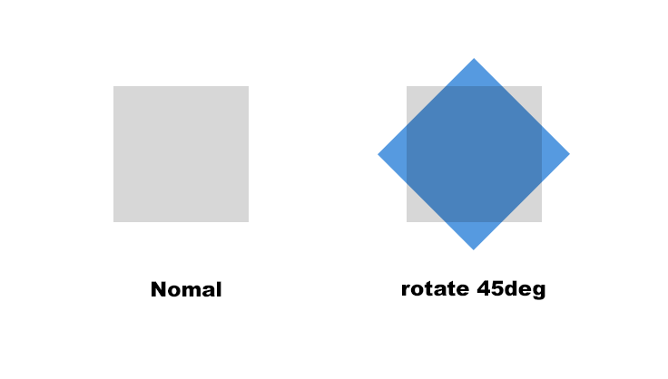
        ```css
          .rotate{
            transform: rotate(45deg);
          }
        ```
    - **rotateX**
      - 해당 요소를 주어진 각도만큼 x축을 기준으로 회전시킨다.
        **45도 예제**
        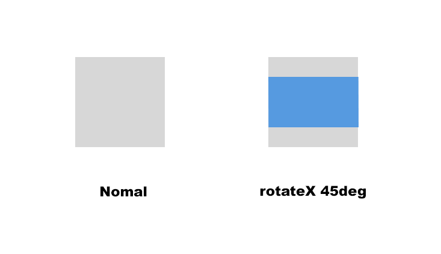

        ```css
          .rotate{
            transform: rotateX(45deg);
          }
        ```
    - **rotateY**
      - 요소를 변형하지 않고 Y축을 중심으로 회전시킴. 이동량은 지정된 각도이며, 양수이면 시계 방향으로, 음수이면 시계 반대 방향으로 이동함. 회전축은 변환 원 CSS 속성으로 정의 된 원점을 지남.
        **45도 예제**
        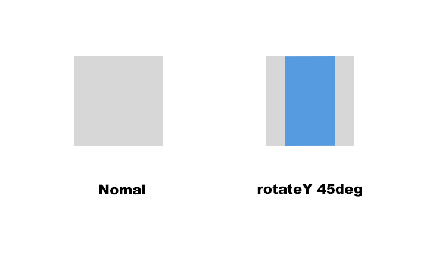

        ```Html
          <p>foo</p>
          <p class="transformed">bar</p>
        ```
        ```css
          p { 
            width: 50px;
            height: 50px;
            background-color: teal;
          }
          .transformed{
            transform: rotateY(60deg);
            background-color: blue;
          }
        ```
    - **translateX**
      - 요소를 평면에서 수평으로 이동. 수평으로 이동하는 정도를 정의하는 <길이>라고 특징짓는다.
        **45도 예제**
        .gif)
        ```html
          <p>foo</p>
          <p class="transformed">bar</p>
          <p>foo</p>
        ```
        ```css
          p { 
            width: 50px;
            height: 50px;
            background-color: teal;
          }
          .transformed {
            transform: translateX(10px);
            background-color: blue;
          }
        ```
    - **translateY**
      - CSS 기능면에 수직으로 length 를 얼마나 이동시킬지 정의한다.
        **45도 예제**
        .gif)
        ```html
          <p>foo</p>
          <p class="transformed">bar</p>
          <p>foo</p>
        ```
        ```css
          p { 
            width: 50px;
            height: 50px;
            background-color: teal;
          }
          .transformed {
            transform: translateY(10px);
            background-color: blue;
          }
    - **translateZ**
      - 3차원 공간의 Z축을 따라 이동시킨다. 이 변환은 Z축으로 length를 얼마나 이동시킬지 정의한다.
        ```html
          <p>foo</p>
          <p class="transformed">bar</p>
        ```
        ```css
          .transformed {
            /* Adding a perspective to create a 3d space */
            /* The user is looking "from" 500px and we */
            /* push the element forward (toward the user) */
            /* by 200px */
            transform: perspective(500px) translateZ(200px);
          }
        ```
    - **transform-style: preserve-3d**  
      - 요소에 변형을 적용할 때 그 변환이 자식(child) 요소들에게도 적용될지 안 될지를 설정한다.
      - preserve-3d
        - preserve-3d 값을 사용하면 요소를 평면화하는 대신 3D 공간에 배치할 수 있다.
        - IE는 Microsoft Edge부터 값 지원
    - **transform-origin**
      - 정의 : 원점의 위치를 지정한다. 기본값은 엘리먼트의 왼쪽(left) 위(top)이지만, 수정이 가능하다. 회전(rotation), 확대/축소(scaling), 비틀기(skewing) 같이 한 점을 기준으로 수행되는 변환에 대해서 이 속성을 지정할 수 있다.
      - 속성
      ```css
        /* x-offset y-offset */
        transform-origin: 3cm 2px;

        /* x-offset-keyword y-offset-keyword */
        transform-origin: right top;

        /* x-offset y-offset z-offset */
        transform-origin: 2px 30% 10px;

        /* x-offset-keyword y-offset-keyword z-offset */
        transform-origin: right bottom 2cm;
      ```
      > keyword    value
      > left    0%
      > center    50%
      > right    100%
      > top    0%
      > bottom    100%
      - 요소의 변형에 대한 원점을 수정할 수 있다.
      - transform-origin 속성은 하나 둘 또는 세 개의 값을 사용하여 지정할 수 있다.
        ```css
          .box {
            transform: rotate(360deg);
            transform-origin: top left;
          }
        ```
      - 위 속성 적용시, 왼쪽위를 기준으로 rotate(360deg)속성이 적용된다.
    - **3D transform 예제 그림**
      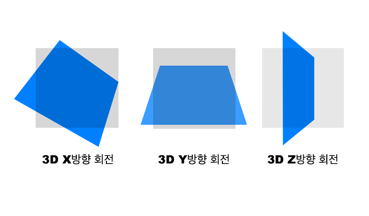
    - **transform 속성 브라우저 호환성**
      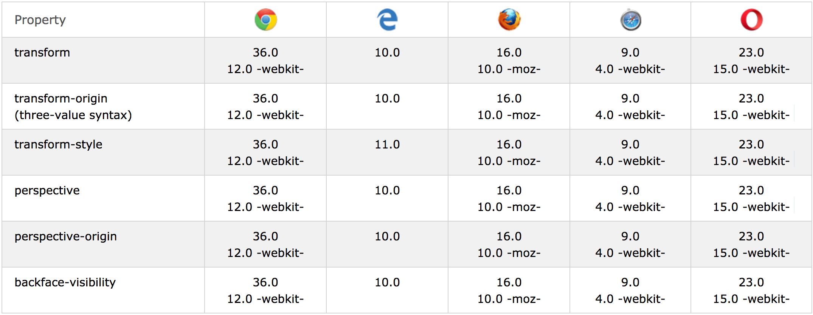
    - **backface-visibility**
      - 정의
        - CSS 의 backface-visibility속성은 요소의 뒷면이 사용자에 접한 때 뒷면을 표시할지 여부를 결정합니다.
        - 이 속성은 원근감 ( perspective )이없는 2D 변환에 효과를주지 않는다.
        - 3D 변형과 연관되어 있으며, 입체적인 모습의 뒷면의 가시성을 결정하는 속성이다.
        - rotate 와 같은 변형이 이루어졌을 때, 뒷면을 숨기거나 보여지게 할 수 있다.
      - 속성
        - hidden
        - visible
      ```css
        backface-visibility: visible;
        backface-visibility: hidden;
      ```
      - 예시
        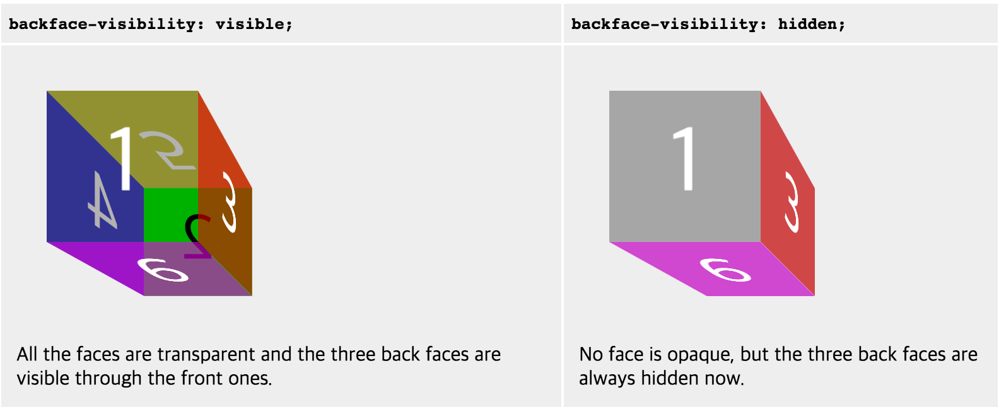
      - [Codepen 참고 링크](http://codepen.io/uzugoer/pen/oXPqPe)

    - **perspective**
      - 정의
        - perspective속성은 3D배치 된 요소에 원근감을 주어 평면과 사용자 사이의 거리를 결정한다. z > 0 인 3D 요소는 더 크고 z <0 인 3D 요소는 더 작아진다. 효과의 강도는 이 속성의 값에 따라 결정된다.
        - 중심은 소실점을 기본으로 하며, perspective-origin으로 변경 가능하다.
      - 속성
      ```css
        perspective: none;
        perspective: 절대 길이px/em;
      ```
      - 예시
        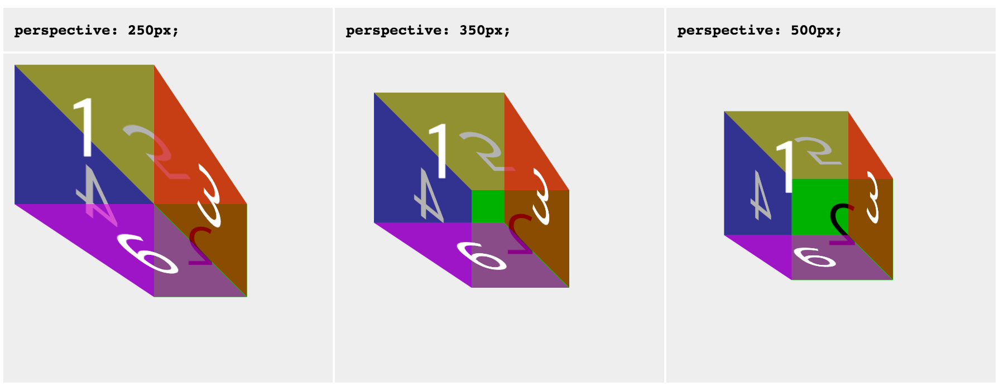
    - **perspective-origin**
      - 정의 : perspective-origin속성은 사용자의 보는 위치를 결정
      - 속성
      ```css
        perspective-origin: x-position y-position;
      ```
      - 예시
        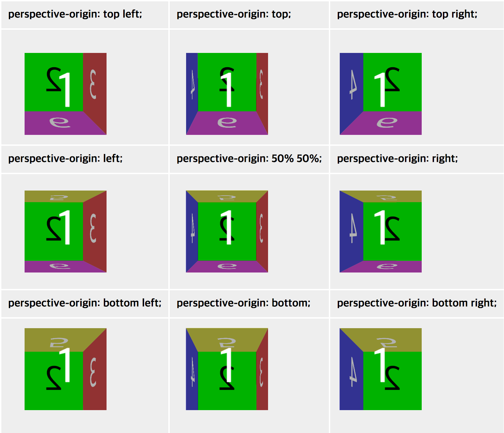
    - **transform-box**
      - 정의 : transform-box속성 transform과 transform-origin속성에 관련한 레이아웃 상자를 말한다.
      - 속성
      ```css
        transform-box: border-box;
        transform-box: fill-box;
        transform-box: view-box;
        /* transform-style */
      ```
    - **transform-style**
      - 정의 : transform-style속성은 요소의 자식 요소가 3D 공간에 배치되는지 평면에 배치되는지를 결정한다.
      - 속성
      ```css
        transform-style: preserve-3d;
        transform-style: flat;
      ```
    - **transform함수**
      - transform : scale() – 요소를 X축이나 Y축으로 확대/축소하기
      ```css
        /*scale은 원본크기를 1로 기준으로 하고, 1보다 크면 확대, 1보다 작으면 축소됩니다.*/
        transform: scaleX(x축 비율);          // x축으로 확대/축소
        transform: scaleY(y축 비율);          // y축으로 확대/축소
        transform: scale(x축 비율, y축 비율); // x축, y축으로 확대/축소
      ```
      - transform: rotate() – 요소 회전하기
      ```css
        /*회전각도가 플러스값일 때는 시계 방향, 마이너스값일 때는 반시계 방향으로 회전합니다.*/
        transform: rotateX(ndeg);  // x축을 기준으로 n도 만큼 회전
        transform: rotateY(ndeg);  // y축을 기준으로 n도 만큼 회전
        transform: rotate(ndeg);   // n도 만큼 회전
      ```
      - transform: skew() – 요소를 X축이나 Y축으로 기울이기
      ```css
        /*skew는 지정한 각도만큼 웹요소를 기울입니다.*/
        transform: skewX(ndeg);           // x축으로 n도 만큼 기울이기
        transform: skewY(ndeg);           // y축으로 n도 만큼 기울이기
        transform: skew(x축ndeg, y축ndeg); // x축, y축으로 n도 만큼씩 기울이기
      ```
      - transform: translate() – 요소를 X축이나 Y축으로 이동
      ```css
        /*translate는 지정한 각도만큼 웹요소를 기울입니다.*/
        transform: translateX(x축 이동거리);             // x축으로 이동
        transform: translateY(y축 이동거리);             // y축으로 이동
        transform: translate(x축 이동거리, y축 이동거리); // x축, y축으로 동시 이동
      ```
  - [참조 링크]
    - [CSS z-index관련 쌓임 맥락(stacking context) 이야기](https://developer.mozilla.org/ko/docs/Web/CSS/Understanding_z-index/The_stacking_context)
    - [W3C School CSS3 transform Property](https://www.w3schools.com/cssref/css3_pr_transform.asp)
    - [MDN Transform](https://developer.mozilla.org/ko/docs/Web/CSS/transform)
    - [transform 브라우저 지원현황(호환성)](http://caniuse.com/#search=transform)

[목차](#목차)

------

# transition
  - **Syntax**
    - `transition`: none | transition-property | transition-duration | [transition-timing-function] | [transition-delay]
  - **property**
    - CSS3 transition은 지정된 duration 동안 특정 속성의 값이 변화 될 때 그 값의 변화가 부드럽게 변화하도록해준다.
    - 기본값: none
    - 상속: 안됨
    - 애니메이션: 불가능
    - `transition-property` : 트랜지션을 적용해야 하는 CSS 속성의 이름 혹은 이름
    - `transition-duration` : 트랜지션이 일어나는 지속 시간
    - `transition-timing-function` : 속성의 중간값을 계산하는 방법을 정의하는 함수
    - `transition-delay` : 속성이 변한 시점과 트랜지션이 실제로 시작하는 사이에 기다리는 시간
    - `여러 속성에 대해 transition 지정 할 때`
      ```css
        transition: height 3s ease-in-out 0s, padding 1s ease-in-out 0s;
      ```
  - **기본값**
    - `transition-property`: all
    - `transition-duration`: 0s
    - `transition-delay`: 0s
    - `transition-timing-function`: ease
  - **주의사항**
    - `transition-delay` : 0초일 경우 0이 아닌 0s로 명시
  
  - **예시**
  ```css
    .box {
        position: absolute;
        background: yellow;
        width: 100px;
        height: 100px;
        transition: height 1s;
    }
    .box:hover {
        height: 200px;
    }
    /*transition 속성 선언 위치는 .box:hover가 아니라 .box에 선언해야함*/
  ```

[목차](#목차)

------

# counter-increment
  - **Syntax**
    - `counter-inrement` : [none] | [variable-name] | [increment-integer(정수)]
  - **property**
    - CSS 카운터(변수 활용 가능)
      > - 기본값: none
      > - 상속: 안됨
      > - 애니메이션: 불가능
    - increment-integer : 1 (기본값);
    - increment-integer 값은 음수도 가능. 
      ```css
        h3 {
          counter-increment: chapter -3;
          /* chapter 변수 값 변화 : 0 -3 -6 -9 -12 */
        }
      ```
  - **예시**
    ```html
      <h3></h3>
      <h3></h3>
      <h3></h3>
      <h3></h3>
    ```
    ```css
      h3 {
        counter-increment: index;
        border: 1px solid gray;
      }
      h3::after {
        content: counter(index, decimal);
      }
    ```
  - **결과**
    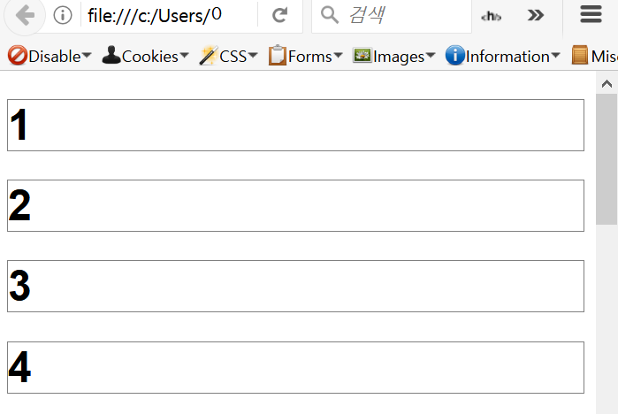

[목차](#목차)

------

# 단축 표기법
  ## Font
  - 웹폰트를 사용하면 디바이스 환경에 상관없이 똑같은 폰트로 보이게 할 수있다. 
    이미지를 사용하면 디바이스에 따라서 흐릿하게 보일 수도 있다. 용량도 크고, 유지보수도 힘들다. 
    점점 이미지를 최소화하고 텍스트로 대체하는 방향으로 나가고 있다.
  - **Syntax**
    - `font` : [font-style] | [font-variant] | [font-weight] | [font-size] | [line-height] | [font-family];
  - **다음 선언은:**
  ```css
    font-style: italic;
    font-weight: bold;
    font-size: 15px;
    line-height: 1.2;
    font-family: Arial;
  ```
  - **아래의 선언으로 단순화될 수 있습니다:**
  ```css
    font: italic bold 18px/1.2 Arial;
  ```
  - **주의사항**
    - `선언 순서`를 지켜야 한다.
      - 1. font-style | font-variant | font-weight
      - 2. font-size
      - 3. line-height
      - 4. font-family
    - `반드시 선언해야할 font 속성`
      - font-size
      - font-family
      ```css
        font: 15px/1.2 Arial;
        /*이때 line-height 앞에 슬래시(/)를 붙여주어야 한다.*/
      ```
  - [참조링크]
    [MDN CSS 단축속성](https://developer.mozilla.org/ko/docs/Web/CSS/Shorthand_properties)

[목차](#목차)

------

# line-height
  > `line-height`의 속성으로 줄간격 지정 가능하다.
  - **property**
    - `normal` : 기본값이며, 브라우저의 기본 속성을 따른다. 폰트(`font-family`)속성에 따라 다르지만 보통 1.2로 되어 있다.
    - `number` : `font-size`를 기준으로 설정한 숫자와의 배율로 적용된다. 대부분의 경우 숫자를 사용하는 것이 가장 문제 없이 동작한다.
    - `length` : px,pt,em 등의 값을 직접 할당할 수 있다.
    - `percent` : 계산된(computed)`font-size`를 기준으로 설정한 %만큼의 배율로 적용된다.
    - `percent`와 `length`의 경우, 자식 엘리먼트가 계산된 값을 상속받게 되어 의도하지 않게 동작할 수 있다.
    - **음수 값은 불가**
    - **단위가 없는 숫자를 사용하는 것이 좋다.**
      > 단위가 포함된 값을 사용하면 자식 요소가 계산된 값(computed value)를 상속받는다.
      > 예를 들어, 부모 요소에서 아래와 같이 정의했다면
        ```css
          font-size: 20px;
          line-height: 150%;
        ```
      > 자식 요소는 `20 * 150%`인 `30px`을 상속받는다.
      > 자식 요소가 `font-size`를 재정의했더라도 자신의 사이즈에 관계 없이 부모 요소 폰트의 비율로 계산된 값을 상속받게 된다.
      > 반면, 아래와 같이 숫자를 사용했다면
        ```css
          font-size: 20px;
          line-height: 1.5;
        ```
      > 자식 요소는 자신의 폰트 사이즈에 1.5 배인 값으로 `line-height`를 설정한다.
      > 이와 같이, 단위가 없는 값을 사용하면 부모 요소에서 계산된 값 대신 비율을 그대로 상속받을 수 있으므로 가능하면 단위가 없는 값을 사용하는 것이 좋다.

      > 줄 간격을 지정하는 속성
        

      > CSS의 leading(행간)은 `font-size`와 `line-height`의 차이에 의해 결정된다. `line-height`와 `font-size`의 차이의 반만큼이 컨텐트 영역의 위/아래로 설정되면서 행간이 만들어진다.
  
  - [참조링크]
    - [꿀벌개발일지](http://ohgyun.com/572)

[목차](#목차)

------

# vertical-align
  > inline 요소 (inline, inline-block)를 수직 정렬하는 속성
  - **Syntax**
    - `vertical-align`: [baseline] | [length] | [percent] | [sub] | [super] | [top] | [middle] | [bottom] | [text-top] | [text-bottom];
  - **property**
    - `baseline` : 기본값으로 부모 요소의 기준선(baseline)에 맞춘다.
    - `length` : px, cm 등으로 0px는 baseline과 같은 값이고, 음수값으로도 설정 가능하다.
    - `percent` : line-height의 백분율로 값을 지정할 수 있으며, 0%는 baseline과 같은 값이고 length와 마찬가지로 음수값도 설정 가능하다.
    - `sub` : 부모 요소의 아래첨자 기준선에 맞춘다.
    - `super` : 부모 요소의 위첨자 기준선에 맞춘다.
    - `top` : 요소의 맨 위를 줄에서 가장 큰 요소의 맨 위에 맞춘다.
    - `middle` : 부모 요소의 중앙에 위치한다.
    - `bottom` : 요소의 맨 아래를 줄에서 가장 낮은 요소에 맞춘다.
    - `text-top` : 요소의 맨 위를 부모 font의 맨 위에 맞춘다.
    - `text-bottom` : 요소의 맨 아래를 부모 font의 맨 아래에 맞춘다.

[목차](#목차)

------

# cursor
  > 해당 태그 위에 위치하는 마우스 커서의 모양 지정하는 속성
  - **Syntax**
    - `cursor`: [auto] | [default] | [pointer] | [wait] ;
  - **property**
    - `auto` : 기본값으로 브라우저가 자동으로 설정한다.
    - `default` : 기본값(화살표)
    - `pointer` : 클릭시의 마우스(손가락 모양)
    - `wait` : 로딩중인 마우스
  - [참조 링크](https://www.w3schools.com/cssref/pr_class_cursor.asp)

[목차](#목차)

------

# letter-spacing
  > 글자 사이의 간격을 지정한다.
  - **Syntax**
    - `letter-spacing`: [normal] | [length] | [initial] | [inherit] ;
  - **property**
    - `normal` : 단어 사이의 여백을 없엔다.
    - `length` : 단어들 사이의 여백의 길이를 설정한다.
    - `initial` : default
    - `inherit` : 부모 요소에서 상속한다.

[목차](#목차)

-----

# text-indent
  > 글자를 들여쓰기 한다.
  - **Syntax**
    - `text-indent` : [length] | [initial] | [inherit] ;
  - **property**
    - `length` : px, pt, cm, em 등 단위로 된 숫자로 들여쓰기를 설정한다.
    - `%` : 부모 넓이에 비례한 %로 들여쓰기를 설정한다.
    - `initial` : default값으로 설정한다.
    - `inherit` : 부모 요소의 속성값을 상속 받는다.

[목차](#목차)

------

# font-weight
  > 글꼴 굵기를 지정한다.
  - **Syntax**
    - `font-weight`: [normal] | [bold] | [bolder] | [lighter] | [number] | [initial] | [inherit];
  - **property**
    - `normal` : default값
    - `bold` : 진하게 표시
    - `bolder` : 부모 요소에서 상속된 굵기보다 진하게 설정한다.
    - `lighter` :  부모 요소에서 상속된 굵기보다 흐리게 설정한다.
    - `number`
      - 100 ~ 300 : normal 보다 흐린 글씨
      - 400 : normal과 동일
      - 500 ~ 600 : normal 보다 진한 글씨
      - 700 : bold와 동일
      - 800 ~ 900 : bold보다 진한 글씨
    - `initial` : default 값
    - `inherit` : 부모 요소에서 상속

[목차](#목차)

------

# radial-gradient
  > 원형 그라디언트 표현
  ```css
    #grad {
      background: radial-gradient(circle at top right, #ffffff 0%, #000000 100%);
    }
  ```

[목차](#목차)

------

# white-space
  - **Syntax**
    - `white-space`: [normal] | [nowrap] | [pre] | [pre-line] | [pre-wrap] | [initial] | [inherit];
  - **property**
    - `normal` : 기본(default) 값으로 콘텐츠가 요소의 너비를 초과할 경우 개행된다.
    - `nowrap` : inline 요소가 개행하지 못하게 한다. 부모 요소보다 커져도 강제로 가로 상태를 유지시킨다. 적용 시 가로배치 가능.
  - [참조링크]
    - [WEBDIR](http://webdir.tistory.com/409)
    - [w3schools](http://www.w3schools.com/cssref/pr_text_white-space.asp)

[목차](#목차)

------

# text-shadow
  - **요약**
    - `text-shadow` 는 텍스트에 그림자(shadow)를 표현하기 위한 속성이다. 콤마(,)로 구분된 그림자 설정정보 리스트가 텍스트와 엘리먼트(element) `text-decorations` 속성에 적용될 수 있다.
    - 각각의 그림자(shadow)에는 색상(color, 생략가능)값, blur범위(blur radius, 생략가능)값들과 함께 텍스트로부터의 위치값(offset)이 설정된다.
  - **Syntax**
    - `text-shadow`: color, x, y, blur;
  - **property**
    - `x` : 수평 그림자의 offset 값으로 반드시 필요하다.
    - `y` : 수직 그림자의 offset 값으로 반드시 필요하다.
    - `blur` : 그림자 가장자리를 부드럽게 처리하는 정도를 나타나매 선택적 값이다. 0이면 가장 날카롭게 처리한다.  
  - **예시**
    - 그림자를 이용한 테두리 만들기
      ```css
        text-shadow: 1px 0px 0 #000, 0px 1px 0 #000, -1px 0px 0 #000, 0px -1px 0 #000;
      ```
    - 적용 전  
         
    - 적용 후    
        
    - 그림자를 중복하여 두꺼운 그림자 만들기
      `text-shadow: 1px 1px 0 #000, 2px 2px 0 #000, 3px 3px 0 #000;`  
      
  - [참조링크]
    - [WEBDIR](http://webdir.tistory.com/410)

[목차](#목차)

------

# border-radius
  - **요약**
    - CSS의 `border-radius` 속성에는 둥근외곽선(rounded border)를 표현하는 방법이 정의되어 있다. 하나 혹은 두개의 반지름을 설정하여 각각 모서리의 굴곡을 설정할 수 있기 때문에, 원 혹은 타원의 모양으로 정의가 가능하다.  
    
  - **Syntax**
    - `border-radius`: [반지름 크기px] | [반지름 크기%];
  - **단축속성(shorthand)**
    - `border-top-left-radius` : 왼쪽 상단 모서리
    - `border-top-right-radius` : 오른쪽 상단 모서리
    - `border-bottom-right-radius` : 오른쪽 하단 모서리
    - `border-bottom-left-radius` : 왼쪽 하단 모서리
  - [참조링크]
    - [MDN](https://developer.mozilla.org/ko/docs/Web/CSS/border-radius)

[목차](#목차)

------

# box-shadow
  > box-shadow 속성은 콘텐츠의 그림자를 설정한다.
  > - 기본값: none
  > - 상속: 안됨
  > - 애니메이션: 가능
  > - 버전: CSS3
  - **Syntax**
    - `box-shadow` : [none] | [h-shadow] | [v-shadow] | [blur] | [spread] | [color] | [inset] | [inherit];
      ```css
        box-shadow: 5px 5px 5px 0 rgba(0,0,0,0.5);
      ```
  - **property**
    - `none` : 박스 그림자를 적용하지 않는다.
    - `h-shadow` : 그림자의 수직(X축) 거리를 나타낸다.
    - `v-shadow` : 그림자의 수직(Y축) 거리를 나타낸다.
    - `blur` : 그림자의 흐림정도를 나타낸다.
    - `spread` : 그림자의 거리를 나타낸다.
    - `color` : 그림자의 색을 나태낸다.
    - `inset` : 그림자를 내부에 적용할 수 있다.
    - `inherit` : 그림자의 속성 값을 상위요소한테 상속받는다.
  - [참조링크]
    - [w3school](https://www.w3schools.com/cssref/css3_pr_box-shadow.asp)

[목차](#목차)

------

# calc() 함수
  > calc()을 이용하여 대상 사이즈나 형상을 결정하는 값을 계산할 수 있다. 
  > \<length>, \<frequency>, \<angle>, \<time>, \<number>, \<integer> 값을 사용하는 어느 곳에서든 사용 가능하다.
  - **Syntax**
    - `property` : calc(expression);
      ```css
        .banner{
          width: calc(100% - 80px);
        }
      ```
  - **주의사항**
    - 내부에 입력할 수 있는 표현식은 +, -, *, /  사칙 연산
    - 계산의 진행 방향은 왼쪽에서 오른쪽
    - \+ 와 – 는 반드시 앞뒤에 공백 삽입 필요.
    - 사칙 연산과 마찬가지로 * 와 / 를 우선 연산
    - 길이의 값이 음수가 되는 경우 결과 값은 0 (예 : width: calc(5px - 10px); → width : 0; )
    - 연산시 다른 단위의 값 사용가능 (예 : calc(100% - 80px))
  - [참조링크]
    - [브라우저 지원 현황 확인](http://caniuse.com/#feat=calc)
    - [MDN CSS Reference](https://developer.mozilla.org/ko/docs/Web/CSS/calc)

[목차](#목차)

------

# Quotes 속성
  > `quotes` : `q` 태그의 before, after에 추가할 인용부호를 지정하는데 사용된다.    ***(IE8 이하 지원 안함)***
  ```html
    <q> 패스트캠퍼스 프론트엔드 </q>
  ```
  ```css
    q{
      quotes: "<" "***";
    }
  ```
  > 결과 화면
    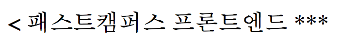

[목차](#목차)

------

# IconFont
  - **특징**
    - 하나의 글꼴에 다양한 문자(아이콘)을 넣어 두고 이를 호출해 사용할 수 있다.
    - 확장 가능한 벡터 그래픽을 이용하기에 모든 아이콘이 어떠한 크기로도 변경 가능하다.
    - CSS로 가능한 어떠한 작업도 가능하다.
    - 아이콘 폰트 제공업체에서 해당 폰트에 대한 유니코드를 지원한다면 모든 요소에 유니코드 형태로 삽입가능 하며, 로컬에서도 이를 사용할 수 있다.
    - 웹폰트의 구형브라우저 지원사항이 통일되지 않아 여러가지 폰트 형식을 준비해야 한다.  
  - **사용 방법**
    [fontello](http://fontello.com/) 이용  
    - 폰텔로 사이트에서 원하는 아이콘 다운로드
    - 다운 받은 font폴더안의 파일들을 복사해서 내 프로젝트 font폴더에 추가
    - 다운 받은 css폴더에 있는 fontello.css 파일을 열어서 @font-face를 복사해 온 후 font-face경로를 내 프로젝트의 font폴더 경로로 수정한다.
    - 아이콘 폰트를 사용할 가상요소의 content값을 fontello.css 파일 내에 있는 content값으로 바꾸면 아이콘이 적용된다.
  - [참조링크]
    - 기타 아이콘폰트 사이트 : [FontAwesome](http://fontawesome.io/)
    - [WEBDIR](http://webdir.tistory.com/476)
    - [특수문자 표](http://entitycode.com/#featured-content)

[목차](#목차)

------

# CSS에서 Fontello 아이콘 폰트 적용하기
  - Fontello란?
    - CSS 라이브러리 중 하나인 fontello는 icon fonts generator 입니다. 
    - 쉽게말해서, 여러 아이콘을 폰트로 제공하는 서비스입니다.
  - Fontello 사용 방법
    - 먼저 폰텔로 공식 홈페이지에 접속 합니다.
    [Fontello.com](http://Fontello.com) 접속하면 그림과 같이 보여 집니다.
    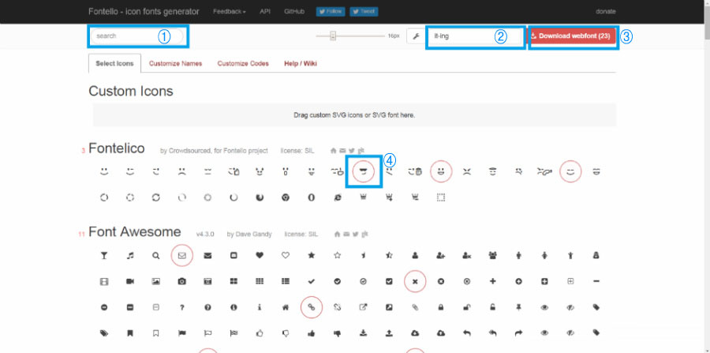
    - 1. 원한는 키워드를 넣어 검색을 할 수 있는 검색바 입니다.
    - 2. 원하는 파일명 (비워둘 경우 Fontello로 설정됩니다.)
    - 3. 선택한 아이콘을 다운 수 있습니다.
    - 4. 자신이 원하는 아이콘을 선택합니다.
    - 그림에 3번 처럼 다운로드를 클릭하여 저장 폴더에 받은 후 압축 해제 css 폴더를 열어 봅니다.
      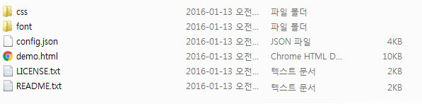
      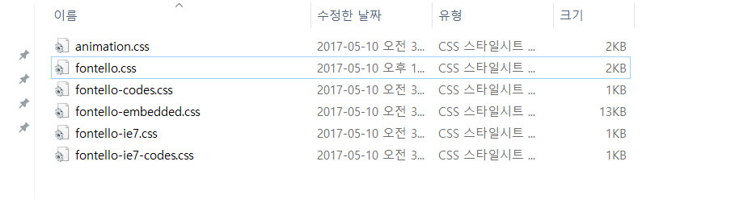
    - css폴더 안에서 fontello.css 파일을 vs code로 열어 다음과 같이 css 파일 상단에 적용 합니다.
      ```css
        @font-face {
          font-family: 'fontello';
          src: url('../font/fontello.eot?9350373');
          src: url('../font/fontello.eot?9350373#iefix') format('embedded-opentype'),
              url('../font/fontello.woff2?9350373') format('woff2'),
              url('../font/fontello.woff?9350373') format('woff'),
              url('../font/fontello.ttf?9350373') format('truetype'),
              url('../font/fontello.svg?9350373#fontello') format('svg');
        }
      ```
  - **예시**
  ```css
    .root1::before{
      content: "\e801";
      font-family: "fontello",sans-serif;
    }
    .root2::before{
      content: "\e802";
      font-family: "fontello",sans-serif;
    }
    .root3::before{
      content: "\e803";
      font-family: "fontello",sans-serif;
    }
    .root4::before{
      content: "\e804";
      font-family: "fontello",sans-serif;
    }
    .root5::before{
      content: "\e805";
      font-family: "fontello",sans-serif;
    }
  ```
  - **적용 결과**
    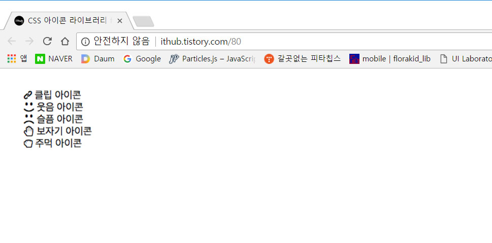

[목차](#목차)

------

# width 와 max-width의 차이점
  > <h4> width 값을 100%로 설정할 경우 </h4> : 창의 크기를 줄이거나 늘리면 창의 너비에 맞춰 크기가 증감한다.
  > <h4> width 값을 아무것도 지정하지 않은 경우 </h4> : 창의 크기를 줄이거나 늘려도 이미지 크기에 아무런 변화가 없다.
  > <h4> width 값을 100%로 지정한 경우 </h4> : 창의 크기를 줄이면 창의 너비에 맞춰 크기가 감소하지만, 창의 크기를 키울 때는 원래 이미지 크기보다 커지지는 않는다.
  - [참조링크]
    - [yucalip의 T-story 블로그](http://ccuram.tistory.com/29)

[목차](#목차)

------

[Index바로가기](https://github.com/seromkim1005/study)