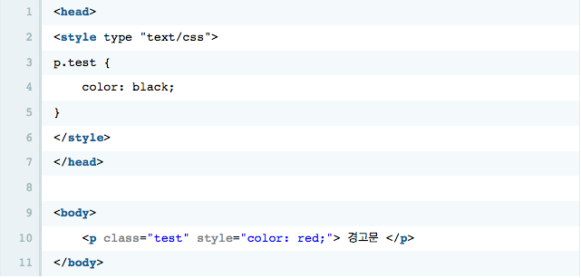
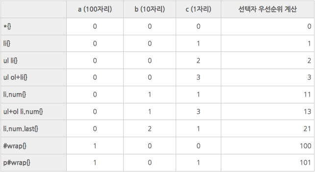

# 목차
  1. []()
  2. []()
  3. []()
  4. []()
  5. []()
  6. []()
  7. []()
  8. []()
  9. []()
  10. []()
  11. []()
  12. []()
  13. []()
  14. []()
  15. []()
  16. []()
  17. []()
  18. []()
  19. []()
  20. []()
  21. []()
  22. []()
  23. []()
  24. []()
  25. []()
  26. []()
  27. []()
  28. []()
  29. []()
  30. []()
  31. []()
  32. []()
  33. []()
  34. []()
  35. []()
  36. []()
  37. []()
  38. []()
  39. []()
  40. []()
  41. []()
  42. []()
  43. []()
  44. []()
  45. []()
  46. []()
  47. []()
  48. []()
  49. []()
  50. []()

------

# CSS Selector(선택자) 우선순위
  - CSS스타일을 적용하는데는 여러가지 방법을 사용하게 되면 `스타일이 충돌`할 수 있습니다. 그렇기 때문에 각 `원천 소스간, 선택자 간의 우선순위`를 알아야 한다.

## 규칙
  - **후자 우선**  
    - 동일한 선택자의 경우 나중에 선언된 스타일이 적용된다.
      ```css
        /*color는 red값이 적용*/
        p {color: skyblue};
        p {color: red};
      ```
    - 만약 충돌하는 두 스타일들이 같은 원천 소스를 가지거나 선택자 우선순위가 같다면 `가장 마지막에 지정된 스타일이 우선` 적용된다.
    
    - 이 경우 "경고문"이라는 텍스트는 가장 마지막에 지정된 스타일이 적용되어 빨간색으로 출력된다.

  - **구체성**  
    - 선택자 구체성 점수가 높은 스타일 우선 적용
    - 점수가 동일한 경우 나중에 선언된 스타일이 적용된다.  
  - **선택자 구체성 우선순위 계산 (specificity 계산)**
    - a = 선택자중 ID의 수를 세어 100자리에 놓는다,
    - b = 선택자중 가상 클래스와 클래스의 수를 세어 10자리에 놓는다.
    - c = 선택자중 엘리먼트의 수를 세어 1의 자리에 놓는다.
    - d = 가상 엘리먼트는 무시한다.

    - 가상 엘리먼트와 가장클래스들은 각각 일반적인 엘리먼트와 클래스와 같이 간주된다.

    - id(#) 100점
    - class(.) 10점
    - tag 1점
      ```css
        .main-menu ul{
          background: aqua;
        }
        /*.main-menu의 첫 번째 하위메뉴*/
        .about-html{
          background: yellow;
        }
      ```
    - `.main-menu ul`의 구체성 점수는 11점, `.main-menu`(10점)+`ul`(1점)  
    - `.about-html`의 구체성 점수는 10점이므로
    - 구체성 점수가 더 높은 `background: aqua`스타일이 적용된다.

  - **선택자 구체성 : 사용자 스타일시트 우선 !important**
    - 작성자측의 스타일시트보다 `사용자 측의 스타일시트를 우선`적으로 적용한다.
    - `!important`는 구체성 점수와 관계없이 최우선으로 `!important`가 선언된 스타일을 적용시킨다.
    - !important 선언을 한 사용자 스타일  > !important 선언을 한 작성자 스타일 > 작성자 스타일 > 사용자 스타일 > User Agent 선언 (브라우저 자체의 선언)
      ```css
        /*구체성 점수는 낮지만 강제로 최우선 적용*/
        .about-html{
          background: yellow!important;
        }
      ```
      
    - 예를들어 다음과 같은 경우를 살펴보면
      ```css
        <style type="text/css">
        p { color: gray;}
        p.wrap { color: black;}
        p#wrap { color: red;}
        </style>
        <p class="wrap" id="wrap">CSS Dictionary </p>
      ```
    - 이 경우 위 세가지 스타일중 선택자 우선순위가 가장 높은 p#wrap 가 적용된다.
    - (p=1 , p.wrap=11 , p#wrap=101)

  - [참조링크]
    - [디자인수지](http://blog.naver.com/PostView.nhn?blogId=sujji9&logNo=220730272669)
    - [w3](https://www.w3.org/TR/css3-selectors/#specificity)
    - [생활코딩 CSS적용 우선순위](https://opentutorials.org/module/484/4149)
    - [CSS 선택자(Selector)와 우선 순위(티스토리)](http://circlash.tistory.com/570)

------

[Index바로가기](https://github.com/seromkim1005/study)