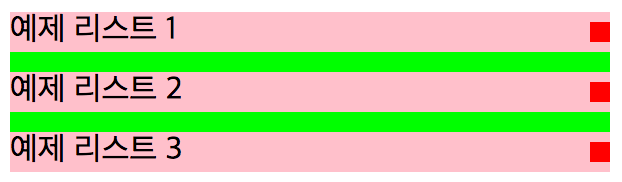

# List 중앙 정렬 방법
  - **예제 1번**
    - float: right; 와 margin-top: 값; 을 사용하는 방법
    ```html
      <ul class="sample1">
        <li>예제 리스트 1 <span></span></li>
        <li>예제 리스트 2 <span></span></li>
        <li>예제 리스트 3 <span></span></li>
      </ul>
    ```
    ```css
      .sample1 li{
        height: 20px;
        line-height: 20px;
      }
      .sample1 li::after{
        content: "";
        display: block;
        clear: both;    
      }
      .sample1 span{
        float: right;
        display: block;
        width: 10px;
        height: 10px;
        margin-top: 5px;
      }
    ```
  - **예제 2번**
    - position: absolute;와 top: 50%; margin-top: -값;(음수) 을 사용하는 방법
    - margin-top의 값은 height의 값의 50%를 계산하여 넣어준다.
    ```html
      <ul class="sample2">
        <li>예제 2번의 리스트 1 <span></span></li>
        <li>예제 2번의 리스트 2 <span></span></li>
        <li>예제 2번의 리스트 3 <span></span></li>
      </ul>
    ```
    ​```css
      .sample2 li{
        position: relative;
        height: 20px;
        line-height: 20px;
      }
      .sample2 span{
        position: absolute;
        right: 0;
        top: 50%;
        margin-top: -5px; 
        display: block;
        width: 10px;
        height: 10px;
      }
    ```
  - **예제 3번** 
    - position: absolute; 와 top: 50%;와 transform: translateY(-50%); 을 사용하는 방법
    ```html
      <ul class="sample3">
        <li>예제 3번의 리스트 1 <span></span></li>
        <li>예제 3번의 리스트 2 <span></span></li>
        <li>예제 3번의 리스트 3 <span></span></li>
      </ul>
    ```
    ```css
      .sample3 li{
        position: relative;
        height: 20px;
        line-height: 20px;
      }
      .sample3 span{
        position: absolute;
        right: 0;
        top: 50%;
        transform: translateY(-50%);
        display: block;
        width: 10px;
        height: 10px;
      }
    ```
    