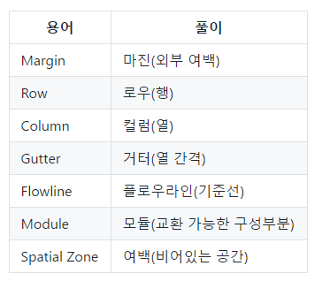
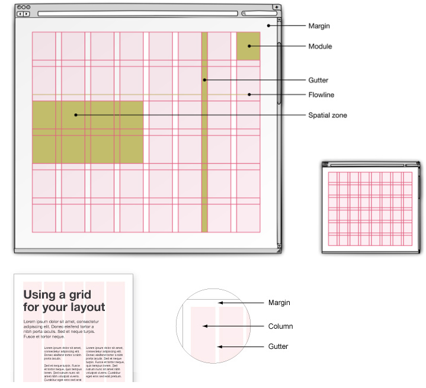
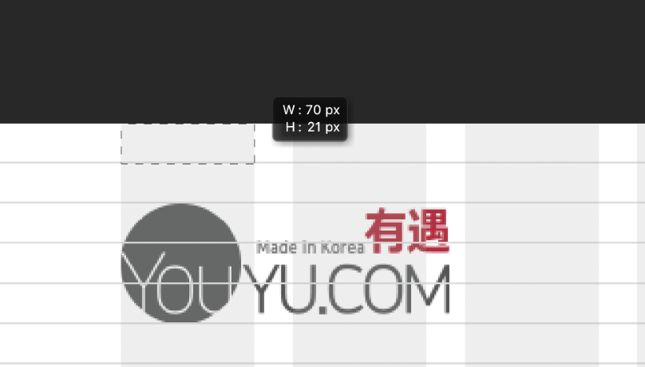
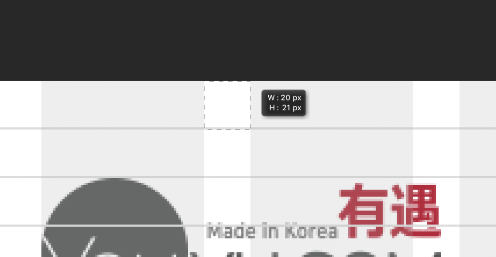
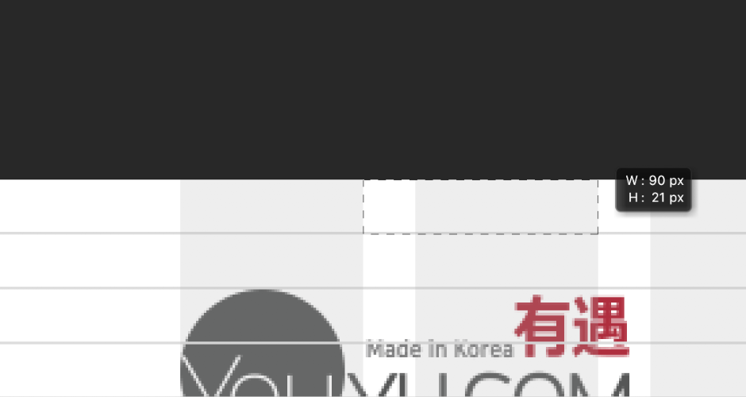
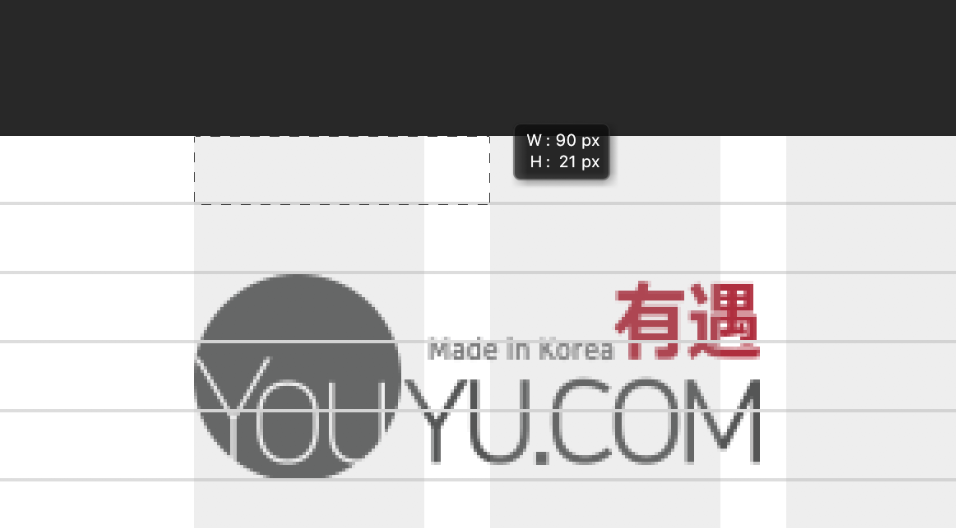
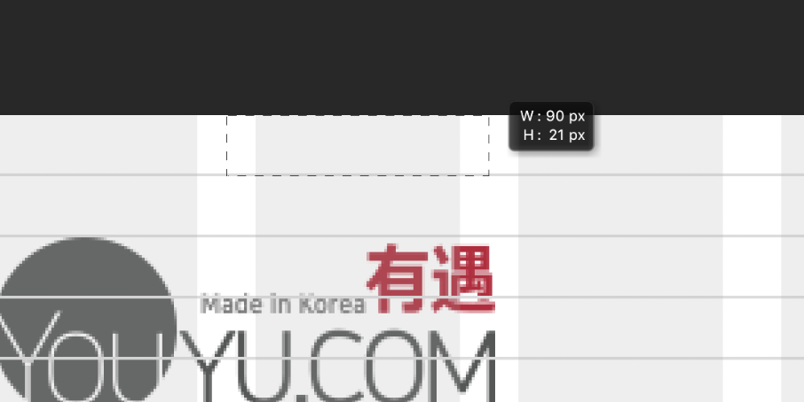

# 목차
  1. [grid](#grid)
  2. [Grid layout 기본 속성, 용어]()
  3. [Unit(유닛)]()
  4. [Gutter(여백)]()
  5. [반응형 Grid 와 유동형 Grid 시스템]()
  6. [Grid 시스템이란?]()
  7. [고정형 그리드 시스템(Static grid system)]()
  8. [반응형 그리드 시스템(Fluid grid system)]()
  9. [RWD 제작시 고려사항](#rwd_제작시_고려사항)
  10. [콘텐츠 전략](#콘텐츠_전략)
  11. [유연한 그리드 레이아웃](#유연한_그리드_레이아웃)
  12. [유연한 이미지/미디어]()
  13. [디바이스 픽셀 밀도](#디바이스_픽셀_밀도)
  14. [중단점/미디어 쿼리]()
  15. [isolate grid 기법](#isolate_grid_기법)
  16. [margin: [negative value]]()
  17. [scss를 이용한 isolate grid system 작성](#scss를_이용한_isolate_grid_system_작성)

------

# grid 

------

## Grid layout 기본 속성, 용어
  
  

[목차](#목차)

------

## Unit(유닛)
  - Grid의 가장 작은 레이아웃 요소
  

[목차](#목차)

------

## Gutter(여백)
  - Gutter의 종류에는 left, right, 그리고 split 방식이 있다.
  
  
  1. Left Gutter
    
  2. Right Gutter
    
  3. Split Gutter
    

[목차](#목차)

------

# 반응형 Grid 와 유동형 Grid 시스템

------

## Grid 시스템이란?
  - 화면의 폭을 몇 개의 Column(컬럼)으로 나누고, 그 중 일부 컬럼을 묶어서 하나의 Class로 간단히 지정하면, 해당 컬럼의 폭과 다른 (묶음) 컬럼과의 간격도 일정하게 유지되는 시스템이다.
  - 대표적으로 960 Grid System 이 유명하고, 주로 사용되는 시스템은 12 컬럼 기반이다.

[목차](#목차)

------

## 고정형 그리드 시스템(Static grid system)
  - 픽셀 기반 치수를 정의한다.
  - 특정 장치 viewport 에서 width와 height를 수동으로 조절해야 한다.
  - 다양한 화면 크기 및 장치에 대한 조정이 필요하다.

[목차](#목차)

------

## 반응형 그리드 시스템(Fluid grid system)
  - 최대 레이아웃 크기를 정의
  - 레이아웃을 쉽게 처리할 수 있도록 특정 수의 열로 나눈다.
  - 12컬럼을 주로 사용하며 3, 4컬럼으로 나뉘어지는 디자인이 좋은 편이다.

[목차](#목차)

------

# RWD 제작시 고려사항
  - `적응형 웹` : ‘적응형 웹’은 서버나 클라이언트에서 웹에 접근한 디바이스를 체크하여 그 디바이스에 최적화된 마크업을 호출. 최적화된 마크업은, 꼭 필요한 정보만을 노출시키며 디바이스에 최적화된 이미지를 사용하고 플래시를 사용하지 않고 자바스크립트를 이용하여 장치를 분석하고 그에 맞는 동작을 적용.
  - `반응형 웹`: 미디어 쿼리를 사용하여 화면의 크기를 확인하고 유연한 이미지와 그리드로 화면 크기의 변화에 따라 그에 맞은 크기가 됨. 새로운 웹 빌드를 추가하기 쉬우며 사이트를 재 구축해야하고 디바이스에 따라 성능이 저하될 수 있음.

[목차](#목차)

------

## 콘텐츠 전략
  - "mobile first" : desktop버전의 scaledown은 바람직하지 않다.
  - 1 column layout
  - main title을 크고 강하게
  - 일관된 디자인 전략을 고수
  - 눈에 보이지 않는 부분까지 고려
  - content first
    - 쌓임
    - 순서
    - 맞물림

[목차](#목차)

------

## 유연한 그리드 레이아웃
  - 유연한 컨텐츠 크기 : 비율(%단위)를 사용한다. (자식요소크기 / 부모요소크기 * 100).
  - subpixel problem
    - 원인 : 비율로 크기 처리시 픽셀 단위에 소수점 값이 생긴다. 이때 브라우저별 소수점 처리 방식이 달라 렌더링 된 결과물에서 차이가 발생. 원하지 않게 요소가 row에서 drop 됨.
    - 해결법 : isolate floating (margin-left로 위치지정. float:left와 margin-right:-100%로 눈에 보이는 요소 순서를 평등하게 만든다.)

[목차](#목차)

------

## 유연한 이미지/미디어
  - 컨테이너 요소의 폭에 맞춰 크기가 변경되는 이미지를 말한다.
  ```css
    .responsive-scale {
      width: 100%;
      height: auto;
    }
    .responsive-scale-bg {
      width: 100%;
      padding-bottom: 66.6666667%;
      background: url(/*이미지경로*/);
      background-size: cover;
    }
  ```
  - 재단이미지 : 컨테이너 요소의 폭에 맞춰 크기가 동적으로 잘려지는 이미지.
    - 재단이미지 방법 1
      ```css
        .responsive-crop {
          width: 100%;
          height: 960px;
          background-image: url(/*이미지경로*/) center top;
          background-size: cover;
        }
      ```
    - 재단이미지 방법 2
      ```css
        .responsive-container {
          position: relative;
          height: 120px;
        }
        .responsive-{
          position: absolute;
          left: 50%;
          width: 100%;
          height: auto;
          transform: translateX(-50%);
        }
      ```
    - 유연한 아이프레임
      ```css
        .responsive-container {
          position: relative;
          /* 4:3 = 75%,
              16:9 => 56.25%,
              21:9 = 42.857142857% */
          padding-bottom: 56.25%;
          height: 0;
          overflow: hidden;
          max-width: 100%;
        }
        .responsive-container iframe {
          position: absolute;
          top: 0;
          left: 0;
          width: 100%;
          height: 100%;
        }
      ```

[목차](#목차)

------

## 디바이스 픽셀 밀도
  - 물리적 단위 공간 (주로 대각선이 1인치인 정사각형을 이용)에 들어가는 픽셀의 양을 의미
  - RETINA display의 경우 픽셀밀도가 기존에 비해 두배로 올랐다.
  - 따라서 bitmap graphic은 device에 따른 픽셀 밀도를 고려해 줘야 한다.
  - window.devicePixelRatio 브라우저 내장 javascript의 함수 : 기기의 픽셀밀도값을 반환.
  - 디바이스 픽셀 밀도에 따라 디바이스별 UI 크기도 다르게 작업해야 함.
    - 1배수로 작업 후 대응 디스플레이에 따라 스케일 업 애샛 추출
    - 포토샵에서 작업시 큰 스마트오브젝트로 1배수로 스케일 다운하여 작업.
  - pt(애플), dp(Density-Independent Pixels 안드로이드) : 장치에 독립적인 단위.
  - 인식의 용이성 고려 : 다음 사항에 따라 UI의 크기가 달라야함.
    - input method
    - physical screen size
    - distance from screen

[목차](#목차)

------

## 중단점/미디어 쿼리
  - 중단점(break point)
    - mobile : 4 column
    - tablet : 8 column
    - desktop : 12 column
  - media query를 통해 같은 요소에 다른 스타일을 동적으로 지정할 수 있음

  - [참조자료]
    - [RWD Design Pattern]

[목차](#목차)

------

# isolate grid 기법

------

# margin: [negative value]
  - 해당 요소는 absolute 요소와 유사하게 작동한다
  - 단위가 백분율일 경우 부모상자의 width를 기준으로 한다.
    - margin-top, margin-bottom도 단위가 백분율일 경우 기준은 부모상자의 width다.
  - negative margin값을 이용한 그리드 시스템 basic idea
    - width와 height가 고정값인 부모상자 밑에
    - 모든 자식이 float: left, margin-right: -100% 를 가지면
    - 부모의 top-left 위치에 모두 겹친다.
    - absolute 요소 처럼...
    - 이때 margin-left: [positive value]로써 위치를 옮길 수 있다.
    ```css
      /* 모든요소 margin과 padding의 초기값이 0이라 가정 */
      부모요소 {
        width: 400px;
        height: 400px;
      }
      자식요소 {
        width: 100px;
        height: 100px;
        float: left;
        margin-right: -100%;
      }
      .to-right-[n] {
        margin-left: [value];
      }
    ```
  - border를 이용한 가짜 가운데 여백 트릭.
    - width와 height가 서로 동일한 고정값인 부모요소밑에
    - width와 height가 부모의 50%인 자식요소 4개를
    - 부모요소의 네 모서리에 각각 정렬시킨듯한 효과.
    ```css
      부모요소 {
        width: 500px;
        height: 500px;
        /* 음수 마진값 때문에 부모요소 밖으로 튀어 나간 자식요소의 border를 안보이게 한다 */
        overflow: hidden;
      }
      자식요소 {
        width: 50%;
        height: 50%;
        float: left;
        /* 이 border가 여백과 같은 역할을 한다 */
        border: 10px solid red;
        /* 음수 마진값 */
        margin: -10px;
      }
    ```
  - isolate grid 고정형
    - HTML 구조
    ```html
      <body>
        <div class="wrapper">
          <div class="row">
            <div class="column"></div>
            <!-- many other columns here -->
          </div>
          <!-- many other rows which have columns in each here -->
        </div>
      </body>
    ```
    - CSS
    ```css
      .wrapper {
        width: [number]px;
        margin: 0 auto;
      }
      .row {
        width: 100%;
        background: yellow;
      }
      .row::after {
        /* 자식 요소들이 absolute처럼 작용하게 되므로 부모요소의 높이를 잃지 않기 위해 이 가상요소가 필요하다. */
        content: "";
        display: table;
        clear: both;
      }
      .col {
        /* 전체 행 너비로 초기화 한다 */
        width: [number]px;
        /* 아래 두 프로퍼티로 absolute 요소처럼 작동하게 된다 */
        float: left;
        margin-right: -100%;
      }
      .column-[x] { /* 1 <= x <= n, n은 최대 칼럼 수 */
        /* 칼럼너비를 설정하는 스타일로 최대 n개의 시리즈를 이룬다 */
        width: (1column너비*x + 1gutter너비*(x-1))px;
      }
      .column-offset[x] { /* 1 <= x <= n, n은 최대 칼럼 수 */
        margin-left: (1column너비*x + 1gutter너비*(x))px;
      }
    ```
    - div.col tag에 필요한 스타일을 class의 값으로 붙이고 떼서 사용한다.

  - 유연한 isolate grid
    - html 구조는 고정형과 같다.
    - CSS
      ```css
        .wrapper {
          /* 너비를 백분율로... */
          width: [number]%;
          margin: 0 auto;
        }
        .row {
          width: 100%;
          background: yellow;
        }
        .row::after {
          content: "";
          display: table;
          clear: both;
        }
        .col {
          /* 너비를 백분율로... */
          width: [number]%;

          float: left;
          margin-right: -100%;
        }
        .column-[x] { /* 1 <= x <= n, n은 최대 칼럼 수 */
          /* calc 내부의 백분율 단위 표현식은 부모요소의 너비에 대한 부분으로 계산 될 것이다.*/
          width: calc(1colum너비의백분율값% * x + 1gutter너비의백분율값% * (x-1));
        }
        .column-offset[x] { /* 1 <= x <= n, n은 최대 칼럼 수 */
          /* calc 내부의 백분율 단위 표현식은 부모요소의 너비에 대한 부분으로 계산 될 것이다.*/
          width: calc(1colum너비의백분율값% * x + 1gutter너비의백분율값% * x);
        }
      ```
    - div.col tag에 필요한 스타일을 class의 값으로 붙이고 떼서 사용한다.

[목차](#목차)

------

# scss를 이용한 isolate grid system 작성

  - scss문법
    - 변수 선언
      ```scss
        $[variable name]: [value];
      ```
    - 컴파일된 css문서와 원본 scss 문서사이의 상관관계를 브라우저 개발자도구에서 표시하는 법. 
      - terminal명령 : node-sass sass/ -o css/ --source-map true
    - 변수 단순 할당(삽입)시 사용법
      ```scss
        #{$[variable name]}
      ```
      ```scss
        /* 단순 할당 표현 내에선 변수끼리 연산시킬수 있다. */
        #{$[variable name] + $[variable name]}
      ```
    - [SASS color control functions](https://robots.thoughtbot.com/controlling-color-with-sass-color-functions)
        ```scss
          $base-color: #AD141E;
        ```
        ```scss
          /* 명도를 어둡게, 밝게 */
          darken( $base-color, 10% )
          lighten( $base-color, 10% )

          /* 채도를 높게, 낮게 (선명하게, 탁하게) */
          saturate( $base-color, 20% )
          desaturate( $base-color, 20% )
        
          /* HSL 모델의 H 값을 변경 */
          adjust-hue( $base-color, 20% )

          /* 알파 값 변경 */
          rgba( $base-color, .7 )

          /* tint(흰색을 섞어 밝게... 즉 명도가 올라가고 채도가 떨어짐) */
          /* shade(검은색을 섞어 밝게... 즉 명도가 내려가고 채도가 떨어짐) */
          tint( $base-color, 10% )
          shade( $base-color, 10% )

          /* 인자1과 인자2의 색을 섞는다. 투명도도 고려된다. */
          /* 세번째인자만큼 인자1색을, 100-세번째인자 만큼 인자2색을 섞는다. */
          mix($color1, $color2, $weight:50%) 

          /* 아래와 같이 하나의 base-color를 설정해 놓고
          테마가 통일된 다양성을 줄 수 있다. */
          border: 1px solid darken($base-color, 20%);
          text-shadow: 0 -1px 0 darken($base-color, 10%);
          @include box-shadow(inset 0 1px 0 lighten($base-color, 20%));
        ```
    - 같은 이름의 sass변수 선언시 마지막에 선언한 것으로 이전 것들이 덮인다.
      ```scss
        $base-font-size: 16px;
        $base-font-size: 24px;
        /* $base-font-size는 24px 값을 갖는다. */
      ```
    - 디폴트 값으로 선언한 변수는 선언 순서에 상관없이 우선순위가 가장 낮다.
      ```scss
        $base-font-size: 16px
        $base-font-size: 24px !default;
        /* $base-font-size는 16px 값을 갖는다. */
      ```
    - 지역변수 : {} 안에서 선언한 변수는 {} 밖에선 참조할 수 없다.
      - {} 안에 스타일을 지정하면 부모-자식 관계를 의미한다. (nested)
        ```scss
          $brand-color: red;
          .wrapper {
            $brand-color: yellow;
            /* wrapper scope 내에선 brand-color가 지역변수로 덮인다 */
            clear: both;
            ul {
              list-style: none;
              padding-left: 0;
              margin: 0;
            }
            li {
            background: $brand-color; /* 값은 yellow */
            }
          }
          .container {
            color: $brand-color; /* 값은 red */
          }
        ```
    - 파일 import
      ```scss
        /* 통합 파일 내에 선언 */
        @import [path]/[filename] /* 확장자는 붙이지 않는다. */
      ```
      - import 파일 내용이 통합 파일 내의 선언문 위치에 복사된다.
      - import파일 이름이 [file name].scss 형태면 output 위치에 import 파일들도 빌드 한다. (import 파일이 하위 폴더에 있다면 output 위치에도 하위 폴더가 만들어진다.)
      - _[파일이름].scss 형태면 output 위치에 부분 파일들을 생성하지 않고 통합 파일에 코드가 전부 합쳐져 빌드 된다.
    - @mixin과 @include
      ```scss
        /* mixinEle 스타일은 CSS 결과파일엔 존재하지 않게 된다. */
        @mixin mixinEle {
          [property]: [value];
          [property]: [value];
          [property]: [value];
        }
        some-element {
          some-property : some-value;
          @include mixinEle;
          /* 빌드 후 css파일을 보면 include 자리에 mixinEle의 내용이
          교체되어 있다.*/
          
        }
      ```
    - @extend
      ```scss
        /* my-class 스타일은 CSS 결과파일에도 실존한다. */
        .my-class {
          border: 1px solid #aaa;
          border-radius: 10px;
          padding: 10px;
          background: #eee;
        }
        .event {
          margin: 10px;
          @extend .my-class
          /* CSS 결과 파일에서 위의 ".my-class" 뒤에 ".event"가 추가된다. */
        }
      ```
    - placeholder selector
      ```scss
        /* 위와 같은 코드에서 ".my-class"를 "%my-class"로 바꾼다. */
        %my-class {
          border: 1px solid #aaa;
          border-radius: 10px;
          padding: 10px;
          background: #eee;
        }
        .event {
          margin: 10px;
          @extend %my-class;
        }
        .favorite {
          box-shadow: 1px 1px 0 0 #000;
          @extend %my-class;
        }
        /* CSS 결과 파일에서 my-class 키워드가 사라지고 event와 favorite이 그 자리를 차지한다. */
      ```
    - 단위 추가/제거
      ```scss
        $width: 100;
        $height: 200px;
        .search {
          /* 단위 붙이기*/
          width: $width * 1px;
          /* 단위 빼기*/
          height: $height / 1px;
        }
      ```
    - for문
      ```scss
        @for $i from 1 to 5 { /* 1~4. to 대신 through 쓰면 1~5 */
          .col-#{$i} {
            width: 100px;
          }
        }
      ```
      **result:**
      ```scss
        .col-1 {
        width: 100px; }
        .col-2 {
        width: 100px; }
        .col-3 {
        width: 100px; }
        .col-4 {
        width: 100px; }
      ```
    - isolate grid에 for문 응용하기
      ```scss
        @for $i from 1 through 13 {
          .col-#{$i} {
            width: (100% / 12) * $i;
          }
          .col-offset-#{$i} {
            margin-left: (100% / 12) * $i;
          }
        }
      ```

[목차](#목차)
    
------

[Index바로가기](https://github.com/seromkim1005/study)