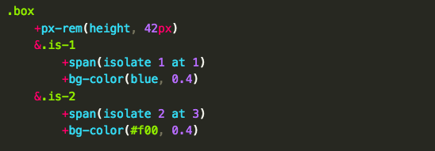
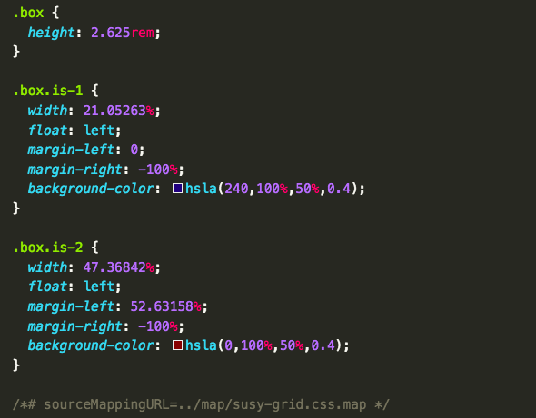
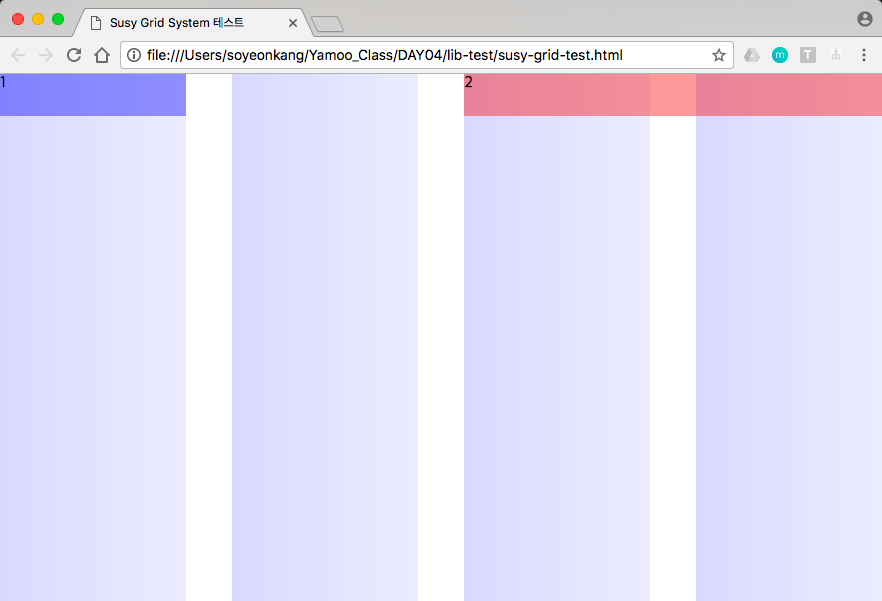

# Susy

------

# Susy 사용법

  1. 터미널 Susy 설치
    ```sh
      $ npm i -D susy
    ```
  2. node_modules 폴더 안의 susy 폴더를 현재 작업 중인 sass폴더로 옮긴다.
  3. _config.scss 파일 : 기본 설정을 위한 파일 (글로벌 설정)
    - **flow : 문서를 읽는 방향 설정**
      + 설정값 : ltr (left to right), rtl (right to left)
      + 기본값 : ltr
    - **math : float 레이아웃 설정 시, 유동(%) 또는 고정(px) 사용 유무 설정**
      + 설정값 : fluid, static (column-width 설정 필요)
      + 기본값 : fluid
    - **output : 레이아웃 출력 모드 설정**
      + 설정값 : float, isolate
      + 기본값 : float
    - **gutter position : 거터의 방향 설정**
      + 설정값 : after, before, split, inside, inside-static (column-width 설정 필요)
      + 기본값 : after
      ※ inside 설정은 Padding으로 처리됨
    - **container : 컨테이너 요소의 최대 가로 폭(max-width) 값을 설정**
      + 설정값 : auto, \<length\>
      + 기본값 : auto
    - **columns : 컬럼의 총 개수 설정**
      + 설정값 : 4, \<number\>, \<list\>
      + 기본값 : 4
    - **gutters : 거터의 폭 설정**
      + cf. 1/4 -> \<gutter-width\> / \<column-width\>
    - **column width : 컬럼의 가로 폭 설정**
      + 설정값 : false, null, \<length\>
      + 기본값 : false
    - **image : 그리드 이미지 설정**
      + 설정값 : hide, show, show-columns, show-baseline
      + 기본값 : hide
      ※ $base-line-height 설정 값에 따라 베이스라인을 그려줌.
    - **color : 그리드 컬럼 색상 설정**
      + 설정값 : rgba (#66f, .25), \<color\>
      + 기본값 : rgba (#66f, .25)
    - **output : 그리드 모드**
      + 설정값 : background, overlay
      ※ overlay 설정일 경우, 컨테이너 요소의 ::before 요소를 사용하여 오버레이 함.
  4. 믹스인 / 함수
    ```scss
      // 믹스인
      +container( auto | <length> )
      +span( <length> | ... )
      +gutters( <length> | ... )

      // 함수
      container( auto | <length> )
      span( <length> | ... )
      gutter( <length> | ... )
    ```

  1. Sass
    
  2. Css
    
  3. Rendering result
    

[go to top](#susy)
------

[Index바로가기](https://github.com/seromkim1005/study)