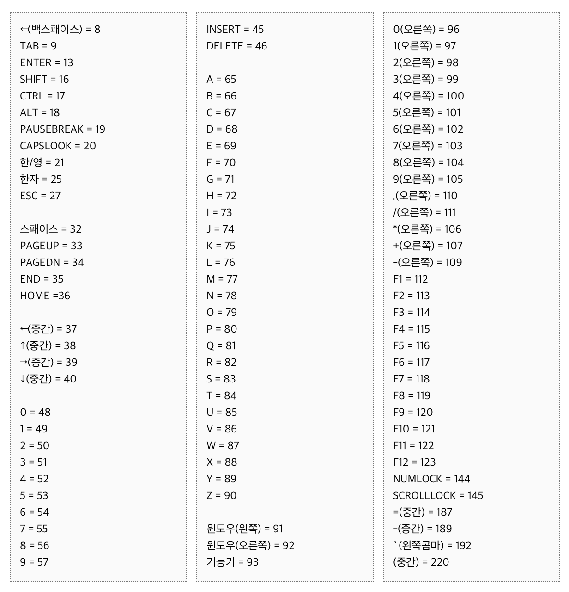
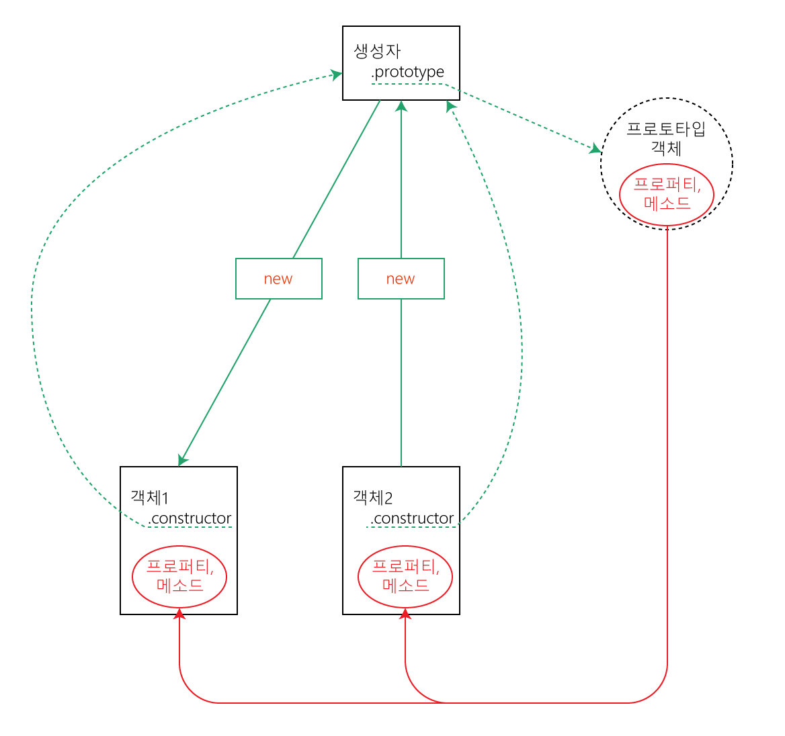

# 목차
  1. [javascript 기초](#javascript-기초)
  2. [javascript 란 무엇인가](#javascript-란-무엇인가)
  3. [javascript 의 이름이 만들어진 마케팅 적 이유](#javascript-의-이름이-만들어진-마케팅-적-이유)
  4. [ECMA Script 란 무엇인가](#ecma-script-란-무엇인가)
  5. [javascript 파일을 </body> 전에 불러오는 이유](#javascript-파일을--전에-불러오는-이유)
  6. [javascript 기본](#javascript-기본)
  7. [Keycode 값 (아스키 형식)](#keycode-값-아스키-형식)
  8. [javaScript 문법과 데이터 유형](#javascript-문법과-데이터-유형)
  9. [변수](#변수)
  10. [변수 선언](#변수-선언)
  11. [변수 이름 작성 규칙](#변수-이름-작성-규칙)
  12. [변수명 관례 (Naming convention)](#변수명-관례-naming-convention)
  13. [변수 범위(Scope)](#변수-범위scope)
  14. [호이스팅(Hoisting)](#호이스팅hoisting)
  15. [상수(Constant)](#상수constant)
  16. [데이터 유형 (Data Types) ES5 기준](#데이터-유형-data-types-es5-기준)
  17. [원시 데이터 유형(Primitive Data Types)](#원시-데이터-유형primitive-data-types)
  18. [참조 데이터 유형(Reference Data Types)](#참조-데이터-유형reference-data-types)
  19. [String 문자 유형의 데이터)](#string-문자-유형의-데이터)
  20. [엄격모드 - "use strict"](#엄격모드---use-strict)
  21. [데이터 유형 변경(자동) / (유)형 변환](#데이터-유형-변경자동--유형-변환)
  22. [동적 할당 언어인 javascript에서 유의할 점!](#동적-할당-언어인-javascript에서-유의할-점)
  23. [Single var pattern](#single-var-pattern)
  24. [자바스크립트 form 영역 엘리먼트 접근 방법](#자바스크립트-form-영역-엘리먼트-접근-방법)
  25. [console.group() 사용법](#consolegroup-사용법)
  26. [리터럴(Literal)](#리터럴literal)
  27. [배열 리터럴(Array Literal)](#배열-리터럴array-literal)
  28. [객체(Object)를 생성하는 정식 구문](#객체object를-생성하는-정식-구문)
  29. [배열(Array)](#배열array)
  30. [값 복사와 값 참조](#값-복사와-값-참조)
  31. [함수](#함수)
  32. [함수 객체와 기본 객체(Function object, Plain object)](#함수-객체와-기본-객체function-object-plain-object)
  33. [함수와 호이스팅(Hoisting)](#함수와-호이스팅hoisting)
  34. [함수 호출하기](#함수-호출하기)
  35. [if문 사용](#if문-사용)
  36. [논리 연산자 사용](#논리-연산자-사용)
  37. [함수 범위](#함수-범위)
  38. [Global Scope](#global-scope)
  39. [Local Scope](#local-scope)
  40. [기본 객체(Plain Object)](#기본-객체plain-object)
  41. [연산자(Operator)](#연산자operator)
  42. [증감 연산자](#증감-연산자)
  43. [할당 연산자](#할당-연산자)
  44. [modulo(%)의 응용](#modulo의-응용)
  45. [비교 연산자](#비교-연산자)
  46. [in](#in)
  47. [typeof](#typeof)
  48. [Array.isArray()](#arrayisarray)
  49. [instanceof](#instanceof)
  50. [constructor](#constructor)
  51. [분명한 데이터 타입 검증](#분명한-데이터-타입-검증)
  52. [생성자함수 (일급함수객체)](#생성자함수-일급함수객체)
  53. [클래스란?](#클래스란)
  54. [객체란?](#객체란)
  55. [Statement(문)](#statement문)
  56. [Block문](#block문)
  57. [if 조건문](#if-조건문)
  58. [if문 축약법](#if문-축약법)
  59. [switch 문](#switch-문)
  60. [thenary operator 삼항식](#thenary-operator-삼항식)
  61. [예외처리문](#예외처리문)
  62. [loop](#loop)
  63. [while](#while)
  64. [do...while](#dowhile)
  65. [for](#for)
  66. [for...in](#forin)
  67. [for...in의 상속된 property issue](#forin의-상속된-property-issue)
  68. [for...of](#forof)
  69. [jumping](#jumping)
  70. [continue](#continue)
  71. [break](#break)
  72. [error handling](#error-handling)
  73. [Object.create()](#objectcreate)
  74. [Math.random()의 실용 예](#mathrandom의-실용-예)

------

# javascript 기초

------

# javascript 란 무엇인가
  - javascript 는 Brendan Eich 라는 분이 1995년에 달랑 10일 만에 만든 언어다.
  - [크로스-플랫폼](https://ko.wikipedia.org/wiki/%ED%81%AC%EB%A1%9C%EC%8A%A4_%ED%94%8C%EB%9E%AB%ED%8F%BC), 객체지향 언어다.
  - 일반적인 용도는 웹 페이지에 기능을 더해 HTML 를 동적으로 만드는 것이다.
  - 현재는 클라이언트와 서버 양쪽 모두에서 범용적으로 사용되고 있다.

[go to top](#목차)

------

# javascript 의 이름이 만들어진 마케팅 적 이유
  - 90년대에 `Java` 는 이미 인기 있는 플랫폼으로 성장해있었고,  `Netscape`는 `Livescript`(javascript의 초기 이름) 를 `javascript` 로 이름을 바꾸면 좀 더 많은 개발자들을 끌어들일 수 있을 거라 생각했기 때문이다.
  - `Java` 랑 `javascript`는 다른 언어다. 햇갈리지 말자.

[go to top](#목차)

------

# ECMA Script 란 무엇인가
  - 스크립트 언어의 표준이다. ES5, ES6 이런 식으로도 사용한다.
  - `European Computer Manufacture's Association`: 유럽 컴퓨터 제조업체 협회... 란다.
    - 그냥 `에크마` 라고 기억하자, 우리가 강의에서 쓰게 되는 건 `ES5` 다.
  - `javascript` 도 사용하고, `ActionScript`, `JScript` 등의 언어도 `ECMA` 표준을 사용한다.
    - 간단히 말하면, 위의 언어들이 자동차라고 하면, 모두 같은 엔진을 사용한다고 생각하면 된다.
  - 계속해서 업데이트 되고 있으며 그에 따른 코드 작성 방법이 진화하고 있다.
  - `ECMAScript 6` 가 해외에서는 이미 상당한 인기를 끌고 있다. 하지만, 모든 웹 브라우저가 동일하게 `ES6` 를 컴파일 하지는 못해서 `Babel` 이라는 컴파일러가 같이 인기를 끌고 있다.
    - Babel 의 가장 기본적인 기능은 어떤 버전의 `javascript` 를 입력해도 `ES5` 버전으로 변환해서 모든 브라우저에서 작동할 수 있게 해준 다는 점이다.

  - [참조링크]
    - [javascript yamoo9](https://github.com/yamoo9/FDS/blob/4th/LECTURE/DAY05/javaScript.md)
    - [javascript 나무위키](https://namu.wiki/w/javaScript)
    - [javascript MDN : 값, 변수, 리터럴](https://developer.mozilla.org/ko/docs/Web/javaScript/Guide/Values,_variables,_and_literals)
    - [javascript : 호이스팅(Hoisting)](http://webruden.tistory.com/25)
    - [javascript MDN: parseInt() 와 parseFloat()](https://developer.mozilla.org/ko/docs/Web/javaScript/Reference/Global_Objects/parseInt)
    - [javascript:  객체(Object)](https://brunch.co.kr/@brunch92ny/8)
    - [javascript MDN: 특수문자](https://msdn.microsoft.com/ko-kr/library/2yfce773(v=vs.94).aspx)

[go to top](#목차)

------

# javascript 파일을 </body> 전에 불러오는 이유
  - 브라우저가 HTML 문서를 해석(Parsing) 할 때, <script> 태그를 만나면 그 안에 있는 javascript의 처리가 끝날 때까지 다른 HTML 해석을 멈춘다.
  - 사용자 입장에서 HTML 페이지가 화면에 다 렌더링 되기까지 더 오래 걸린다.
  - CSS, HTML 해석이 먼저 완료된 후, javascript를 불러오는 것이 사용자 입장에서는 더 빠르게 느껴진다.

[go to top](#목차)

------

# javascript 기본
  - 대소문자 구분한다.
  - 명령을 선언문과 선언식으로 구분할 수 있다.
    - 영어권에서는 Statement와 Expression 이라고 표현한다.
    - 혹은 구문과 표현식이라고 부르기도 한다.
    - [함수 선언과 표현](http://insanehong.kr/post/javascript-function/)
  - 주석은 한줄 주석은 // 사용하고, 여러 줄은 /* ~ */ 를 사용한다.

[go to top](#목차)

------

# Keycode 값 (아스키 형식)
  - javascript 에서 Key 이벤트로 값을 받아 사용한다.
  

[go to top](#목차)
      
------

# javaScript 문법과 데이터 유형

------

# 변수
  - javaScript 변수(Variable) 선언, 값을 할당

[go to top](#목차)

------

## 변수 선언
  - 변수(Variable) = 식별자(identifier) 
  - 초기 값은 할당되지 않음
    ```javascript
      var runch; // undefined가 기본 값
    ```
  - 선언된 변수에 값을 할당
  - 할당하는 역할을 수행하는 연산자 -> 할당(대입) 연산자
    ```javascript
      runch = 김밥;   // 김밥이란 이름의 변수를 찾음
    ```
  - var를 꼭 작성해야 한다. 안쓰면 문제를 야기시킨다.
  - 선언된 변수가 없으면 참조 오류(Reference Error) 발생!
  - Uncaught ReferenceError: 김밥 is not defined
    ```javascript
      runch = "김밥";
        // 김밥이란 문자열 데이터를 runch에 담음
      runch = '김밥';
        // 상동
      
      // 아래 영문의 경우도 마찬가지!
      runch = kimbab;
        // kimbab이란 변수를 찾음
      runch = 'kimbab';
        // kimbab이란 문자열 데이터를 runch에 담음
    ```
  - 변수를 선언함과 동시에 값을 할당하는 구문
    ```javascript
    var 변수_이름 = 값;
    var 변수_이름 = 다른_변수_이름;
      // 다른 변수에 할당된 값을 선언하는 변수에도 할당

    var dinner = '치맥';
      // 점심에 먹은 것을 저녁에도 먹고 싶지 않아!
    var dinner = runch;
      // 점심에 먹은 것을 저녁에도 먹자!
    ```

[go to top](#목차)

------

## 변수 이름 작성 규칙
  - 이름은 알아보기 쉽게, 이해하기 쉽게 명시적으로 지어야 한다.
  - 이름은 직관적으로 그것이 무엇을 말하며, 무엇을 행할 수 있는지 알게 지어야 한다.

  `<이름 지을 때 하지 말아야 할 것>`
  1. 공백으로 이름이 구분되게 지어서는 안된다.
      ```javascript
        var my name = 'yamoo9'; [X]
      ```
  2. 이름을 지을 때 첫 글자가 숫자여서는 안된다.
      ```javascript
        var 101Team = 'IoI'; [X]
        var 10px = 'Tem Pixel'; [X]
      ```
  3. 이름 지을 때 사용할 수 있는 특수문자는 정해져 있다.
    - _, $ 을 제외한 다른 특수문자는 사용할 수 없다.
      ```javascript
        var Team-101 = 'IoI'; [X]
        var @design-people = '디자인 피플'; [X]
      ```
  4. 대소문자를 구분하는 javaScript에서는 이름을 지을 때 관례가 있다.
    어긴다고 해서 문법에 오류가 발생하지는 않지만, 오래 전부터 내려오는 관습이 있다.

[go to top](#목차)

------

## 변수명 관례 (Naming convention)
  - 변수 이름은 _을 사용하여 이름을 구분한다.
  - 패턴(Pattern): 사용 빈도가 높다.
  - Single var pattern : var 변수 선언 키워드를 한 번만 사용하여 변수를 정의하는 패턴
    ```javascript
      var my_name, is_visible, has_children, remote_control;
    ```

  - 함수 이름은 카멜 케이스(camelCase) 표기법을 사용한다.
    - getName(), setAge(), showMeTheMoney(), blackSheepWall()

  - 함수 이름의 첫글자가 대문자인 경우는 특별한 함수일 가능성이 높다.
    - Navigation(), Tabs(), Carousel(), Component(), ..
    - Vue() 도 마찬가지!

[go to top](#목차)

------

## 변수 범위(Scope)
  - 전역 객체(Global Object): Window 객체
  - 전역 변수(Global Variable)
    - 전역 변수는 전역 객체의 속성이 된다. 변수를 전역에 선언 후 window.변수명
    - 어떤 함수의 바깥에 변수를 선언하면, 현재 문서의 다른 코드에 해당 변수를 사용할 수 있다.
    - 모든 구역(Block)에서 접근(Access)이 가능한 변수
    - 클라이언트 환경(Front-End)
      - 전역 객체(Global Object): Window 객체
    - 서버 환경(Back-End)
      - 전역 객체(Global object) : Global 객체
      ```javascript
        var type_of_my_phone = 'iPhone';
        console.log('전역 변수:', type_of_my_phone); // 'iphone'
      ```

  - 지역 변수(Local Variable)
    - 특정한 구역(Block)에서만 접근이 가능한 변수
    - 함수 내에 변수를 선언하면 지역 변수가 된다.
    - Block 문
      ```javascript
        {
          var type_of_my_phone = 'Apple Device';
          console.log('블록 내부 변수:', type_of_my_phone);
          // 'Apple Device'
        }
        console.log('전역 변수는 블록 내부의 변수에 영향을 받았나?:', type_of_my_phone);
        // ES6 부터는 블럭문 안에서 변수가 지역변수가 된다.
      ```

[go to top](#목차)

------

## 호이스팅(Hoisting)
  - 변수가 끌어올려지는 현상
  ```javascript
    // var somthing; // undefined이 기본값
    console.log('is exist variable `somthing`?:', somthing);
    var somthing = '썸씽~';
  ```
  - somthing에는 아직 값이 할당 되지 않아서, 자동으로 undefined 가 된다.

[go to top](#목차)

------

## 상수(Constant)
  - const 로 선언하게 되면 값이 재할당되지 않을 것이라는 신호다.
  - console 에서 간단하게 `var` 과 `const` 의 차이를 확인해 볼 수 있다.
  - 상수는 변수와 유사하나, 읽기 전용(Read Only)이다.
  - 한 번 선언된 상수는 재 선언될 수 없다. 
  - 뿐만 아니라 다른 값을 할당하는 것도 불가능하다.
  - 관례적으로 대문자로만 구성된 이름을 사용하여 변수와 구분 짓는다. (강제성 없음)
  - 배열과 객체의 값에는 접근하여 변경 할 수 있다.
  - 하지만 그냥 값은 변경 할 수 없다. 
  ```javascript
    const NUM = 1;

    const OBJ = {
      속성1 : 값1,
      속성2 : 값2
    };
    const ARR = [값1, 값2, 값3];

    console.log('OBJ:', OBJ);
    console.log('ARR:', ARR);
  ```

[go to top](#목차)

------


# 데이터 유형 (Data Types) ES5 기준

------

## 원시 데이터 유형(Primitive Data Types)
  - `undefined`
    - nothing
    - 형변환을 자동으로 변경 : 불리언 값으로 바뀌어 false값으로 됨.
    - 값을 할당하지 않은 변수는 `undefined` 값을 가진다.
  - `null`
    - nothing
    - 형변환을 자동으로 변경 : 불리언 값으로 바뀌어 false값으로 됨.
  - `Number`
    - 모든 숫자를 64비트 부동 소수점으로 저장한다.
    - 다른 언어에서처럼 정수, 실수의 구분이 없다. 숫자는 그냥 숫자일 뿐
    - 정수, 실수, 소수, 0, 1 모두 `Number` 에 포함된다.
  - `String`
    - 홑따옴표, 쌍따옴표로 묶인 텍스트    
    - ''(false): 값이 안들어 있기 때문에 부정으로 형변환이 된다.
    - ' '(true): 공백 문자를 값으로 인식한다. - 문자열을 표현한다.
    - 홀따옴표, 쌍따옴표로 묶인 텍스트(따옴표의 시작과 끝은 같아야한다)
    - 문자로서의 따옴표의 경우는 Escape(이스케이프) 처리해야 한다.
      ```javascript
      var str = "My record is \"20\" minutes";
      // str 의 값은 My record is "20" minutes
      // 쌍따옴표와 홑따옴표는 \ 를 사용해서 문자열 내부에 추가할 수 있다.
      ```
  - `Boolean`
    - true, false
  - `Symbol` 
    - ECMAScript6 에 추가됨

[go to top](#목차)

------

## 참조 데이터 유형(Reference Data Types)
  - `Function`(함수)
    - 수행을 위한 절차
      ```javascript
        var example = function(){};
      ```
  - `Array`(배열)
    - 값의 집합
    - 참고로 함수와 배열 모두 객체다. 원시형을 제외한 모든 형식은 모두 객체다.
      ```javascript
        var example = [값, 값, 값];
      ```
  - `Object`(객체)
    - 속성의 집합
      ```javascript
        var example = {
          프로퍼티 : 메소드,
          프로퍼티 : 메소드,
        };
      ```

[go to top](#목차)

------

## String 문자 유형의 데이터)
  - 따옴표(큰, 작은)로 묶인 텍스트 
    - "나의 하프 마라톤 달리기 기록은 50분이다." -> string
    - "나의 하프 마라톤 달리기 기록은 50분이다.' -> SyntaxError
    - "나의 하프 마라톤 달리기 기록은 50" 23'이다." -> SyntaxError
    - "나의 하프 마라톤 달리기 기록은 50\" 23\'이다." -> string / 이스케이트 처리
  - 사용할 때 유의점 
    - 따옴표의 시작과 끝이 같은 유형이어야 한다.
    - 문자 데이터 유형을 구분짓기 위한 따옴표가 아닌, 문자로서의 따옴표의 경우는 이스케이프(Escape) 처리해야 한다.
  - 예제
  ```javascript
    <p class="message" title="달리기 기록">나의 하프마라톤 기록은 50" 23'이다.</p>
    // 큰 따옴표 사용 시
    var message_html = "<p class=\"message\" title=\"달리기 기록\">나의 하프마라톤 기록은 50\" 23'이다.</p>";
    // 작은 따옴표 사용 시
    var message_html = '<p class="message" title="달리기 기록">나의 하프마라톤 기록은 50" 23\'이다.</p>';
  ```

[go to top](#목차)

------

# 엄격모드 - "use strict"
  - Strict mode 선언 방법: 코드의 최상단에 선언한다.
  ```javascript
    "use strict"

    function foo(){
      var example = 7;

    }
  ```
  - 일반적으로는 javascript 는 오류를 묵인하고 코드를 편하게 칠 수 있는 환경을 제공하지만, Strict 모드에서는 묵인하지 않는다.
  - [참조링크]
    - [Strict 모드에서 사용 할 수 없는 부분들](http://gyus.me/?p=384)

[go to top](#목차)

------

# 데이터 유형 변경(자동) / (유)형 변환
  - javaScript는 동적 데이터 유형 처리 언어
    - 그 말은, 변수 선언할 떄 데이터 형을 지정할 필요가 없다.
    - 자동으로 지정되서, 유형 타입 검증을 요구한다.
  - 변수를 사용하여 런타임(실시간, 웹 브라우저에서 실행 중인 상황) 중에 값의 유형을 변경할 수 있다. (단점)
  - 문자열 + 숫자 -> 문자열이 높기 때문에 문자열이 된다.
  ```javascript
    // 변수 선언 시에 문자 유형의 데이터 값을 변수에 할당했지만,
    var process_my_work = '논리에 기반한 선별적 디자인 프로세스';

    // 웹 브라우저에서 실행 중인 상황에 사용자의 코드에 따라 값의 유형이 바뀔 수 있다. (너무나 쉽게)
    process_my_work = false;        // 문자 -> 불리언으로 변경
    process_my_work = function(){}; // 불리언 -> 함수로 변경
  ```

  1. Number → String
    ```javascript
      // 세 방식 모두 Number 형에서 String 형식으로 데이터를 변환한다.
      // 방식의 차이일뿐, 결과값은 모두 같다.
      var first = String(num);
      var second = num + '';
      var third = num.toString();
    ```
  2. String → Number
    ```javascript
      // 숫자만으로 구성된 문자열에 -, +, *, / 를 사용할 시에 Number 데이터형이 반환된다.
      var str = "29382947";
      // str-0, str+1, str*1, str/1
      // 브라우저 콘솔창에 시도해보자.

      // 문자데이터(숫자 + 문자를 포함하는 문자)를 숫자로 변환
      // window.parseInt()   : 단위를 제거하고 정수값 반환
      // window.parseFloat() : 단위를 제거하고 실수 값 반환
      var width = "1024px";
      width = parseInt(width);	// 이 작업을 거치면 width 에는 px 문자열을 제외한 1024 라는 숫자값이 할당됨

      var height = "45.55%";
      height = parseFloat(height);	// width 에는 % 를 제외한 실수 값인 45.55 가 할당됨

      // 진법 매개변수를 포함하는게 정확하다.
      console.log( parseInt("1111", 2) );		// 2진수 1111 을 받아들임, 결과값은 15
    ```
  3. Data → Boolean 
    ```javascript
      // 데이터를 불리언 형식으로 변경

      // False 결과
      Boolean(null);
      Boolean(undefined);
      Boolean(0);
      Boolean("");

      // True 결과
      Boolean(1);
      Boolean(4);
      Boolean(312312);
      Boolean("John");
      Boolean(23.43);
    ```
  4. null, undefined
    ```javascript
      console.log(!null);	// true
      console.log(!!null); // false

      console.log(!undefined); // true
      console.log(!!undefined); //false

      console.log(null + ''); // null
      console.log(null+''); // string

      console.log(undefined + ''); // undefined
      console.log(typeof(undefined + '')); // string

      console.log(null + 10);	// 10
      console.log(undefined + 10) // NaN

      console.log(Number(null)); // 0
      console.log(Number(undefined)); // NaN
    ```

[go to top](#목차)

------

# 동적 할당 언어인 javascript에서 유의할 점!
  ```javascript
    var a, b, c;
    a = 10;
    b = 7;
    c = a + b; // 17

    a = 10;
    b = '칠'; // 사용자가 잘못된 유형을 입력한 경우!!
    c = a + b; // '10칠' 의도치 않는 결과를 가져온다.
  ```

[go to top](#목차)

------

# Single var pattern
  ```javascript
    var x = 'X', 
        y = 'Y', 
        z = 'Z';
  ```

[go to top](#목차)

------

# 자바스크립트 form 영역 엘리먼트 접근 방법
  * 일반적으로 자바스크립트에서 HTML 엘리먼트에 접근시 getElement(s)By* 와 같은 메소드를 통해 가능하다.
  * form 영역 엘리먼트의 경우 전역객체(window)에서 엘리먼트의 name 값으로 직접 접근할 수 있다.
  * 단, name의 값이 자바스크립트 문법 규칙에 어긋나지 않아야 한다.
  - 예시
    ```html
      <form name="user_info">
        <div>
          <label for="user-name">이름</label>
          <input id="user-name" name="user_name" type="text">
        </div>
        <div>
          <label for="user-email">이메일</label>
          <input id="user-email" name="user_email" type="email">
        </div>
        <div>
          <label for="user-gender">성별</label>
          
          <input id="user-gender" name="user_gender" type="radio" value="male" checked> 남성
          <input name="user_gender" type="radio" value="female"> 여성
        </div>
        <div>
          <label for="user-age">나이</label>
          <input id="user-age" name="user-age" type="number">
        </div>
        <button type="submit">확인</button>
      </form>
    ```
    ```javascript
      // name="user_name" 인 input 엘리먼트 접근
      var user_name = document.user_info.user_name;
      console.log(user_name.value);

      // name="user-age" 인 input 엘리먼트는 접근 할 수 없다. ('-' 문자 javascript 문법에 어긋남)

    ```

[go to top](#목차)

------

# console.group() 사용법
  - 콘솔에 메시지를 쓰고 콘솔에 보낸 모든 향후 메시지를 들여 쓰지 않도록 중첩된 블록을 연다. 블록을 닫으려면 console.groupEnd ()를 호출한다.
  ```javascript
    console.group("메시지 그룹");
    console.log("로그 메시지 1");
    console.log("로그 메시지 2");
    console.groupEnd();
  ```
  

[go to top](#목차)

------

# 리터럴(`Literal`)
  - 값 그 자체다. 변수가 아니다.
  - 배열도 객체다. 

[go to top](#목차)

------

# 배열 리터럴(Array Literal)
  ```javascript
    var coffees = ["Irish Cream", "Vanilla Blonde", "Hazulnut"];	// 일반적인 배열 객체

    var missing = ["파이리", , "Angel"];
    // 지정되지 않은 요소를 설정할 수 있다. 파이리 다음 요소는 undefined 로 지정된다.
  ```

[go to top](#목차)

------

# 객체(Object)를 생성하는 정식 구문
  ```javascript
    var num = new Number(10);	// 숫자 생성자 함수를 통해 숫자 객체가 생성됨
    num.valueOf();	// 숫자 10 에 접근하기 위해서는 메소드를 사용해야 한다.
  ```
  ```javascript
    var str = new String("How are you?");	// 문자열 생성자 함수를 통한 생성
    str.valueOf();	// 마찬가지로 How are you 라는 문자열에 접근하기 위해선 메소드를 사용해야 한다.
  ```
  ```javascript
    var arr = new Array('one', 'two', 'three'); // 배열 생성자 사용
    var arr = ['pasta', 'soup'];	// 배열 리터럴 사용
  ```
  ```javascript
    var Obj = new Object();	// 객체 생성자 사용
    var Obj = {};	// 객체 리터럴 사용
  ```

[go to top](#목차)

------

# 배열(Array)
  ```javascript
    var arr = ["909", 909, "HI"];	// 배열 선언

    console.log( arr[0] );	// 909 출력

    arr.push("안녕");	// arr 의 4번째 요소로 "안녕" 이 추가된다.

    arr.pop(); // arr 의 마지막 요소를 제거한다.
  ```
  - 연관형 배열 표기법
  ```javascript
    var music_list = [];

    // Index 를 사용하여 추가
    music_list[0] = 'Have nothing';
    music_list[1] = 'You are my love';


    // key 값을 사용하여 추가
    music_list['author'] = 'TakeFive';
    music_list['maker'] = 'E-soul';
    music_list['location'] = 'Germany';

    // 값 접근 방법
    console.log( music_list['author'] );	// TakeFive 가 출력됨
  ```

[go to top](#목차)

------

# 값 복사와 값 참조
  - 원시 데이터형은 값 복사가 이루어진다.
    - Number, string, boolean, null, undefined
      ```javascript
        var num = 49; 
        var num_two = num;

        num = 50;	// 이제 num 은 50의 값을 가진다.

        console.log(num);	// 50 이 출력된다.
        console.log(num_two);	// 복사했던 49가 그대로 num_two 에 있게되어, 49가 출력된다.
      ```

  - 객체는 값 참조가 이루어진다.
  ```javascript
    var arr = [1, 2, 3, 4];
    var arr_two = arr;	// arr_two 는 arr 를 참조한다.

    console.log(arr_two);	// [1, 2, 3, 4] 가 보인다. 아직까지는 값이 복사 된 것 같다.

    arr.push("HI"); // arr 에 "HI" 라는 문자열을 추가한다.

    console.log(arr);	 // 생각했던대로 [1, 2, 3, 4, 5] 가 출력된다.
    console.log(arr_two);  	// arr 과 같은 [1, 2, 3, 4, 5] 가 출력된다.

    // arr 과 arr_two 은 같은 배열을 참조하므로 같은 값이 출력된다.
    // 심심하면 .pop() 을 사용하여 콘솔해서 확인해 보는 것도..  :-)

  ```

[go to top](#목차)

------

# 함수

------

## 함수 객체와 기본 객체(Function object, Plain object)
  - 함수는 두 가지 방법으로 표현할 수 있다.
    - 함수 선언문(Function statement)
      ```javascript
        function calculate(){
          ...
        }
      ```
    - 함수 표현식(Function expression)
      - 변수에 함수 참조값이 들어가 있는 형태
        ```javascript
          var calculate = function() {
            ...
          };
        ```
  - 함수 생성자를 통해서도 함수 객체를 생성할 수 있다.
    ```javascript
      var func = new Function('console.log("Create function object...")');
    ```

[go to top](#목차)

------

## 함수와 호이스팅(Hoisting)
  ```javascript
    calWidth();		// 이 함수는 작동하지 않는다.
    calHeight();	// 이 함수는 작동한다.
    var calWidth = function(){
    };
    function calHeight(){
    }
    // 이유는 아래의 코드블락에서 볼 수 있다.
  ```
  ```javascript
    // 실제로 코드가 실행되면 호이스팅으로 인해 아래와 같은 코드로 해석된다.
    // function 선언문과 변수는 코드의 최상단으로 끌어올려진다.
    function calHeight(){
    }
    var calWidth;
    calWidth();	// 에러 발생, calWidth 는 아직 함수가 아님
    calHeight();
    calWidth = function(){
    }
    // calWidth 함수는 이 부분부터 사용해야 정상적으로 작동한다.
  ```

[go to top](#목차)

------

## 함수 호출하기
  - 함수인지 검증 후 실행

[go to top](#목차)

------

### if문 사용
  ```javascript
    if ( isFunction(registerUserInfo) ) {
        registerUserInfo();
    }
  ```

[go to top](#목차)

------

### 논리 연산자 사용
  ```javascript
    isFunction(getUserInfo) && getUserInfo();
  ```

[go to top](#목차)

------

## 함수 범위

------

### Global Scope
  ```javascript
    var g_scope = '전역 변수';
  ```

[go to top](#목차)

------

### Local Scope

  - 호이스팅 발생 시 순서
    1. 일단 함수 안에서 찾는다. (지역)
    2. 없으면 다음으로 변수 영역에서 찾는다.
    3. 없으면 다음으로 Parameters(매개변수) 영역에서 찾는다.
    4. 없으면 다음으로 함수를 포함하는 상위 영역에서 찾는다.
    5. 없으면 다음으로 전역에서 찾는다.
    6. 그래도 없으면 ReferenceError 발생!

  ```javascript
    function localScope() {
      console.log('g_scope:', g_scope);

      // 아래의 함수값이 어떻게 나올까?
      innerScopeFn();

      // 1)
      function innerScopeFn() {
          var l_scope = '지역 변수';
          console.log('l_scope:', l_scope);
      }
      // ——> '지역 변수'
      
    }
  ```
  ```javascript
    function localScope() {
        console.log('g_scope:', g_scope);

        // 아래의 함수값이 어떻게 나올까?
        innerScopeFn();

        // 2)
        var innerScopeFn = function() {
            var l_scope = '지역 변수';   
            console.log('l_scope:', l_scope);
        }
        // ——> typeError
        // Why? 함수 표현식은 변수만 호이스팅되기 때문에 innerScopeFn 값은 undefined가 된다.
        // 따라서 innerScopeFn는 함수가 아니게 되므로 실행 시 콘솔에는 typeError가 뜬다.
    }
  ```

[go to top](#목차)

------

# 기본 객체(Plain Object)
  - 속성(key) : 값(value) 의 쌍(Pair) 로 구성된 집합체(Collection)
  ```javascript
    var Person = {
      name: "John",
      address: "100 Main st",
      phone: "+1 416 554 3342"
    };
    // Person 이라는 객체를 생성함
    // Person 에는 name, address, phone 의 속성이 있다. (key)
    // 그리고 각각의 속성에는 John, 100 Main st, +1 416 554 3342 라는 값이 들어 있다. (value)

    // 속성의 값에 접근하는 방법은 아래 두 가지로 할 수 있다.
    Person.name;		// John
    Person.["name"];	// John
  ```
  ```javascript
    // 객체 내부에 객체를 넣을 수도, 함수를 넣을 수도 있다.
    var Fastcampus = {
      size: 20,
      students: {
        number: 10,
        type: "4th"
      },
      addStudent: function(){
        
      },
      location: "Seoul"
    };
  ```
  ```javascript
    // 객체의 속성 추가
    Fastcampus.capacity = 50;	// 간단하게 capacity 라는 속성이 추가된다.
    // 객체의 속성 제거
    delete Fastcampus.capacity;	// delete 키워드를 사용해 capacity 속성을 Class 객체에서 삭제한다.
    // 일반적으로 delete 를 사용해서 객체의 속성을 제거할 수 있지만
    // 전역 객체의 이미 설정되 있는 속성에는 접근할 수 없다.
  ```

[go to top](#목차)

------

# 연산자(Operator)

------

## 증감 연산자
  + 숫자 데이터를 증감 시키는 연산자
  + 변수에 적용되는 위치에 따라 연산 순서가 달라진다. (선연산 : `++i` / 후연산 : `i++`)

  - `++` (증가 연산자)
    - 데이터 값을 1 증가 시킨다.
      ```javascript
        var k = 1;  // k : 1
        k++;        // k : 1
        ++k;        // k : 3
      ```
  - `--` (감소 연산자)
    - 데이터 값을 1 감소 시킨다.
      ```javascript
        var k = 3;  // k : 3
        k--;        // k : 3
        --k;        // k : 1
      ```

[go to top](#목차)

------

## 할당 연산자
  - 우변의 값 좌변의 값을 연산자로 연산한 결과값을 좌변의 연산자에 할당한다.
  
  | `+=`  | `-=`  |  `*=` | `/=`  | `%=`  |
  |:-:|:-:|:-:|:-:|:-:|
  | 덧셈 할당 | 뺄셈 할당   | 곱셈할당  | 나눗셈 할당  | 나머지 할당  |

[go to top](#목차)

------

## modulo(%)의 응용
  - 정수 전체에 대하여 어떤 수 x로 나눴을때의 나머지는 0 과 x-1 사이의 정수다. 따라서 x가지의 분기를 만들때 %연산자를 응용할 수 있다. 예를 들어 carousel 등.

[go to top](#목차)

------

## 비교 연산자
  | `==`,  `===`  | `!=`,  `!==`  | `<`, `>`, `>=, <=`  |
  |:-:|:-:|:-:|:-:|:-:|
  | 피 연산자 동일 값 여부 | 피 연산자 비동일 값 여부 | 피 연산자의 크고 작은 값 비교 | 

  * `==(!=)`와 `===(!==)`의 차이  
  자바스크립트의 자동형변환은 ==, != 연산자 사용시에도 일어난다. 이에 대하여 데이터 형까지 같음(같지않음)을 엄격하게 검사하는 연산자가 ===(!==) 이다.

[go to top](#목차)

------

## in
  ```js
    // string형 값인 property_name과 같은 이름의 property을 obj가 소유하고 있다면
    // true를 반환, 아니면 false를 반환.
     property_name in  obj
  ```

[go to top](#목차)

------

# typeof
  > typeof _Object_  
  - 객체 타입 반환
  - typeof의 문제점
    ```javascript
      typeof(123);	// 결과: number
      typeof("123");	// 결과: string

      var func = function(){};
      typeof(func);	// 결과: function

      var obj = {};
      typeof(obj);	// 결과: object

      var array = [];
      typeof(array);	//결과: object

      var is_this_bug = null;
      typeof(is_this_bug);	//결과: object.
      // 원시형태인 null 은 결과값으로 null 을 반환해야 하는게 정상이다.
      // MDN 에는 object (ECMAScript 의 버그로, null이어야 함)... 이라고 명시되어 있다.
    ```
    - 배열, null을 포함하여 constructor가 객체를 구분하지 못하고 'object'를 반환한다.

[go to top](#목차)

------

# Array.isArray()
  - Array.isArray(_Object_)

  - 객체가 배열인지 확인
  - 배열이면 true 값을 반환하며, 아닌경우 false를 반환한다.
    ```javascript
      Array.isArray([]);              // true
      Array.isArray(new Array());     // true
      Array.isArray('Array');         // false
    ```

[go to top](#목차)

------

# instanceof 
  > _Object_ instanceof _constructor_
  - 객체의 생성자 확인
  - primitive type는 객체로 랩핑 되어 검사가 가능하나 불완전하다. 또한 null과 undefined에 대해선 오류를 내보낸다.
    ```javascript
      new Array()     instanceof Array;   // true
      new Array()     instanceof Object;  // true
      90              instanceof Number;  // false
      new Number(90)  instanceof Number;  // true
      null            instanceof null;    // ERR!
      ({})            instanceof Object;  // true, 오브젝트 리터럴 노테이션으로 생성된 오브젝트
    ```
  - instanceof 문제점
    1. primitive type에는 사용할 수 없다
    2. 부모 클래스에 대한 연산결과를 구분 할 수 없다

[go to top](#목차)

------

# constructor
  > _Object_.constructor
  
  - 객체의 속성 확인
  - null, undefined 와 같이 객체가 아닌 유형에는 사용할 수 없다.    
    ```javascript
      new Array().constructor === Array;      // true
      false.constructor       === Boolean;    // true
      null.constructor        === null;       // ERR!
    ```

[go to top](#목차)

------

# 분명한 데이터 타입 검증
  > Object.prototype.toString.call(_data_);
  - _data_ 에서 Object.prototype.toString 함수를 빌려(call), 해당 객체의 타입을 반환
  - 대소문자가 구분된 `[object` _`Type`_`]` 포멧으로 반환되므로, `slice`와 `toLowerCase` 함수를 이용하여 가공한다.
  ```javascript
    function type(obj){
        return Object.prototype.toString.call(obj).slice(8,-1).toLowerCase();
    }

  ```
[go to top](#목차)
------

# 생성자함수 (일급함수객체)
  - 모든 생성자가 생성자로써 활용될 수 있는 능력은 prototype 프로퍼티에서 온다.
  - prototype 프로퍼티는 프로토타입 객체를 참조하며
  - 객체 생성시 new 생성자(); 참조하고 있는 프로토타입 객체로부터 구조를 상속받는다.
  - 생성된 객체의 constructor는 생성자를 참조한다.

  

  ## 클래스란?
    - OOP에서 사용자 정의 데이터 형의 프로퍼티(멤버 변수, 메소드)의 추상적 명세. 구체적인 값과 상태에 대해서 완전히 독립적이다.

  ## 객체란?
    - 클래스의 구조 위에 구체적인 값과 상태(메모리에 할당된 상태)를 갖는다. 객체는 클래스의 instance다.
    - 한 클래스의 객체끼리는 그 구조가 같지만 물리적으로는 완전히 불리된 존재들이다.

[go to top](#목차)

------

# Statement(문)

------

## Block문
  > 코드를 묶는 기본적인 문법
  > 대괄호({})로 범위 결정하나 변수의 범위를 정의하지는 않는다.

[go to top](#목차)

------

## if 조건문
  - `if ... else 문`
    - 특정 조건을 만족할 경우 수행할 블록(Block)을 정할 수 있다.
      ```javascript
        if ( /* 결과값이 boolean형인 표현식1 */ ) {
          /* 표현식1이 true일 경우 실행될 문장*/
        } else if (/* 결과값이 boolean형인 표현식2 */) {
          /* 표현식1이 false이면서 표현식2가 true일 경우 실행될 문장 */
        } else {
          /* 표현식1과 표현식2가 모두 false일 경우 실행될 문장 */
        }

        if (condition1) {
          statement_1;  //condition1이 true 일 경우 수행
        }

        if (condition2) {
          statement_1;  //condition2가 true 일 경우 수행
        } else {
          statement_2;  //condition2가 false 일 경우 수행
        }
      ```
  - `else if` 문을 추가하여 조건을 추가할 수 있다.
  - if 문 내부 블록이 1 line인 경우 블록문({})을 생략할 수 있다.

  - condition에 거짓으로 판단되는 값
    - false
    - undefined
    - null
    - 0
    - NaN
    - ""

[go to top](#목차)

------

## if문 축약법
  - &&, || 연산자를 이용해 소스코드를 줄일 수 있다.
  ```javascript
    condition && statement;     //condition이 true일 경우 statement 수행
    condition || statement;     //condition이 false일 경우 statement 수행
  ```

[go to top](#목차)

------

## switch 문
  > 값과 조건이 일치하는 경우 하위 문장 실행
  - 각 case의 실행문과 다음 case 사이에 `break;`를 넣어주지 않으면 조건에 부합한 case부터 마지막 case 또는 default까지의 실행문이 전부 실행된다.
  ```javascript
    switch (expression) {
      case label_1:     // => if (expression == label_1)
        statements_1
        [break;]        // break 문을 만날때까지 수행
      case label_2:     // => if (expression == label_2)
        statements_2
        [break;]
        ...
      default:          // 일치하는 case 조건이 없을 경우 수행(생략 가능)
        statements_def
        [break;]
    }
  ```

[go to top](#목차)

------

## thenary operator 삼항식
  ```js
  /* 결과값이 boolean형인 표현식 */ ? /* 표현식이 true일때 실행될 표현식 */ : /* 표현식이 false일때 실행될 표현식 */
  ```

[go to top](#목차)

------

## 예외처리문
  - `throw 문`
    - 예외 시, 사용할 값을 포함하는 표현
    > throw [ String | Number | Boolean | Function ... ]
  - `try...catch 문`
    ```javascript
      try{
          // 블록 내부 구문을 수행
      } catch (e){
          // try 블록에서 발생하는 예외를 처리하는 블록
      } finally {
          // try-catch 수행 후 return 값과 관계없이 항시 수행
      }
    ```

[go to top](#목차)

------

# loop

------

## while
  ```js
    while( /* 결과값이 boolean형인 표현식 */ ) {
      /* 표현식이 true이면 실행될 문장 
      * 문장이 끝나면 다시 표현식을 평가한다.
      */
    }
  ```

[go to top](#목차)

------

## do...while
  ```js
    do {
      /* 최소 1회 실행된후 
      * 표현식이 true면 다시 실행.
      * 문장이 끝나면 표현식을 평가한다.
      */
    } while ( /* 결과값이 boolean형인 표현식 */ )
  ```

[go to top](#목차)

------

## for
  ```js
    // 기본적으로 for문의 세 선언부는 필수가 아니다.
    // 그러나 비워둘 경우 실용성이 없다.
    for ( /* 변수 선언부, for문 진입시 최초 1회만 실행 */ ; /* 결과값이 boolean인 표현식1, for문 따라 반복평가 */ ; /* 표현식2, for문 따라 반복실행 */ ) {
      /* 표현식1이 ture이면 실행될 문장
      * 문장이 끝나면 표현식1을 재 평가.
      */
    }
    for (var i, l; i<l; i++ ){
      실행
    }
  ``` 

[go to top](#목차)

------

## for...in
  ```js
    for (/* cursor */ in /* obj */) {
      /*
      * cursor에 obj의 가시적 프로퍼티중 하나의 이름(문자열값)을 대입한다.
      * obj[cursor] 와 같은 형태로만 참조할 수 있다.
      * obj엔 object, array등이 올 수 있다.
      * obj 내의 모든 가시적 프로퍼티들을 전부 순회할 때 까지 반복.
      */
    }
  ```

[go to top](#목차)

------

## for...in의 상속된 property issue
  ```js
    for (/* cursor */ in /* obj */) {
      // 이 if문을 통해 obj 고유의 property만을 걸러낼 수 있다.
      if obj.hsOwnProperty(cursor)
    }
  ```

[go to top](#목차)

------

## for...of
  ```js
    for (/* cursor */ of /* obj */) {
      /*
      * cursor에 obj의 가시적 프로퍼티중 하나의 이름(문자열값)을 대입한다.
      * obj[cursor] 와 같은 형태로만 참조할 수 있다.
      * obj엔 array, map등 유사배열객체가 올 수 있다.
      * 그러나 object등 property에 순서가 없는 객체는 올 수 없다.
      * obj 내의 모든 가시적 프로퍼티들을 전부 순회할 때 까지 반복.
      */
    }
  ```

[go to top](#목차)

------

# jumping

------

## continue
  - 기본 사용법
  ```js
    label1: /* 실행문 */
    label2: /* 실행문 */
    continue /* lable */; // 해당 label로 실행 루틴을 강제 이동시킨다.
  ```
  - 반복문 내부에서의 응용법
  ```js
    while( /* ... */){
      /* 실행문 */
      if( /* ... */){
        continue; // if의 조건이 true 일때 당회 반복문의
                  // 나머지 실행문을 무시하고 차회 반복으로 진입한다.
      }
      /* 실행문 */
    }
  ```

[go to top](#목차)

------

## break
  - 기본 사용법
  ```js
    label1: {
      /* 실행문 */
      label2: {
      /* 실행문 */ 
      break /* lable */; // 해당 label의 block 밖으로 루틴을 강제 이동시킨다.
                          // continue와는 다르게 label block 안에 있어야 한다.
                          // break문 뒤의 나머지 실행문들은 무시된다.
      /* 실행문 */ 
      }
      /* 실행문 */
    }
  ```
  - 반복문 내부에서의 응용법
  ```js
    while( /* ... */){
      /* 실행문 */
      if( /* ... */){
        break; // if의 조건이 true 일때 당회 반복문의
              // 나머지 실행문을 무시하고 차회 실행도 무시하며
              // 반복문 밖으로 나간다.
      }
      /* 실행문 */
    }
  ```

[go to top](#목차)

------

## error handling
  ```js
    try {
      /* 문 */
    } catch(error) {
      /* try 내의 문장에서 실행 오류가 발생한 경우
      * error 핸들링 메시지 수행
      * throw문이 주로 쓰인다.
      */
    } finally {
      /*
      * 에러 발생 여부와 상관 없이 try 문이 종료 된 후 실행된다.
      */
    }
  ```

[go to top](#목차)

------

# Object.create()
  ```js
    var newObj = Object.create(proto[, propertiesObject]);
    // proto를 상속하는 새로운 객체를 만들어 반환한다.
    // 옵션으로 열거형 객체 propertiesObject를 제공하면 proto에서 상속받는 property 외에 새 객체 고유의 property를 만들 수 있다.
  ````

[go to top](#목차)

------

# Math.random()의 실용 예
  ```javascript
    // 두 인자는 number 타입이어야 한다. validation 루틴은 생략.
    function radomNumber( scale, base ){
      scale = scale || 2;
      base = base || 0;

      // scale == 1 이면 난수의 발생의 의미가 없다.
      if(scale === 1){
        return base;
      }

      return Math.floor( ( Math.random() * scale ) + base );
    }
  ```
  ```javascript
    // 두 인자는 number 타입이어야 한다. validation 루틴은 생략.
    function randomRange( num1, num2 ) {
      var min, max;

      // num1, num2 두 수의 차이가 0이면 난수의 발생의 의미가 없다.
      if(num1 === num2){
        return num1;
      }

      if (num1 < num2) {
        min = num1;
        max = num2;
      } else {
        min = num2;
        max = num1;
      }
      return randomNumber( (max - min + 1), min);
    }
  ```

[go to top](#목차)

------

[Index바로가기](https://github.com/seromkim1005/study)