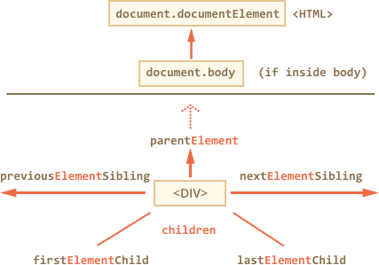

# 목차
  1. [DOM(Document Object Model)](#domdocument-object-model)
  2. [Microsoft 사의 기술 문서](#microsoft-사의-기술-문서)
  3. [W3C 표준 기술 문서](#w3c-표준-기술-문서)
  4. [Syntax](#syntax)
  5. [DOM 종류](#dom-종류)
  6. [XML DOM vs HTML DOM](#xml-dom-vs-html-dom)
  7. [Node](#node)
  8. [Node 속성(property)](#node-속성property)
  9. [Element 속성(property)](#element-속성property)
  10. [Node 속성과 Element 속성을 이용한 노드 탐색 방식의 차이점](#node-속성과-element-속성을-이용한-노드-탐색-방식의-차이점)
  11. [DOM 트리 탐색](#dom-트리-탐색)
  12. [getElement series](#getelement-series)
  13. [CSS 수정](#css-수정)
  14. [메소드 체이닝 패턴(Method chaining pattern)](#메소드-체이닝-패턴method-chaining-pattern)
  15. [Nodelist 와 HTMLCollection 차이점](#nodelist-와-htmlcollection-차이점)
  16. [Event 핸들링 방법: 바인딩](#event-핸들링-방법-바인딩)
  17. [브라우저의 기본 동작 차단: a tag 의 기본 동작인 페이지 이동 해제](#브라우저의-기본-동작-차단-a-tag-의-기본-동작인-페이지-이동-해제)
  18. [이벤트 위임(Event Delegation)](#이벤트-위임event-delegation)
  19. [사용 가능한 이벤트 핸들러](#사용-가능한-이벤트-핸들러)
  20. [이벤트 핸들러와 this 키워드](#이벤트-핸들러와-this-키워드)
  21. ['this' 에 대한 예제 +](#this-에-대한-예제-)
  22. [Node.parentNode](#nodeparentnode)
  23. [Element.className](#elementclassname)
  24. [HTMLElement.offsetParent](#htmlelementoffsetparent)
  25. [Node.hasChildNodes (IE7+)](#nodehaschildnodes-ie7)
  26. [Document.getElementByClassName (IE9+)](#documentgetelementbyclassname-ie9)
  27. [querySelector(), querySelectorAll()](#queryselector-queryselectorall)
  28. [querySelector()](#queryselector)
  29. [querySelectorAll()](#queryselectorall)
  30. [querySelector 사용시 주의할 점](#queryselector-사용시-주의할-점)
  31. [node creation](#node-creation)
  32. [node manipulation](#node-manipulation)
  33. [applications](#applications)
  34. [Methods of String.prototype](#methods-of-stringprototype)
  35. [insertBefore](#insertbefore)
  36. [FDS util](#fds-util)
  37. [인라인 이벤트](#인라인-이벤트)
  38. [이벤트 비활성화 하기](#이벤트-비활성화-하기)
  39. [removeChild](#removechild)
  40. [replaceChild](#replacechild)
  41. [innerHTML](#innerhtml)
  42. [tabindex](#tabindex)
  43. [lang 속성](#lang-속성)
  44. [OOCSS (Oriented Object CSS)](#oocss-oriented-object-css)

------

# DOM(Document Object Model)
  - HTML 문서의 요소 개체들에 접근을 가능하게 하고 컨트롤 할 수 있도록 메서드와 프로퍼티를 제공하는 것
  1. DOM Level 0 (Legacy DOM)
    - Netscape사와 Microsoft사와의 점유율 전쟁으로 인해 많은 객체들이 만들어 졌고 표준화 이전에 만들어진 이런 객체들이 비공식적으로 DOM Level 0 으로 알려져 있다.
    - 많은 객체들이 만들어지면서 문서의 모든 객체에 접근이 가능해지고 CSS를 사용하여 속성을 변경 제어할 수 있게 되었다.
  2. DOM LEVEL 1
    - **기업 간 합의를 통해 표준화가 진행되던 시대**
      ```javascript
        doucment.getElementById() => Node
        (ElementNode || doucment).getElementsByTagName() => NodeList
      ```
    - 이 사양은 프로그램 및 스크립트가 문서의 내용, 구조 및 스타일에 동적으로 접근(Access)하고 업데이트 할 수 있게 해주는 플랫폼 및 언어 중립적인 인터페이스 문서 객체 모델 레벨 1을 정의합니다.
    - Document Object Model은 HTML 및 XML 문서를 표현하기 위한 표준 객체 집합으로,이러한 객체를 결합 할 수 있는 표준 모델 및 객체 접근 및 조작을위한 표준 인터페이스를 제공합니다.
    - 공급 업체는 독점적인 데이터 구조 및 API에 대한 인터페이스로 DOM을 지원할 수 있으며 콘텐츠 작성자는 제품 별 API가 아닌, 표준 DOM 인터페이스에 쓸 수 있으므로 웹에서 상호 운용성이 향상됩니다.
    - DOM 사양의 목표는 XML 및 HTML을 위한 프로그래밍 방식의 인터페이스를 정의하는 것입니다. DOM Level 1 사양은 Core와 HTML의 두 부분으로 구분됩니다.
    - Core DOM Level 1 섹션은 XML 문서를 표현하기 위한 확장된 인터페이스를 정의 할뿐만 아니라 모든 구조화 된 문서를 나타낼 수있는 저 수준의 기본 인터페이스 집합을 제공합니다. 이러한 확장 XML 인터페이스는 HTML 문서에 대한 접근만 제공하는 DOM 구현으로 구현할 필요는 없습니다. 핵심 섹션의 모든 기본 인터페이스를 구현해야합니다. 확장된 XML 인터페이스를 구현하는 호환 DOM 구현은 HTML 인터페이스가 아닌 기본 핵심 인터페이스도 구현해야 합니다.
    - HTML 레벨 1 섹션은 추가, 코어 레벨 1 섹션에서 정의된 기본 인터페이스와 함께 사용되는 더 높은 수준의 인터페이스로 HTML 문서를 보다 편리하게 볼 수 있습니다.
    - HTML DOM의 호환 구현은 HTML 인터페이스뿐만 아니라 모든 기본 Core 인터페이스를 구현합니다.
  3. DOM Level 2
    - **화합이 무너지고 기업간 경쟁이 다시 점화되는 시기**
      * Events 모델 -> 업그레이드
      * DOM레벨1은 HTML, XML문서 구조를 정의하는데 초점이 맞춰져있습니다.
      * 레벨2와 레벨3은 위 구조에 따른 상호작용 기능 추가 및 고급 XML기능을 지원합니다.
      * 서로 관련있는 아래와 같은 모듈로 구성되어있습니다.
      * DOM 코어 : 레벨 1 코어를 바탕으로 노드에 메서드와 프로퍼티를 추가.
      * DOM 뷰 : 스타일 정보를 바탕으로 여러가지 문서 뷰 정의
      * DOM 이벤트 : 이벤트에 기반한 DOM 문서 상호작용 방법 정의
      * DOM 스타일 : CSS스타일 정보에 접근하고 변경하는 방법 정의
      * DOM 이동과 범위 : DOM문서를 이동하고 특정 범위를 선택하는 새 인터페이스 정의
      * DOM HTML : 레벨1 HTML에 기반하여 새 인터페이스와 프로퍼티, 메서드를 추가  
      - [참조링크]
        - [http://sonim1.tistory.com/149](http://sonim1.tistory.com/149)

------

## Microsoft 사의 기술 문서
  - 이벤트 버블링만 지원  [window.event](https://msdn.microsoft.com/en-us/library/ms535863(v=vs.85).aspx)
  - window.event는 DOM 이벤트 핸들러가 호출되는 동안에만 사용할 수 있는 Microsoft Internet Explorer 속성입니다. 이 값은 현재 처리중인 Event 객체입니다.  [window.event.srcElement](https://msdn.microsoft.com/en-us/library/ff974945(v=vs.85).aspx)
  - Event.srcElement는 표준 Event.target 속성에 대한 독점적 인 별칭입니다. 이전 버전의 Microsoft Internet Explorer에만 적용됩니다.  
  - srcElement 속성은 이전 버전과의 호환성을 위해 제공됩니다. 대신 [target](https://msdn.microsoft.com/en-us/library/ff974946(v=vs.85).aspx) 속성을 사용하십시오. [.attachEvent()](https://msdn.microsoft.com/en-us/library/ms536343(v=vs.85).aspx)  
  - 지정된 함수를 이벤트에 바인딩하여 해당 객체에서 이벤트가 발생할 때마다 함수가 호출되도록 합니다.  
  - Internet Explorer11부터는 [addEventListener](https://msdn.microsoft.com/en-us/library/ff975245(v=vs.85).aspx) 사용  [.detachEvent()](https://msdn.microsoft.com/en-us/library/ms536411(v=vs.85).aspx)  
  - 이벤트가 발생할 때 함수가 알림 수신을 중지 할 수 있도록 이벤트에서 지정된 함수를 바인딩 해제합니다.


[목차](#목차)

------

## W3C 표준 기술 문서
  - 이벤트 캡쳐링/버블링 모두 지원
  - 함수 내에 event 객체를 전달 [event.target](https://www.w3schools.com/Jsref/event_target.asp) target 이벤트 속성은 이벤트를 트리거 한 요소를 반환합니다.
  - target 속성은 이벤트가 원래 발생했던 요소를 가져 오며, currentTarget 속성은 이벤트 리스너가 이벤트를 트리거 한 요소를 항상 참조합니다.

  [.addEventListener()](https://www.w3schools.com/js/js_htmldom_eventlistener.asp)  
  - 메서드는 지정된 요소에 이벤트 처리기를 연결합니다.
  - 메서드는 기존 이벤트 처리기를 덮어 쓰지 않고 요소에 이벤트 처리기를 연결합니다.
  - 하나의 요소에 많은 이벤트 핸들러를 추가 할 수 있습니다.
  - 한 요소에 동일한 유형의 여러 이벤트 핸들러, 예를 들어 두 번의 “클릭“이벤트를 추가 할 수 있습니다.
  - 메서드를 사용하면 이벤트가 버블 링에 반응하는 방식을보다 쉽게 제어 할 수 있습니다.
  - 메서드를 사용할 때 JavaScript는 가독성을 높이기 위해 HTML 태그와 분리되어 있으며 HTML 태그를 제어하지 않아도 이벤트 리스너를 추가 할 수 있습니다.
  - 메서드로 첨부 된 이벤트 핸들러를 제거하려면 removeEventListener () 메서드를 사용합니다.  


[목차](#목차)

------

## Syntax  
  - element.addEventListener(event, function, useCapture);
  - 첫 번째 매개 변수는 이벤트 유형 (예 : ‘클릭‘또는 ‘마우스 다운‘)입니다.
  - 두 번째 매개 변수는 이벤트가 발생할 때 호출 할 함수입니다.
  - 세 번째 매개 변수는 이벤트 버블 링 또는 이벤트 캡처를 사용할지 여부를 지정하는 부울 값입니다. 이 매개 변수는 선택적입니다. [.removeEventListener()](https://www.w3schools.com/jsref/met_element_removeeventlistener.asp)
  - addEventListener () 메서드로 연결된 이벤트 처리기를 제거합니다.  
  - 이벤트 핸들러를 제거하려면 addEventListener () 메서드로 지정된 함수가 외부 함수 여야합니다. 


[목차](#목차)

------

# DOM 종류
  1. Core DOM
    - 어느 문서에나 통용되는 표준 모델로 모든 문서 요소의 객체와 속성을 정의하고 이들에 접근하기 위한 인터페이스를 정의

  2. XML DOM
    - XML 문서의 표준 모델 
    - XML 문서 요소의 객체와 속성을 정의하고 XML DOM은 XML 문서에 접근하여, 그 문서를 다루는 표준화된 방법을 정의한다. 
    - 모든 XML 요소는 XML DOM를 통해 접근할 수 있다. 
    - XML DOM은 플랫폼이나 프로그래밍 언어에 상관없이 언제나 사용할 수 있다. 
    - XML 문서라는 정보 단위의 계층 구조인 노드에 대해 노드와 그들 사이의 관계를 설명하는 표준 프로그래밍 인터페이스이다. 
    - (Core DOM을 XML에 맞게 확장 시킨 것.)

  3. HTML DOM
    - HTML 문서의 표준 모델로 HTML DOM은 HTML 문서에 액세스하고 조작하기위한 표준적인 방법을 정의한다. 
    - 모든 HTML 요소는 HTML DOM를 통해 접근할 수 있다. 
    - HTML 문서 요소의 객체와 속성을 정의하고 이들에 접근하기 위한 인터페이스를 정의


[목차](#목차)

------

## XML DOM vs HTML DOM
  - Get DOM Nodes
    ```javascript
      // XML DOM
      var anchors = document.getElementsByTagName("a");
      // HTML DOM
      var anchors = document.anchors;

      // XML DOM
      var form = document.getElementsByTagName("form");
      // HTML DOM
      var form = document.forms;
    ```
  - Get Attribute
    ```javascript
      // XML DOM
      var imgSrc = elem.getAttribute(“src”);
      // HTML DOM
      var imgSrc = elem.src;
    ```
  - Set Attribute
    ```javascript
      // XML DOM
      elem.setAttribute(“src”, “menu01_on.gif”);
      // HTML DOM
      elem.src = “menu01_on.gif”;
    ```
  - **HTML DOM은 좀 더 직관적이며 단순 (W3C에서는 XML DOM을 권장)**


[목차](#목차)

------

# Node
  - W3C DOM에서 HTML 문서 내의 모든 것은 노드이다.
  - 모든 요소가 서로 계층 관계를 이루는 노드로 이루어짐
  - 또한, 요소 뿐 아니라 속성(attribute), 텍스트 또한 노드로 이루어짐


[목차](#목차)

------

## Node 속성(property)
  - `parentNode` : 지정된 노드의 부모 노드를 Node 객체로 반환 (부모 노드가 없는 경우 null을 반환)
  - `firstChild` : 지정된 노드의 첫 번째 자식 노드를 Node 객체로 반환 (자식 노드가 없는 경우 null을 반환)
  - `lastChild` : 지정된 노드의 마지막 자식 노드를 Node 객체로 반환 (자식 노드가 없는 경우 null을 반환)
  - `previousSibling` : 지정된 노드의 이전 형제 노드를 Node 객체로 반환 (이전 형제 노드가 없는 경우 null을 반환)
  - `nextSibling` : 지정된 노드의 다음 형제 노드를 Node 객체로 반환 (다음 형제 노드가 없는 경우 null을 반환)
  - `nodeType` : 지정된 노드의 유형을 반환
    - `ELEMENT_NODE`: 1
    - `ATTRIBUTE_NODE`: 2
    - `TEXT_NODE`: 3
    - `COMMENT_NODE`: 8
  - `nodeName` : 지정된 노드의 이름을 반환
    - 요소 노드(ELEMENT_NODE) : 태그 이름 반환
    - 속성 노드(ATTRIBUTE_NODE) : 속성의 이름을 반환
    - 다른 노드 유형 : 다른 노드 유형에 대해 다른 이름을 반환
  - `nodeValue` : 텍스트 노드의 값을 설정하거나 리턴 할 수 있다. (텍스트 노드가 아닌 경우 null을 반환)
  - `childNodes` : 지정된 노드의 자식 노드 컬렉션(NodeList - 유사배열) 객체 반환(읽기 전용)
    - 인덱스 번호로 접근 가능
    - 공백은 텍스트 노드 반환
    - 주석은 주석 노드 반환


[목차](#목차)

------

## Element 속성(property)
  - firstElementChild : 지정된 노드의 첫 번째 자식 요소 노드를 Node 객체로 반환 (하위 요소 노드가 없는 경우 null을 반환)
  - lastElementChild : 지정된 노드의 마지막 자식 요소 노드를 Node 객체로 반환 (하위 요소 노드가 없는 경우 null을 반환)
  - previousElementSibling : 지정된 노드의 이전 형제 요소 노드를 Node 객체로 반환 (이전 형제 요소 노드가 없는 경우 null을 반환)
  - nextElemntSibling : 지정된 노드의 다음 형제 요소 노드를 Node 객체로 반환 (다음 형제 요소 노드가 없는 경우 null을 반환)
  - tagName : 요소 노드의 이름 반환
    - nodeName과의 차이점 : nodeName은 모든 노드 (요소, 속성, 텍스트, 주석)의 이름을 반환하는 반면 tagName은 요소 노드의 이름을 반환한다.
  - children : 지정된 노드의 자식 노드 컬렉션(HTMLCollection - 유사배열) 객체 반환(읽기 전용)


[목차](#목차)

------

## Node 속성과 Element 속성을 이용한 노드 탐색 방식의 차이점
  - Node 속성을 이용한 탐색 방식은 요소 노드, 텍스트 노드, 주석 노드를 반환
  - Element 속성을 이용한 탐색 방식은 요소 노드만 반환
  - 예제
    ```javascript 
      // parentNode
      // DOM API를 사용해서 노드리스트에 접근한 후, 개별 아이템을 추출
      var headline = document.getElementsByTagName('h1')[0];
      headline.parentNode; 
      console.log('headline.parentNode:', headline.parentNode);
      // h1요소의 상위 부모 노드를 Node 객체로 반환 

      // firstChild 
      var headline = document.getElementsByTagName('h1')[0];
      headline.firstChild;
      console.log('headline의 첫번째 자식은?', headline.firstChild);
      // #text node 반환 

      // lastChild
      var headline = document.getElementsByTagName('h1')[0];
      console.log('headline의 마지막 자식은?:', headline.lastChild);

      // previousSibling
      //html  <li><a id="b1"/><a id="b2"/></li>
      document.getElementById("a").previousSibling; // null
      document.getElementById("b1").nextSibling.id; // a[id="b2"]

      // nextSibling
      //html <div></div><p></p>  
      document.getElementsByTagName('div')[0].nextSibling // p 


      // childNode vs children
      // html  <div><h1><abbr>DOM</abbr>이란?</h1></div>
      document.getElementsByTagName('h1').childNodes; // [abbr, text]

      // firstElementChild
      var headline = document.getElmentsByTagName('h1')[0];
      headline.firstElementChild; // abbr

      // lastElementChild
      var headline = document.getElementsByTagName('h1')[0];
      headline.lastElementChild; // abbr

      // nextElemntSibling 
      //html <div></div><p></p>  
      document.getElementsByTagName('div')[0].nextElementSibling  // p

      // previousElementSibling
      //html <div></div><p></p>
      document.getElementsByTagName('p')[0].previousElementSibling // div

      // nodeType
      document.nodeType // 9 
      var headline = document.getElementsByTagName('h2')[0].nodeType // 1 
      
      // nodeName
      var headline = document.getElementsByTagName('h1')[0].nodeName // 'H1' 
      var abbr_in_headline = document.getElementsByTagName('abbr')[0].nodeName // 'ABBR'

      // nodeValue
      var headline = document.getElementsByTagName('h1')[0].firstChild.nodeValue 
      // h1  요소의 첫번째 자식이 텍스트 노드일 경우 값을 반환 
    ```


[목차](#목차)

------

## DOM 트리 탐색
  - DOM 트리 탐색(node)
    

  - DOM 트리 탐색(element)
    

    - element 탐색의 경우, 크로스 브라우징 이슈가 있으므로 주의해서 사용해야함.
    - nextElementSibling, previousElementSibling, firstElementChild, lastElementChild, children 속성의 경우 IE 9.0 이상에서 지원


[목차](#목차)

------

# getElement series
  - DOM Scripting의 첫 단계는 작업 대상 요소를 찾는 것.

  1. `getElementById`
    - 인자로 받은 ID를 가진 Element Object 를 반환 
    - 해당 요소가 없을 시 null 반환
    - document.getElementById( id )
  2. `getElementsByTagName`
    - document(Element)의 후손 중 Tag Name을 가진 요소들의 노드리스트를 반환
    - document.getElementsByTagName( Tag Name ) 
    - Element.getElementsByTagName( Tag Name )
  3. `getElementsByName`
    - document(Element)의 후손 중 인자로 받은 name 속성 값을 가진 요소들의 노드리스트를 반환
    - document.getElementsByName( name )
    - Element.getElementsByName( name )
  4. `getElementsByClassName`
    - document(Element)의 후손 중 인자로 받은 class name 을 가진 요소들의 노드리스트를 반환
    - document.getElementsByClassName( class name ) 
    - Element.getElementsByClassName( class name )
  5. `querySelector`
    - document의 후손 중 인자로 받은 selectors와 매칭되는 첫번째 요소를 반환
    - document.querySelector( selectors )
  6. `querySelectorAll`
    - document.querySelectorAll( selectors )
    - document의 후손 중 인자로 받은 selectors와 매칭되는 요소의 노드리스트를 반환
  7. 속성 다루기
    - 속성 값을 `가져`오는 `getAttribute`
    - 속성 값을 `설정`하는 `setAttribute`

  


[목차](#목차)

------

# CSS 수정
  - 요소의 style 프로퍼티를 수정
  - 요소의 class 나 id 값을 수정
  - 새 CSS 코드를 문서에 작성
  - 전 페이지에 적용되는 stylesheet 를 수정
    ```html
      <p id="test" style="margin-left: 10px;">
        ...
      </p>
    ```
    - 오류
      ```javascript
        var el = document.getElementById("test");
        el.style.padding-left = "15px";
      ```
    - `-` 는 minus 연산자로 사용
    - `Camel 표기법` : `-` 를 빼고 dash 바로 뒤의 글자를 `대문자`로 작성
      ```javascript
        var el = document.getElementById("test");
        el.style.paddingLeft = "15px";
      ```
    - `[""]으로 묶어서 사용`
      ```javascript
        var el = document.getElementById("test");
        el.style.["padding-left"] = "15px";
      ```


[목차](#목차)

------

## 메소드 체이닝 패턴(Method chaining pattern)
  - 메소드가 특정 객체를 반환하게 되면, 반환된 객체를 통해 또 다시 함수를 호출할 수 있다. 이러한 연쇄적인 호출 형태를 사용하는 프로그래밍 패턴을 메소드 체이닝이라 부른다.
  - 메소드 체이닝 사용 예제
    ```javascript
      var str1 = 'chaning';
      str1 = str1.split('').reverse().join('');
      console.log('str1 : ', str1);
    ```
  - 메소드 체이닝 사용X 예제
    ```javascript
      var str2 = 'chaning';
      var str_arr = str2.split('');
      var reverse_str_arr = str_arr.reverse(); // 배열에서는 reverse()를 사용할 수 있다.
      var reverse_str = reverse_str_arr.join('');
      console.log('reverse_str : ', reverse_str);
    ```


[목차](#목차)

------

# Nodelist 와 HTMLCollection 차이점
  - NodeList 는 어떤 종류의 nodeType 도 가질수 있지만, HTMLCollection 은 보통 Element 노드만 가진다.


[목차](#목차)

------

# Event 핸들링 방법: 바인딩
  - 구형 : on{event_name}
  - 이벤트 핸들러에 할당하는 매우 오래된 방식이며, 모든 브라우저에서 지원하는 방법
  - 엘리멘트의 이벤트 핸들러 프로퍼티에 직접적으로 할당하는 방식
  - 이벤트 핸들러는 해당 엘리먼트의 메소드로 간주되기 때문에, this의 스코프는 엘리먼트가 된다.
  ```javascript
    var clickBtn = document.getElementById('clickBtn');
    btn.onclick = function() {
      alert('message!');
      console.log(this.id);
    }
  ```

  - 신형(IE9+) : addEventListener('event_name', handler)
  - 이벤트에 대한 추가 및 제거를 위한 메소드로서,
  아래의 메소드를 사용하면 하나의 이벤트 핸들러에 여러개의 이벤트 함수를 할당할 수도 있다.
  - 또한, 같은 이벤트 함수가 아닌 경우, 삭제가 되지 않으니 주의하도록 한다.
    - `. addEventListener()` : `이벤트 할당`
    - `. 파라메터` : `이벤트 이름` / `이벤트 핸들링 함수` / `호출방식 (true:캡쳐링, false:버블링)`
    - `. removeEventListener()` : `이벤트 제거`
    - `. 파라메터` : `이벤트 이름` / `이벤트 핸들링 함수`
  ```javascript
    var clickBtn = document.getElementById('clickBtn');
    btn.addEventListener('click', function() {
      alert('message!');
    }, false);

    btn.removeEventListener('click', function() {
      alert('message!');
    });
  ```


[목차](#목차)

------

# 브라우저의 기본 동작 차단: a tag 의 기본 동작인 페이지 이동 해제
  - 브라우저의 기본 동작 차단
    - 구형 : return false;
    - 신형(IE9+) : Event.preventDefault();
    ```javascript
      //  * 이벤트를 바인딩할때 함수를 반복문 안에 넣는거보다는 바깥으로 빼서 참조 시키는 형태가 더 좋다.
      for ( var link, i=0, l=study_content_links.length; i<l; ++i ) {
        link = study_content_links.item(i);
        link.onclick = activeParent;
      };
      function activeParent(){
        console.log('this.parentNode:', this.parentNode);
        _.parent(this).className = 'active';
        return false;
      };
    ```


[목차](#목차)

------

# 이벤트 위임(Event Delegation)
  - Child Element들 각각에 Event Handler를 추가하는 것이 아니라 Parent Element에 Event Handler를 추가한 뒤 Event가 발생한 node를 확인하여 처리하는 방법.
  - `장점**
    - 등록되는 Event Handler의 수를 줄일 수 있다. (성능에 도움이 된다.)
    - 코드가 간결해지며 유지보수가 수월해진다.
  - **단점**
    - 불필요한 Event를 filtering하는 작업이 추가된다.

  - [참조링크]
    - [HERSHEY'S WEB PLANET](http://hersheyweb.blogspot.kr/2013/04/javascript-event-delegation.html)
    - [Regular Motion](http://regularmotion.kr/tag/%EC%9D%B4%EB%B2%A4%ED%8A%B8-%EC%9C%84%EC%9E%84/)
    - [DWB](https://davidwalsh.name/event-delegate)


[목차](#목차)

------

#	사용 가능한 이벤트 핸들러
  - **onabort**: 이미지 로딩이 중단될 경우 실행된다.
  - **onblur**: 엘리먼트가 입력 포커스를 잃어버릴 경우 실행된다.
  - onchange: 폼 엘리먼트가 포커스를 잃고 값이 변경될 경우 실행된다.
  - **onclick**: 마우스 버튼이 눌렸다 떼어질 때 실행된다. mouseup 이벤트가 이어서 발생한다. 기본 동작 방식을 취소하려면 false를 반환한다.
  - **ondblclick**: 마우스가 더블클릭될 때 실행된다.
  - **onerror**: 이미지 로딩 오류가 일어날 경우 실행된다.
  - **onfocus**: 엘리먼트가 입력 포커스를 얻을 경우 실행된다.
  - **onkeydown**: 키가 눌렸을 때 실행된다. 취소하려면 false를 반환한다.
  - **onkeypress**: 키가 눌렸을 때 실행된다. keydown 이벤트가 이어서 발생한다. 취소하려면 false를 반환한다.
  - **onkeyup**: 키에서 손을 뗐을 때 실행된다. keypress 이벤트가 이어서 발생한다.
  - **onmousedown**: 마우스 버튼이 눌렸을 때 실행된다.
  - **onmousemove**: 마우스가 이동할 경우 실행된다.
  - **onmouseout**: 마우스가 엘리먼트에서 벗어났을 때 실행된다.
  - **onmouseover**: 마우스가 엘리먼트 위로 이동할 때 실행된다.
  - **onmouseup**: 마우스 버튼에서 손을 뗐을 때 실행된다.
  - **onresize**: 윈도우 크기가 변경될 경우 실행된다.
  - **onselect**: 텍스트가 선택됐을 때 실행된다.
  - **onreset**: 폼 초기화가 요청됐을 때 실행된다. 초기화를 방지하려면 false를 반환한다.
  - **onsubmit**: 폼 제출이 요청됐을 때 실행된다. 제출을 방지하려면 false를 반환한다.
  - **onload**: 문서 로딩이 완료됐을 때 실행된다.
  - **onunload**: 문서나 프레임셋이 사라졌을 때 실행된다.


[목차](#목차)

------

# 이벤트 핸들러와 this 키워드
  > 이벤트 핸들러를 HTML 속성으로 정의하든 자바스크립트 프로퍼티로 정의하든 함수를 document 엘리먼트의 프로퍼티로 할당하는 셈이다. 다시 말해 document 엘리먼트에 새로운 메서드를 정의하는 것이다. 이벤트 핸들러가 호출되면 이벤트가 발생한 엘리먼트의 메서드로서 해당 이벤트 핸들러가 호출되고, 따라서 this 키워드는 대상 엘리먼트를 가리킨다.


[목차](#목차)

------

# 'this' 에 대한 예제 +
  - `this 의 정의`
    - 전역 컨텍스트 : 전역에서(어떤 함수 외부) this는 전역 객체를 나타낸다. 웹브라우저에서 전역객체는 window
    - 함수 컨텍스트 : 함수내부에서 this는 호출한 방법에 의해 좌우된다.
  - 각 상황에 따라 `this가 가리키는 것`
    1. 기본적으로 **global** 객체이다. (window)
      - **strict mode**가 아닐 때 this의 값은 항상 window
      ```javascript
        function f1(){
          return this;
        }
        f1() === window; // 전역 객체

        function sum(a, b) {
          console.log(this === window); // => true
          this.myNumber = 20; // 전역 객체에 'myNumber'라는 속성을 추가
          return a + b;
        }
      ```
      - **strict mode**일 때 **undefined** ( 실행 컨텍스트에 들어갈 때 할당되어 유지. 만약 정의되지 않았을 경우 **undefined**. null, 숫자, 문자값 등으로 설정 가능. 엄격모드는 내부 함수에서도 적용된다.)
      ```javascript
        function f2(){
          "use strict"; // strict mode
          return this;
        }
        f2() === undefined;
        //  f2가 어떠한 기본(예. f2())도 제공하지 않고 호출했다. 이 기능은 strict mode를 지원하기 위해 시작했을 때 일부 브라우저에서 구현되지 않았다. 결과적으로, window 객체를 잘못 반환했다.
      ```
      ```javascript
        // 내부 함수에서의 this
        var numbers = {
          numberA: 5,
          numberB: 10,
          sum: function() {
            console.log(this === numbers); // => true
            function calculate() {
              // this는 window, 엄격 모드였으면 undefined
              console.log(this === numbers); // => false
              return this.numberA + this.numberB;
            }
            return calculate();
          }
        };
        numbers.sum(); // NaN, 엄격 모드였으면 TypeError
      ```
    2. **new연산자**(생성자)로 생성된 **function** 영역에서 **this**는 새롭게 생성된 객체 그 자신이다.
      ```javascript
        function F (v) {
          this.val = v;
        }
        var f = new F("Woohoo!");
        console.log(f.val); // Woohoo!
        console.log(val); // ReferenceError
      ```
    3. 객체의 **prototype** 체인에서 **this**는 호출된 객체이다.
      ```javascript
        var o = {
          f:function(){ 
            return this.a + this.b;
          }
        };
        var p = Object.create(o);	// 객체 o 를 프로토타입으로한 객체 p 를 생성한다.
        p.a = 1;
        p.b = 4;

        console.log(p.f()); // 5
      ```
    4. 메소드 실행에서의 this는 메소드를 소유하고 있는 객체다.(객체 내에 있는 메소드를 실행할 때, 여기서의 this는 자기자신)
      ```javascript
        var calc = {
          num: 0,
          increment: function() {
            console.log(this === calc); // => true
            this.num += 1;
            return this.num;
          }
        };
        // 메소드 실행. 여기서의 this는 calc.
        calc.increment(); // => 1
        calc.increment(); // => 2
      ```
    5. **getter**와 **setter**에서의 **this**는 get 또는 **set** 되는 속성 객체다.
      ```Javascript
        function modulus(){
          return Math.sqrt(this.re * this.re + this.im * this.im);
        }

        var o = {
          re: 1,
          im: -1,
          get phase(){
            return Math.atan2(this.im, this.re);
          }
        };

        Object.defineProperty(o, 'modulus', {
            get: modulus, enumerable:true, configurable:true});

        console.log(o.phase, o.modulus); // logs -0.78 1.4142
      ```
    6. **call, apply, bind** 메서드로 **this**를 특정한 객체와 연결할 수 있다.
      ```javascript
        var add = function (x, y) {
            this.val = x + y;
          },
          obj = {
            val: 0
          };
        add.apply(obj, [2, 8]);
        console.log(obj.val); // 10
        add.call(obj, 2, 8);
        console.log(obj.val); // 10

        function f(){
          return this.a;
        }

        var g = f.bind({a:"azerty"});
        console.log(g()); // azerty

        var o = {a:37, f:f, g:g};
        console.log(o.f(), o.g()); // 37, azerty
      ```
    7. **DOM** 이벤트 핸들러로 사용되는 함수에서 this는 이벤트가 발생한 엘리먼트다.
      ```Javascript
        // 리스너로서 호출될 때, 관련된 엘리먼트를 파랗게 만든다.
        function bluify(e){
          // 항상 true
          console.log(this === e.currentTarget); 
          // currentTarget 과 target 이 같은 객체일 때 true
          console.log(this === e.target);
          this.style.backgroundColor = '#A5D9F3';
        }

        // document의 모든 엘리먼트의 목록을 얻는다.
        var elements = document.getElementsByTagName('*');

        // 클릭 리스너로 bluify를 추가하여서 엘리먼트를 클릭하면, 그 엘리먼트는 파랗게 된다.
        for(var i=0 ; i<elements.length ; i++){
          elements[i].addEventListener('click', bluify, false);
        }
      ```
  - [참조링크]
    - [자바스크립트의 'this' 키워드 이해하기](http://resoneit.blogspot.kr/2014/01/this.html)
    - [MDN](https://developer.mozilla.org/ko/docs/Web/JavaScript/Reference/Operators/this)
    - [자바스크립트에서 사용되는 this에 대한 설명 1](http://webframeworks.kr/tutorials/translate/explanation-of-this-in-javascript-1/)


[목차](#목차)

------

# Node.parentNode
  - 특정 document 요소에 접근하여 그 요소의 부모를 찾고싶을 때 사용하는 속성이다.
    ```javascript
      // 활용 예제
      // node 는 선택된 특정 document 요소
      if (node.parentNode) {
      // remove a node from the tree, unless
      // it’s not in the tree already
      node.parentNode.removeChild(node);
      }
    ```
  - Document 노드와 DocumentFragment 노드는 부모를 가질 수 없으므로 parentNode는 항상 null을 반환한다. 또한, 노드가 방금 작성되고 트리에 아직 연결되지 않은 경우 널 (null)을 리턴한다.


[목차](#목차)

------

# Element.className
  - 특정 엘리먼트의 클래스 속성의 값을 가져오거나 설정할 수 있다.
    ```javascript
      // 간단한 class 토글 예제
      var elm = document.getElementById(‘item’);
      if(elm.className === ‘active’){
        elm.className = ‘inactive’;
      } else {
        elm.className = ‘active’;
      }
    ```
  - 많은 언어에서 DOM 조작을 위해 사용되는 “class ” 키워드와의 혼란을 줄이기 위하여 class 대신 className이라는 프로퍼티 명을 사용한다.


[목차](#목차)

------

# HTMLElement.offsetParent
  - DOM 트리에 존재하는 부모요소들 중 위치(positioned)요소를 기준으로 가장 가까운 요소를 찾아서 jQuery 객체로 만들어(wrapped) 준다. 여기서 말한 위치(positioned)는 CSS의 속성인 relative, absolute, fixed를 의미한다. 이런 정보들은 페이지상에서 객체들의 위치를 계산하기 위해 아주 유용하다.
  ```html
    <div class="hello">
      <p class="bonjour">Bonjour</p>
    </div>
  ```
  ```css
    .hello{
      position: relative;
    }
    .bonjour{
      position: absolute;
      left: 20px;
      font-family: sans-serif
    }
  ```
  ```javascript
    var offsetP = document.querySelector('.bonjour');

    console.log(offsetP.offsetParent);

    // 여기서 hello가 bonjour 의 상대적인 부모 노드다.
  ```


[목차](#목차)

------

# Node.hasChildNodes (IE7+)
  - Node.hasChildNodes() 메소드는 현재 노드(Node)에게 자식노드(child nodes)가 있는지를 Boolean 값으로 반환합니다.
  - 예시 ) 아래 예시에서는 "foo"라는 id를 가진 요소를 찾고 "foo" 요소에게 자식노드가 있으면 첫번째 자식노드를 제거해줍니다.
  ```javascript
    var foo = document.getElementById("foo");

    if ( foo.hasChildNodes() ) { 
      foo.removeChild( foo.childNodes[0] );
    }
  ```
  - [참조링크]
    - [https://developer.mozilla.org/ko/docs/Web/API/Node/hasChildNodes](https://developer.mozilla.org/ko/docs/Web/API/Node/hasChildNodes)


[목차](#목차)

------

# Document.getElementByClassName (IE9+)
  - 지정된 클래스 이름을 가진 모든 요소를 가져옵니다. (Internet Explorer 9 이상 부터 지원)
  - 예시 ) 아래 예시에서는 클래스 값이 'example'인 모든 요소를 x라는 변수에 할당합니다.
    ```javascript
      var x = document.getElementsByClassName("example");
    ```
  - [참조링크]
    - [MDN](https://developer.mozilla.org/ko/docs/Web/API/Document/getElementsByClassName)


[목차](#목차)

------

# querySelector(), querySelectorAll()
  - IE8+ 에서 작동한다.
  - 태그의 아이디, 클래스, 이름 등으로 태그 객체를 반환하는 메서드로 jQuery의 $(“셀렉터“) 와 비슷하다.


[목차](#목차)

------

## querySelector()
  - css의 선택자를 인자로 받아서 해당 엘리먼트 객체를 찾음
  - 가장 첫번째 엘리먼트만을 리턴
  - 배열아니므로 직접 제어해야함

  ```javascript
    var container = document.querySelector("#container");
    var box = document.querySelector(".box"); //배열이 아님
    var body = document.querySelector("body"); //배열이 아님
  ```


[목차](#목차)

------

## querySelectorAll()
  - IE8 에서는 CSS2만 지원한다.
  - 해당 선택자의 모든 엘리먼트를 유사배열에 담아 리턴
  - for-in문 사용


[목차](#목차)

------

## querySelector 사용시 주의할 점
  1. 인자를 문자열로 전달해야함
    ```javascript
      querySelector(""), querySelectorAll("")
    ```
  2. css 선택자와 사용방법이 동일하나 약간의 제한이 있음
    ```javascript
      * > .class // (o) 
      >.class // (x)
    ```
  3. CSS 구문을 따르지 않는 id 또는 선택기 (예 : 콜론 또는 공백을 사용하여)를 일치 시키려면 백 슬래시로 이스케이프 문자를 사용
  4. 의사 클래스 선택기 :hover, :focus, :active 지원. :visited :link 가 포함 된 선택기 는 무시되고 요소가 반환되지 않음
  5. 지정한 선택자는 검색을 시작할 시작 요소의 하위 항목에만 적용. 시작 요소 자체는 포함되지 않음
  6. CSS Pseudo-elements(가상 요소)는 어떠한 element도 결코 반환하지 않음


[목차](#목차)

------

# node creation
  1. `element node`
    ```javascript
      // syntax
      var elementNode = document.createElement('element name');
      // elementNode.nodeName : element name
    ```
  2. `attribute node`
    ```javascript
      // syntax
      var attributeNode = document.createAttribute('attribute name');
      // attributeNode.nodeName : attribute name
      // attributeNode.nodeValue : ''
    ```
  3. `text node`
    ```javascript
      // syntax
      var textNode = document.createTextNode('text');
      // textNode.nodeValue : text
    ```


[목차](#목차)

------

# node manipulation
  1. `append a child node`
    ```javascript
      // syntax
      var appendedChild = parentElementNode.appendChild(appendedChild);
      // appendedChild : node;
      // parentElementNode : element node;
    ```
  2. `insert a node`
    ```javascript
      // syntax
      var insertedNode = parentElementNode.insertBefore(insertNode, referenceNode);
      // insertNode : node;
      // parentElementNode : element node;
      // referenseNode : parentElementNode의 자식 node. insertNode 의 앞에 위치하게 된다.
    ```
  3. `remove a child node`
    ```javascript
      // syntax
      // removedChild 의 참조를 유지하는 경우.
      var removedChild = parentElementNode.removeChild(removedChild);
      // removedChild : node;
      // parentElementNode : element node;

      // removedChild 의 참조를 유지하지 않는 경우.
      node.removeChild(removedChild);
    ```


[목차](#목차)

------

# applications
  1. `API utility`
    ```javascript
      // API namespace 안에 아래 코드를 삽입하면 된다.

      // create element node
      var createElement = function ( name ) {
        // parameter type validation 위치
        return document.createElement( name );
      };
      // name : element node

      // create text node
      var createText = function ( nodeValue ) {
        // parameter type validation 위치
        return document.createText( nodeValue );
      };
      // nodeValue : text value

      // create attribute node
      var createAttribute = function ( name ) {
        // parameter type validation 위치
        return document.createAttribute( name );
      };
      // name : attribute name

      // create element node with its content
      var createEl = function(name, content) {
        // parameter type validation 위치
        var el = createElement( name );
        
        // content 가 null이 아니고 string 값을 갖고 있다면,
        // content 를 값으로 갖는 text node를 생성하고
        // 'el'에 자식으로 집어 넣는다.
        if( content && isType(content, 'string') ) {
          var text = createText(content);
          appendChild(el, text);
        }
        return el;
      };
    ```
  2. `create and manipulate mark-up structure in run-time`
    - `target mark-up structure`
      
    - `js code`
      ```javascript
        // no-name namespace (IIFE)
        // FDS is user API
        (function ( global, document, FDS ) {
          'use strict';

          // indices for each image urls
          var imageIndex = [1068, 1017, 1067, 1060, 1042, 1039, 1027, 1013, 977, 859];

          // alternative mentions for each images
          var imageAlt = ["푸른 빛 탁자", "광활한 산맥", "빛이 스며드는 해안 도시 풍경", "커피 향기 가득한 매장", "수 놓은 별 빛이 흐른다", "녹색 산림 위 폭포수", "우수에 찬 눈빛의 여인", "하얀 차량 내부에서 전화 통화 중인 여인", "아름다운 버섯과 빛의 향연", "강렬한 인상을 주는 붉은 벽과 노란 대문"];
          
          // image size information
          var imageInfo = {
            imageHost: '',
            big: {
              width: 900,
              height: 420
            },
            thumbnail: {
              width: 100,
              height: 100
            }
          };
          // Get a image url template from an actual DOM element's attribute.
          imageInfo.imageHost = FDS.selector('figure.photo-showcase > img').getAttribute('src').substr(0, 20);

          // Get an unordered list element node from actual DOM
          var ul = FDS.selector('ul');

          // make structure like 'ul > li*10 > a > img'
          for ( var i = 0; i < 10; i += 1 ) {
            // <li role="presentation"> ... </li>
            var li = FDS.createElement('li');
            li.setAttribute('role', 'presentation');

            // <a role="tab" href="" class="photo-showcase-indicator"> ... </a>
            var a = FDS.createElement('a');
            a.setAttribute('role', 'tab');
            a.setAttribute('href', '');
            a.setAttribute('class', 'photo-showcase-indicator');

            // 
            var img = FDS.createElement('img');
            img.setAttribute('src', ('https://unsplash.it/' + imageInfo.thumbnail.width + '/' + imageInfo.thumbnail.height + '?image=' + imageIndex[i]));
            img.setAttribute('alt', imageAlt[i]);

            //ul > li[0-9] > a > img
            FDS.appendChild(img, a);
            FDS.appendChild(a, li);
            FDS.appendChild(li, ul);
          }
        })( window, window.document, window.FDS );
      ```
  3. WAYs to give each \<li\> nodes its own indcies
    1. WAY 1
      ```javascript
        // no-name namespace (IIFE)
        // FDS is user API
        (function ( global, document, FDS ) {
          // omit...

          for ( var i = 0; i < 10; i += 1 ) {
            // omit...

            // create anchor element
            var a = FDS.createElement('a');

            // omit...

            // 'a.onclick' 은 뒤따르는 IIFE 함수가 반환하는 익명 함수를 참조하게 되는데, 이 익명함수는 for문의 각 단계에서 특정된 i의 값을 보관하는 index라는 클로저 변수를 parameter 로 받는다.
            // 이 코드는 매 반복마다 IIFE 함수를 생성한다는 문제점을 갖고 있다.
            a.onclick = (function ( index ) {
              return function () {
                index = index;
                // prevent default action
                return false;
              };
            })( i );
          }
        })( window, window.document, window.FDS );
      ```
    2. WAY 2
      ```javascript
        // no-name namespace (IIFE)
        // FDS is user API
        (function ( global, document, FDS ) {
          // omit...

          for ( var i = 0; i < 10; i += 1 ) {
            // omit...

            // create anchor element
            var a = FDS.createElement('a');

            // omit...

            // 'a.onclick' 는 'changeShowcaseView' 함수가 반환하는 익명함수를 참조하게 된다.
            // 함수를 반환하는 changeShowcaseView는 첫 사례와는 다르게 한번만 만들어지고 반복 호출된다.
            a.onclick = changeShowcaseView( i );
          }

          function changeShowcaseView( index ) {
            return function () {
              index = index;
              // It has a closure variable-parameter 'index' which has a copied value of 'i' from 'for' loop.
              // prevent default action
              return false;
            };
          }

        })( window, window.document, window.FDS );
      ```
    3. WAY 3
      ```javascript
        // no-name namespace (IIFE)
        // FDS is user API
        (function ( global, document, FDS ) {
          // omit...

          for ( var i = 0; i < 10; i += 1 ) {
            // omit...

            // create anchor element
            var a = FDS.createElement('a');

            // omit...

            // 'a.onclick' 은 changeShowcaseView 를 참조한다.
            // 'a' 는 i값을 자신의 프로퍼티로 값복사 한다.
            a.onclick = changeShowcaseView;
            a.index = i;
          }

          function changeShowcaseView( ) {
            // The 'this' context refers calling 'a'.
            this.index;
            return false;
          }

        })( window, window.document, window.FDS );
      ```
  4. Make nav visible when it gets keyboard focus
    - js
      ```javascript
        (function ( global, document, FDS ) {
          // omit...
          
          for ( var i = 0; i < 10; i += 1 ) {
            // omit...
          }

          var container = FDS.selector('.photo-showcase-container');
          var controller = FDS.selector('.photo-showcase-controller [role="tablist"]');
          
          // 아래의 두 변수는 반드시 위의 for 문 다음에 나와야 한다.
          // 이들은 for 문 안에서 동적으로 생성되는 요소를 참조하기 때문이다.
          var indicator_first, indicator_last;
          indicator_first = FDS.selector('li:first-child a', controller);
          indicator_last = FDS.selector('li:last-child a', controller);

          // 첫번째 nav > a 가 focus를 얻으면,
          // 이의 조상인 container에 active라는 class attribute를 추가한다.
          indicator_first.onfocus = function () {
            var container_class = container.getAttribute('class');
            container_class += ' ' + 'active';
            container.setAttribute('class', container_class);
          };

          // 첫번째 nav > a 가 focus를 잃으면,
          // 이의 조상인 container에 active라는 class attribute를 제거한다.
          indicator_last.onblur = function () {
            var container_class = container.getAttribute('class');
            // replace from matched character pattern 'active' to ''.
            container_class = container_class.replace(/active/, '').trim();
            container.setAttribute('class', container_class);
          };

          // omit...

        })( window, window.document, window.FDS );
      ```
    - The code above needs the CSS below...
      ```css
        .photo-showcase-container.active .photo-showcase-controller,{
          opacity: 1;
        }
      ```


[목차](#목차)

------

# Methods of String.prototype
  ```javascript
    String.prototype.charAt(index);
    String.prototype.substring(start, end);
    String.prototype.substr(start, length);
    String.prototype.indexOf(string);
    String.prototype.slice(start, end);
    String.prototype.split(string);
    String.prototype.replace(string, string);
    String.prototype.replace(regExp, function(){});
  ```


[목차](#목차)

------

# insertBefore
  - [참조링크]
    - [MDN: Node.insertBefore()](https://developer.mozilla.org/en-US/docs/Web/API/Node/insertBefore)
  
  - 노드 ~ 앞에 삽입하기. `부모노드.insertBefore(삽입할노드, 부모노드를 통해 찾은 자식 노드)`

  1. 1번 방법 : 부모노드를 찾아서 삽입하기
    ```javascript
      function methodOne() {
        var wrapper = $.selector('.wrapper');
        var new_node = $.createEl('h1', 'insertBefore');
        new_node.setAttribute('lang', 'en');
        new_node.setAttribute('class', 'wrapper-headline');
        // 문서의 특정 요소노드에 마운트(Mount)되지 않은 상태
        console.log('new_node:', new_node);
        // ~ 앞에 삽입해보자.
        // 부모노드.insertBefore(삽입노드, 부모노드를_통해_찾은_자식노드)
        // 이벤트가 요구된다면
        wrapper.onmouseover = function() {
          // 문서의 특정 요소노드에 마운트(Mount)된 상태
          this.insertBefore(new_node, $.selector('p', this));
          // 이벤트의 제거
          this.onmouseover = null;
        };
      }
    ```
  2. 2번 방법 : 대상 노드를 찾아서 삽입하기
    ```javascript
      function methodTwo(){
        // 문서에서 대상 찾기
        var wrapper_p = $.selector('.wrapper p');
        var target = $.selector('.wrapper .target');
        // 전역에 changePosition() 함수를 공개
        global.changePosition = function() {
          // 상대적으로 insertBefore() 메서드 사용하기
          // 목표노드.부모노드.insertBefore(삽입노드,목표노드);
          $.parent(wrapper_p).insertBefore(target, wrapper_p);
        };
      }
    ```


[목차](#목차)

------

# FDS util
  1. 입력받은 target 앞에 노드 삽입.
    ```javascript
      var insertBefore = function(insert, target){
        validateElementNode(insert);
        validateElementNode(target);
        parent(target).insertBefore(insert, target);
        return insert;
      };

    ```
  2. target 노드 뒤에 insert 노드 삽입
    ```javascript
      var insertAfter = function(insert, target){
        var next = nextSibling(target);
        //형제가 있으면?
        if(next){
          insertBefore(insert,next);
        }else{
          appendChild(parent(target), insert);
        }
        return insert;
      }
    ```


[목차](#목차)

------

# 인라인 이벤트
  - 모든 태그의 이벤트 속성에는 자바스크립트 코드를 적을 수 있으며 이벤트 핸들러를 연결 할 수 있다.

  1. 이벤트 핸들러 연결  
  ```html
    <h1 onclick ="alert('클릭')">Click</h1>
  ```
  2. 여러 줄의 자바스크립트 코드
  ```html
    <h1 onclick ='var alpha =10; arelt(alpha);'>Click</h1>>
  ```
  3. 함수 호출
  ```html
    <!-- 함수에 this를 전달할 수 있다. 이 때 this는 h1이다.-->
    <h1 onclick='whenClick(this)'>click</h1>
  ```


[목차](#목차)

------

# 이벤트 비활성화 하기
  1. disabled 속성
    ```html
      <!-- disabled 속성을 적용한다.-->
      <button type="button" disabled>Click Me!</button>
    ```
  2. removeAttribute
    ```javascript
      //JavaScript를 통해서 onclick 속성을 제거한다. 
      button.removeAttribute('onclick');
    ```


[목차](#목차)

------

# removeChild 
  - 부모모드.removeChild(자식노드) 
    - 문서 계층 구조에서 하나의 노드를 삭제합니다.
    - 주의할 점은 이 메서드는 삭제하려는 노드가 아니라 이 노드를 자식으로 가진 부모 노드에서 실행된다는 점입니다. 
    - 따라서 메서드 전달인자로 삭제할 자식 노드를 넘기고, 부모 노드의 메서드로 호출합니다.

  - [참조 링크]
    - [removeChild()](https://developer.mozilla.org/ko/docs/Web/API/Node/removeChild)
  - 예시
    - 아래와 같이 부모노드(ul) 안에 자식노드(li id="target")를 삭제하는 예시 입니다.
      ```html
        <ul>
            <li>HTML</li>
            <li>CSS</li>
            <li id="target">JavaScript</li>
        </ul>
        <input type="button" onclick="callRemoveChild();" value="removeChild()" />
      ```
      ```javascript
        function callRemoveChild(){
          var target = document.getElementById('target');
        target.parentNode.removeChild(target);
        }
      ```


[목차](#목차)

------

# replaceChild
  - [참조 링크]
    - [MDN:Node.replaceChild()](https://developer.mozilla.org/en-US/docs/Web/API/Node/replaceChild)
  - 기존의 노드를 새로운 노드로 바꿀 수 있는데, 그러기 위해서는 기준점이 있어야 한다.
  - 이때 부모노드에서 replaceChild() 메서드를 사용하면 기존에 있던 노드를 새로운 노드로 변경할 수 있다.

  - 부모노드.replaceChild(대체노드, 목표노드)  
    - 활용예시 
      ```html
        <!DOCTYPE HTML>
        <html>
          <head>
              <title> replaceChild() 메서드 예제 </title>
          </head>
          <body>
              <p>짜장면</p>
          </body>
        </html>
      ```
      ```javascript
        var new_node = document.createElement('p');
        var new_text = document.createTextNode('짬뽕');
        new_node.appendChild(new_text);
        var parent_node = document.querySelector('body');
        var old_node = document.querySelector('p');
        var replace_node = parent_node.replaceChild(new_node, old_node);
        console.log('원래의 node의 text값:', old_node.innerHTML);
      ```
    - FDS util
      ```javascript
        var replaceChild = function(repalce, target){
          validateElementNode(taget);
          return parent(target).replaceChild(replace, target);
        }
      ```


[목차](#목차)

------

# innerHTML
  - [참조링크]
    - [MDN:Element.innerHTML](https://developer.mozilla.org/ko/docs/Web/API/Element/innerHTML)
  - **Element.innerHTML** 프로퍼티는 HTML 구문의 하위 노드들을 가져오거나 설정한다.
  - **syntax**
    ```javascript
      var content = element.innerHTML;
    ```
    - content 변수가 return 받는 값은, element의 모든 하위 노드를 설명하는 직렬화된 HTML 코드이다.
    - element의 모든 자식들(하위노드, 즉 HTML 코드들)을 제거한다. content의 문자열을 파싱하고, 생성된 노드를 element의 자식으로 할당한다.
      ```javascript
        element.innerHTML = content;
      ```


[목차](#목차)

------

# tabindex
  - [참조링크]
    - [MDN:tapindex](https://developer.mozilla.org/ko/docs/Web/HTML/Global_attributes/tabindex)

  - **탭 인덱스**는 [전역 속성(Global Attribute)](https://developer.mozilla.org/en-US/docs/Web/HTML/Global_attributes)에 속하며, 요소의 포커스 설정 여부와 만약 요소가 키보드 탐색 범위에 속해야 한다면 어느 지점에서 선택되어야 하는지 정수값을 사용해 지정할 수 있다.

  - `음의 정수` : 요소가 포커스를 받을 수는 있지만 순차적인 키보드 탐색으로는 접근 불가능함을 나타낸다.
  - `0`  : 요소가 포커스를 받을 수 있으며 동시에 순차적인 키보드 탐색으로도 접근 가능함을 나타낸다. 그러나 요소의 상대적인 순서는 플랫폼이 정한 규약에 따라 달라질 수 있다.
  - `양의 정수`: 요소가 포커스를 받을 수 있으며 동시에 순차적인 키보드 탐색으로도 접근 가능함을 나타낸다. 요소의 상대적인 순서는 속성값에 의해 결정된다. 탭 인덱스 값이 낮은 것부터 차례대로 순차 탐색한다. 만약 몇몇 요소에게 동일한 탭 인덱스 값을 부여한다면, 탐색 순서는 문서내의 요소의 상대적인 위치에 따라 결정된다.

  - 버튼이나 링크요소가 아닌 요소에 tabindex를 적용했을 때의 이슈 : onclick을 이벤트를 연결하였을 때 클릭시에는 실행되지만 tab으로 이동한 후 스페이스바를 눌렀을 때에는 실행되지 않는다. 


[목차](#목차)

------

# lang 속성
  - [참조링크]
    - [MDN:lang](https://developer.mozilla.org/ko/docs/Web/HTML/Global_attributes/lang)
    - [널리:Html lang 속성과 스크린 리더](http://nuli.navercorp.com/sharing/blog/post/1132824)
    - [스포카기술블로그:다국어 환경에 맞게 타이포그래피 세팅하기](https://spoqa.github.io/2016/06/03/localize-type-setting.html)

  - 한국형 웹 콘텐츠 접근성 지침(KWCAG) 2.1에는 웹페이지의 head 요소 안에 페이지의 기본 언어 선언을 규정하고 있다(항목 7.1.1 참조). 
  - 기본 언어 선언이 중요한 이유는 자동 언어 전환 기능을 지원하는 스크린리더가 선언된 언어에 해당하는 TTS로 자동으로 전환함으로 콘텐츠를 자연스럽게 출력하도록 하기 위함.

  - 필요에 따라 웹페이지의 기본 언어 선언과는 상관 없이 페이지의 특정 영역 언어를 lang 속성으로 변경하는 것을 통해 웹페이지 중간에 제공되는 다른 언어 콘텐츠를  해당하는 언어의 발음으로 정확하게 들을 수 있다.
  - 언어는 그 언어에 맞는 고유한 문자가 있고,  문자별로 특징적인 형태를 지닌다. 따라서 문자의 기본적인 문자폭과 자간 등 타이포그래피 세팅도 다르게 되어야 한다.


[목차](#목차)

------

# OOCSS (Oriented Object CSS)

  - [참조링크]
    - [\[번역\] 객체 지향 CSS(OOCSS) 소개](https://mytory.net/archives/8949)

  - `OOCSS의 목적` : 코드 재사용성을 높이고, 궁극적으로는, 더 빠르고 효율적이며 뭔가 추가하기 쉽고 유지보수하기 용이한 스타일시트를 만드는 것.

  - `원칙1) 겉모양에서 골격을 분리`: 웹사이트에서 비슷하게 반복되는 스타일을 모듈로 추상화하면 재사용이 가능해지고, 어떤 요소에도 적용할 수 있으며 기본적으로 일관된 모양을 기대할 수 있다. 
    ```css
      /*OOCSS를 적용하지 않은 방식*/
      #button {
        width: 200px;
        height: 50px;
        padding: 10px;
        border: solid 1px #ccc;
        background: linear-gradient(#ccc, #222);
        box-shadow: rgba(0, 0, 0, .5) 2px 2px 5px;
      }
      #box {
        width: 400px;
        overflow: hidden;
        border: solid 1px #ccc;
        background: linear-gradient(#ccc, #222);
        box-shadow: rgba(0, 0, 0, .5) 2px 2px 5px;
      }
      /*OOCSS를 적용한 방식
      =>공통 스타일과 재사용 가능한 “겉모양”용 스타일을 결합해 사용하면서 불필요한 반복은 없어진다. */
      .button {
        width: 200px;
        height: 50px;
      }

      .box {
        width: 400px;
        overflow: hidden;
      }
      .skin {
        border: solid 1px #ccc;
        background: linear-gradient(#ccc, #222);
        box-shadow: rgba(0, 0, 0, .5) 2px 2px 5px;
      }
    ```
  - `원칙2) 컨테이너와 콘텐츠를 분리` : 계층화한 선택자를 사용해 스타일을 선언하면, 재사용할 수 없게 되지만, OOCSS의 클래스 기반 모듈을 구축하면 스타일이 어떤 컨테이너에도 종속되지 않도록 할 수 있다. 때문에, 구조적 맥락을 신경쓰지 않고, 클래스를 문서의 어디에서나 재사용할 수 있다.
    ```css
      /*OOCSS를 적용하지 않은 방식 
      => 불필요한 중복 스타일이 발생 & 계층화된 선언으로 재사용할 수 없다.*/
      #sidebar h3 {
        font-family: Arial, Helvetica, sans-serif;
        font-size: 2em;
        line-height: 1;
        color: #777;
        text-shadow: rgba(0, 0, 0, .3) 3px 3px 6px;
      }
      #footer h3 {
        font-family: Arial, Helvetica, sans-serif;
        font-size: 1.5em;
        line-height: 1;
        color: #777;
        text-shadow: rgba(0, 0, 0, .3) 2px 2px 4px;
      }
    ```
    ```css
      /*OOCSS를 적용한 방식*/
      .globalwidth {
        width: 980px;
        margin: 0 auto;
        position: relative;
        padding-left: 20px;
        padding-right: 20px;
        overflow: hidden;
      }
      .header-inside {
        padding-top: 20px;
        padding-bottom: 20px;
        height: 260px;
      } 
    ```
    ```html
      <!--필요한 요소에 클래스만 추가해주면 된다.-->
      <header>
        <div class="header-inside globalwidth">
        </div>
      </header>

      <div class="main globalwidth">
      </div>

      <footer>
        <div class="footer-inside globalwidth">
        </div>
      </footer>
    ```


[목차](#목차)

------

[Index바로가기](https://github.com/seromkim1005/study)